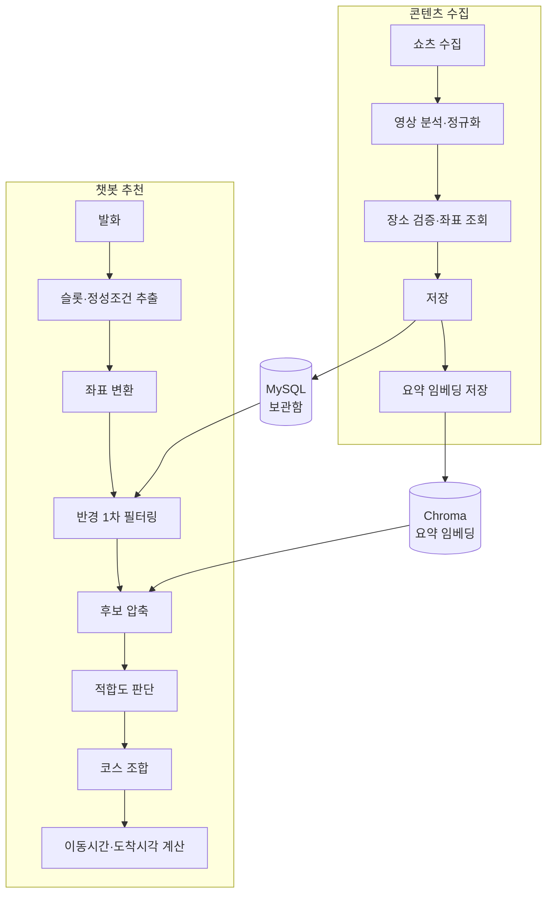

# KTB4-8th-AI

## AI 파이프라인



## API

| Method | 엔드포인트 | 기능 |
| --- | --- | --- |
| POST | `/v1/analyze-video` | 유튜브 쇼츠 영상 분석 (장소명·지역·카테고리·행사 시작일·종료일 추출) |
| POST | `/v1/verify-place` | 장소 존재 여부·영업시간 검증 및 좌표 조회 |
| POST | `/v1/extract` | 사용자 발화에서 슬롯·정성 조건 추출 |
| POST | `/v1/recommend-courses` | 후보 장소로 코스 조합·방문 순서·도착 시각 생성 |
| POST | `/v1/embed-places` | 장소 요약을 임베딩해 벡터 DB에 저장 |

상세 명세는 [설계 문서](docs/1_wiki_api_design.md)를 참고하세요.

## 설계 문서

| 문서 | 내용 |
| --- | --- |
| [모델 API 설계](docs/1_wiki_api_design.md) | 엔드포인트 명세, 입출력 스키마, 연동 구조 |
| [모델 추론 성능 최적화](docs/2_wiki_inference_optimization.md) | 모델 비교, 병목 분석, 로컬 전환 검토 |
| [서비스 아키텍처 모듈화](docs/3_wiki_architecture_modularization.md) | 모듈 경계, 책임 분리, 인터페이스 설계 |
| [멀티스텝 파이프라인 구현 검토](docs/4_wiki_pipeline_design.md) | 파이프라인 단계, 모델·도구 선택 이유 |
| [데이터/컨텍스트 보강 설계](docs/5_wiki_context_augmentation.md) | 벡터 검색·웹검색 기반 보강, 임베딩 모델 선택 |
| [도구 통합 및 외부 API 활용](docs/6_wiki_Tool_Integration_API_Design.md) | 표준화된 도구 통합, 외부 API 연동 |
| [서비스 인프라 확장성과 모니터링](docs/7_wiki_Service_Infrastructure_Scalability_and_Monitoring_Design.md) | 확장성 설계, 모니터링 계획 |
| [최종 통합 설계 및 회고](docs/8_wiki_final_integration.md) | 전체 설계 통합, 회고 |

## 실행

```bash
uv sync
```

```bash
# app/main.py 구현 전 (스캐폴딩 단계)
uv run uvicorn app.main:app --reload
```
