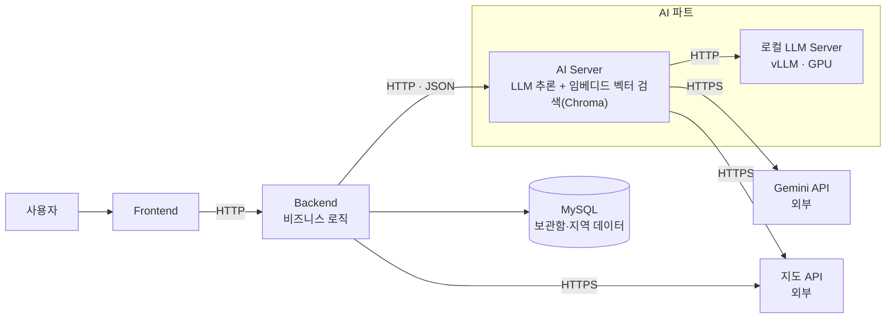
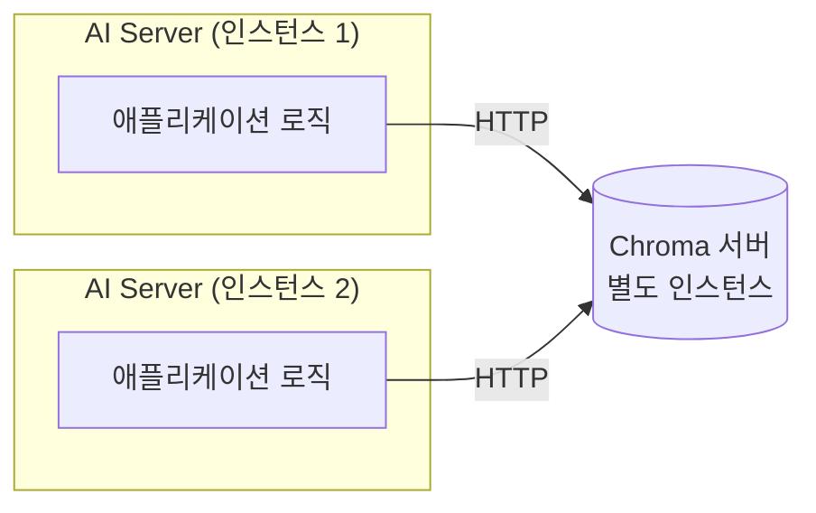
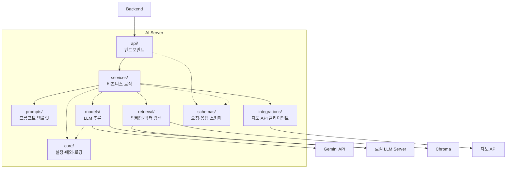

작성일 : 2026년 9월 7일
작성자 : hayes.yu, amy.kim

## 목차
---
1. [서비스 아키텍처 다이어그램](#1-서비스-아키텍처-다이어그램)
2. [AI Server를 분리한 이유](#2-ai-server를-분리한-이유)
3. [각 모듈의 책임과 기능](#3-각-모듈의-책임과-기능)
4. [모듈 간 인터페이스 설계](#4-모듈-간-인터페이스-설계)
5. [모듈화로 기대되는 효과](#5-모듈화로-기대되는-효과)
6. [서비스 시나리오 부합 근거](#6-서비스-시나리오-부합-근거)
---

# 1. 서비스 아키텍처 다이어그램

## 1-1) 서비스 레벨



| 구성 요소      | 소유    | 비고                        |
| ---------- | ----- | ------------------------- |
| Frontend   | 프론트파트 | 사용자 화면                    |
| Backend    | 백엔드파트 | AI Server를 호출             |
| MySQL      | 백엔드파트 | 보관함, 지역 데이터 원본            |
| AI Server  | AI파트  | AI 주요 로직(프롬프트, 검증, 모델 호출), 임베디드 DB(장소 요약 임베딩) |
| 로컬 LLM Server  | AI파트  | 모델 서빙, v2부터 서빙                     |
| Gemini API | 외부    | LLM                       |
| 지도 API     | 외부    | 좌표 조회 및 소요 시간 계산          |

### AI 서버에서 2개로 나뉜 이유

- AI Server: 
  - 애플리케이션 로직: 프롬프트 구성 및 모델 호출 등 AI 주요 로직을 처리하며, CPU로 충분한 서버
  - Chroma: 장소 요약을 임베딩해서 DB에 저장해두고 슬롯과 선호도에 따라서 장소를 검색하는 인덱스. 서버 규모가 작고 임베딩 할 데이터가 적으므로 임베디드 방식의 db인 Chroma로도 충분.
- 로컬 LLM Server: 공개 가중치 모델을 서버에 올려서 서빙. GPU를 주로 사용. API 모델과 성능과 비용 사이의 트레이드 오프를 비교해서 부분적으로 대체

### 벡터DB를 Chroma로 선택한 이유

- 서비스 규모가 작고 임베딩 할 데이터도 적어서 관리형 DB보다 직접 설치해서 사용하는 임베디드 방식을 선택
- 임베디드 방식(Chroma, FAISS, sqlite) 중 Chroma는 필터링 기능이 기본으로 지원되어서 구현하고 관리하기 더 간편

### 지도 API 호출 주체

| 호출 주체     | 용도                               |
| --------- | -------------------------------- |
| Backend   | 좌표 -> 지역명으로 변환                   |
| AI Server | `verify-place`에서 장소 조회           |
| AI Server | `recommend-courses`에서 코스 소요시간 검색 |

### 스케일아웃 시 Chroma 분리 구조 (참고)



- 임베디드 상태로 scaleout 시 인스턴스마다 로컬에 저장되는 인덱스가 달라져서 정합성이 깨진다.
- 이를 동기화로 맞추려면 인스턴스마다 데이터 중복이 일어나고 복장성이 커진다.
- 그래서 직접 동기화를 구현하는 대신, Chroma DB를 임베디드에서 별도 인스턴스에 분리해서 서버 모드로 사용

## 1-2) AI Server 디렉토리 구조

```
app/
├── main.py                      FastAPI 앱 진입점
│
├── api/                         엔드포인트 — 라우팅·요청 검증·응답 조립
│   ├── router.py                  라우터 등록
│   ├── analyze_video.py
│   ├── verify_place.py
│   ├── extract.py
│   ├── recommend_courses.py
│   └── embed_places.py
│
├── services/                    서비스 로직 — 각 엔드포인트의 처리 흐름
│   ├── analyze_video.py           영상 분석 + 카테고리 정규화
│   ├── verify_place.py            웹검색 검증 + 좌표 조회
│   ├── extract.py                 슬롯·자연어 조건 추출
│   ├── recommend_courses.py       취향 벡터 계산 → 후보 압축 → 재순위 → 코스 조합 → 이동시간 계산 → 검증
│   └── embed_places.py            장소 요약 임베딩 저장
│
├── prompts/                     프롬프트 템플릿 — 가장 자주 바뀌는 부분
│   ├── analyze_video.py           영상 분석
│   ├── extract.py                 슬롯 추출
│   ├── rerank.py                  적합도 판단
│   └── compose_course.py          코스 조합 + 제목 생성
│
├── models/                      LLM 추론 추상화
│   ├── base.py                    추론 인터페이스 정의
│   ├── gemini.py                  Gemini API 호출 구현
│   ├── local.py                   로컬 LLM Server 호출 구현
│   └── factory.py                 설정값에 따라 구현체 선택·주입
│
├── retrieval/                   벡터 검색 (슬롯, 취향 기반 후보 압축)
│   ├── embedder.py                텍스트 → 임베딩 변환
│   └── chroma_store.py            Chroma 임베딩 저장·유사도 검색
│
├── integrations/                외부 API 클라이언트
│   └── map_client.py              지도 API (좌표·주소 조회, 이동 시간 계산)
│
├── schemas/                     데이터 계약 — 백엔드와 공유하는 요청·응답 모델
│   ├── common.py                  공통 스키마
│   ├── analyze_video.py
│   ├── verify_place.py
│   ├── extract.py
│   ├── recommend_courses.py
│   └── embed_places.py
│
└── core/                        공통 설정·유틸
    ├── config.py                  환경변수·모델명·타임아웃
    ├── exceptions.py              에러 타입 정의 
    └── logging.py                 LLM 호출 로깅
```

| 모듈  | 왜 필요한가 |
| --- | --- |
| api | 라우팅 및 요청 검증을 비즈니스 로직과 분리 |
| services | 태스크별 비즈니스 로직을 모아서 관리 |
| models | LLM 모델 교체 시 비즈니스 로직이 영향받지 않도록 격리 |
| schemas | 백엔드와 공유하는 요청, 응답 스키마 관리 |
| core | 설정, 예외, 로깅 등 공통 요소 |
| prompts | 자주 변경되는 프롬프트를 따로 관리 |
| retrieval | 벡터 DB와 임베딩 모델 교체 시 비즈니스 로직이 영향 받지 않도록 격리 |
| integrations | 지도 api 교체 가능성을 대비해 영향 범위를 제한 |

## 1-3) 내부 모듈 관계



# 2. AI Server를 분리한 이유

## 2-1) 자원 특성이 다르다

- Backend, AI, 로컬 LLM Server는 주로 사용하는 자원이 다르다.
- 스케일링 기준이 서버마다 달라서 분리하지 않았다면 AI Server를 스케일링해도 필요없는 Backend까지 늘어나게 된다.

| 서버 | 주로 사용하는 자원 | 응답 시간 |
| --- | --- | --- |
| Backend   | CPU | 수십 ms |
| AI Server(FastAPI) | CPU | 1~2초 |
| 로컬 LLM Server | GPU(VRAM) | 3~10초 |

## 2-2) 책임 분리

- Backend와 분리하여 AI, 로컬 LLM Server를 따로 구성하여 개발자간의 책임 분리를 한다.
- 스키마만 합의한 뒤 각자 개발을 진행할 수 있다.
- 서로의 커밋을 기다리거나 충돌을 해결할 일이 없다.

## 2-3) 배포 주기

- 서버마다 배포 주기가 다르다.
- 분리하지 않았다면 AI 쪽에서 프롬프트 수정이 많이 일어날 경우 그때마다 Backend 전체를 재배포해야한다.

## 2-4) 장애 격리

- LLM 호출은 외부 의존이라 실패율이 구조적으로 높다. 타임아웃, 레이트 리밋, 스키마 위반 응답, 모델 서버 다운이 대표적이다.
- 분리하지 않았다면 느린 LLM 호출이 Backend의 스레드, 커넥션을 점유해서, AI 처리가 밀리는 동안 보관함 조회 같은 무관한 API까지 함께 느려진다.
- 분리했기 때문에 AI Server가 응답 불가 상태여도 Backend는 정상 동작하여, 장애 범위가 "AI 기능 일시 중단"으로 좁혀진다.
- 로컬 LLM Server도 별도로 분리되어 있어, GPU 자원 소진 등으로 로컬 모델이 응답하지 않아도 AI Server가 Gemini API 호출로 폴백해 서비스를 유지할 수 있다.

# 3. 각 모듈의 책임과 기능

## 3-1) 모듈화 기준

- 다음 두 기준에 따라 모듈화를 진행했다.
    1. 아키텍처에서 책임에 따라 표준적으로 분리하는 모듈(`api/services/models/schemas/core`)
    2. 이 프로젝트에서 특정한 이유로 분리하는 모듈(`prompts/retrieval/integrations`)
- 특정한 이유에 대해서는 3-2에서 설명한다.

## 3-2) 책임과 기능

1. `api/`
    - 책임: 엔드포인트의 역할을 하며 요청이 스키마에 맞는지 검증하고 응답을 조립
    - 기능: Pydantic 스키마로 요청 바디를 검증, 실패시 에러 응답 반환, `services/`가 반환한 결과를 응답 스키마로 래핑

2. `services/`
    - 책임: 각종 모듈을 사용하여 비즈니스 로직을 수행
    - 기능: 엔드포인트별로 독립된 파이프라인 구현(`영상분석`, `슬롯추출`, `취향벡터계산 -> 후보압축 -> 코스조합` 등)

3. `prompts/`
    - 책임: 각 엔드포인트별로 필요한 프롬프트 작성
    - 기능: 각 태스크별 지시문과 출력 형식을 문자열 템플릿으로 정의, `models/` 호출 시 주입

4. `models/`
    - 책임: LLM 모델 호출 방식을 인터페이스로 추상화
    - 기능: 공통 추론 인터페이스 정의, 로컬 및 API LLM(Gemini 등)별로 호출 구현

5. `retrieval/`
    - 책임: 임베딩과 유사도 계산과 같은 벡터 관련 작업을 수행
    - 기능: 장소 요약 텍스트를 임베딩해 Chroma에 저장, 검색 조건과 취향 벡터를 기준으로 Chroma DB에서 유사도 계산을 통해 후보 압축

6. `integrations/`
    - 책임: 지도 API와 같은 외부 API 호출 수행
    - 기능: 지도 API를 통해 좌표 및 주소를 검색하고 이동 시간 계산

7. `schemas/`
    - 책임: 백엔드와 공유하는 요청, 응답 데이터 형태를 정의
    - 기능: 엔드포인트별 요청, 응답 Pydantic 모델 정의, 여러 엔드포인트에서 공통으로 쓰는 스키마는 `common.py`로 분리

8. `core/`
    - 책임: AI Server에서 공통적으로 설정 및 유틸을 정의
    - 기능: 에러 정의, 로깅, 공통 설정(환경변수, 모델명 등)을 정의하여 한곳에서 관리

# 4. 모듈 간 인터페이스 설계

## 4-1) 네트워크 통신

| 구간 | 통신 방식 | 데이터 포맷 | 계약 정의 위치 |
| --- | --- | --- | --- |
| Backend -> AI Server | HTTP | JSON | Pydantic 스키마 |
| AI Server -> Gemini API | HTTPS | JSON | Gemini API 스키마 |
| AI Server -> 지도 API | HTTPS | JSON | 지도 API 스키마 |
| AI Server -> 로컬 LLM Server | HTTP | JSON | Pydantic 스키마 |

## 4-2) 내부 함수 호출

| 구간 | 통신 방식 | 데이터 포맷 | 계약 정의 위치 |
| --- | --- | --- | --- |
| services/ -> models/ | 함수 호출 | 파이썬 객체 | 각 함수의 타입 힌트 |
| retrieval/ -> Chroma | 함수 호출(임베디드) | 벡터(임베딩), 메타데이터(dict) | chromadb 라이브러리 API |

> `services/`가 다른 모듈(`prompts/retrieval/integrations/schemas/core` 등)을 호출하는 방식도 동일하여 `models/`만 대표로 작성

# 5. 모듈화로 기대되는 효과와 장점

## 5-1) 개발 측면

- 의존성 격리: 무거운 라이브러리가 다른 서버에 포함되지 않아 빌드 시간 및 이미지 크기가 독립적으로 관리
- 변경 영향 범위 축소: 모듈 단위로 독립적인 코드 수정 가능, 벡터 DB 및 LLM 모델 교체 시 비즈니스 로직 영향 없음
- 병렬 개발: 스키마만 합의하고 담당자별 독립적 개발 가능
- 온보딩 비용 감소: 새 팀원이 AI Server 저장소만 이해하고 AI 개발 가능

## 5-2) 운영 측면

- 장애 격리: AI Server가 죽어도 백엔드는 정상
- 스케일 단위 분리: 각 인스턴스마다 독립적인 스케일이 가능
- 독립 배포: 부분 수정 시 전체 재배포 불필요
- 비용 최적화: 각자 다른 자원을 중점적으로 사용하도록 인프라 구축 가능
- 롤백 범위 축소: 문제가 있을 시 AI Server만 이전 버전으로 되돌리고 백엔드는 무관

# 6. 서비스 시나리오 부합 근거

- 실제 발생 가능한 변경 요구 사항은 다음과 같다.

| 변경 요구 사항 | 영향받는 모듈 | 영향받지 않는 모듈 |
| --- | --- | --- |
| Gemini -> 로컬 모델 전환 | `core/` | `api/`, `services/`, `schemas/`, 백엔드, 프론트 |
| 프롬프트 수정 | `prompts/` | 나머지 전부 |
| 지도 API 변경 | `integrations/` | 나머지 전부 |
| 엔드포인트 추가 | `services/`, `api/`, `schemas/` | 나머지 전부 |
| 벡터 DB를 임베디드에서 별도 서버로 분리 | `retrieval/`, `core/` 설정 | 나머지 전부 |

- 대부분의 시나리오에서 영향받는 모듈이 1~2개로 좁혀지고 전체 재배포나 다른 모듈 수정없이 해결이 가능하다.