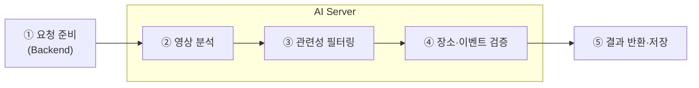
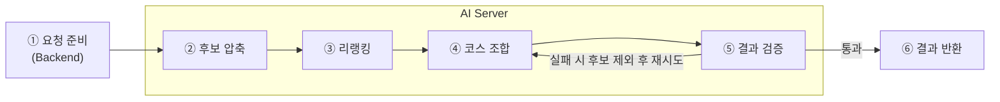

작성일 : 2026년 9월 12일
작성자 : hayes.yu, amy.kim

## 목차
---
1. [파이프라인 다이어그램](#1-파이프라인-다이어그램)
2. [기술 선택 및 선택 이유](#2-기술-선택-및-선택-이유)
3. [코드의 일부 및 의사코드](#3-코드의-일부-및-의사코드)
4. [멀티스텝 구조 도입의 이점과 서비스 요구와의 관련성](#4-멀티스텝-구조-도입의-이점과-서비스-요구와의-관련성)
---

# 1. 파이프라인 다이어그램

## 1-1) 유저 동기화



- 유저의 유튜브 정보를 가져와서 좋아요 목록의 영상들을 요약하여 DB에 저장하는 단계
- Gemini 영상 요약 API를 이용하여 장소 정보를 추출
- 요약된 정보를 보고 장소와 관련이 없는 영상일 경우 제외
- 실제로 존재하는 장소인지, 끝난 이벤트는 아닌지 웹 검색으로 검증
- 지도 API로 주소, 좌표 정보 조회
- 요약된 정보를 구조화하여 임베딩하여 Chroma에 저장하고 Backend에게 결과를 JSON으로 반환

## 1-2) 챗봇 추천



- 사용자의 저장된 장소를 기반으로 개인화된 장소 추천하는 단계
- 사용자의 지역, 반경, 기간으로 1차 필터링
- 선호도를 기반으로 Backend가 전달한 사용자의 저장된 장소 중 후보를 압축
- 입력된 슬롯과 선호도로 후보를 리랭킹
- 지도 API를 이용하여 이동 거리와 시간을 고려하여 코스를 조합
- 결과를 검증하여 잘못된 코스가 나오면 재시도
- 최종적으로 Backend에게 결과를 반환

# 2. 기술 선택 및 선택 이유

## 2-1) 프레임워크: LangChain

- Gemini, 로컬 모델 호출 코드를 직접 구현하지 않고 Langchain이 제공하는 표준 클라이언트를 재사용해 개발 속도를 높임
- 프롬프트 템플릿과 구조화된 출력 파싱을 LangChain이 제공하는 방식으로 처리하여 직접 파싱 구현을 할 필요가 없음
- LangSmith와 연동하여 LLM 호출 로그와 중간 결과를 추적하기 용이

> 고려한 대안:
> - LangGraph: LLM 판단에 따라 분기가 자주 일어나는 경우 LangGraph의 노드와 엣지로 그 분기 흐름을 구현, 관리하기 용이하지만, 우리 서비스 특성상 agent가 아닌 workflow로 흐르는 방식이라 LangGraph가 불필요
> - 재시도 루프는 존재하지만 쉽게 구현이 가능해서 그래프 구조는 불필요

## 2-2) 모니터링 도구: LangSmith

- LangChain을 사용하는 환경에서 환경변수만 추가하면 손쉽게 자동으로 로그를 추적
- 멀티 스텝 파이프라인에서 각 단계마다 로그를 확인하여 디버깅 가능
- LLM API 호출량(토큰 사용량) 추적하여 비용 모니터링 가능

> 고려한 대안:
> - Langfuse: LangSmith와 비슷한 오픈소스 로그 도구. LangChain에 종속되지 않고 프레임워크 무관하게 사용가능하지만 이미 LangChain을 사용하는 환경에서 LangSmith가 더 용이함


## 2-3) 모델선택: Gemini

- Gemini의 멀티모달 입력 기능을 통해 영상 분석 가능
- 타 API에 비해 비용이 저렴
- 웹검색 grounding 내장

> 고려한 대안:
> - Claude(Anthropic) API: 이미지, PDF는 지원하나 비디오, 유튜브 URL 직접 입력은 미지원하여 영상을 분석하려면 프레임을 직접 추출해 이미지로 전달해야 함
> - GPT(OpenAI) API: 마찬가지로 비디오 직접 입력 미지원하여 프레임 추출 또는 음성을 텍스트로 변환(STT) 후 전달해야 함

## 2-4) 웹서칭툴: Gemini grounding

- 장소, 이벤트 정보 검증을 위해 실시간 웹검색으로 보강하여 정확도를 높임
- 이미 사용 중인 Gemini API 하나로 검색과 추론이 통합되어 있어 별도 검색 API 연동이 필요 없음

> 고려한 대안:
> - ddgs(DuckDuckGo Search): API 키 없이 무료로 사용 가능하나 검색 결과를 직접 파싱해 프롬프트에 구성하는 과정을 별도로 구현해야 함
> - 네이버 검색 API: 한국 로컬 장소 정보 커버리지가 더 좋을 수 있으나, 별도 API 키 발급, 인증 관리와 결과-프롬프트 연동을 직접 구현해야 함 

## 2-5) 지도 API: 네이버지도

- 국내 지도 앱 점유율 1위로 장소와 팝업 같은 이벤트 등록률이 높아서 데이터가 더 정확하고 최신임
- 한국에 특화되어 있는 앱으로 한국의 주소 체계와 정보가 정확함

> 고려한 대안:
> - 카카오맵 API: 개발자 문서, SDK가 잘 되어 있어 채택 사례가 많으나 카페, 팝업 등 소규모 로컬 매장 데이터 커버리지는 네이버가 더 강점이라고 판단
> - Google Maps API: 글로벌 표준이지만 국내 지도 데이터 반출 규제로 국내 경로, POI 정보 정확도가 상대적으로 떨어짐

## 2-6) 벡터 DB: Chroma

- 서비스 규모가 작고 임베딩 할 데이터도 적어서 관리형 DB보다 직접 설치해서 사용하는 임베디드 방식을 선택
- Chroma는 필터링 기능이 기본으로 지원되어서 구현하고 관리하기 더 간편

> 고려한 대안: 
> - 관리형 벡터 DB: 서비스 규모가 작고 임베딩 할 데이터도 적어서 불필요한 비용
> - 임베디드 방식 DB(FAISS, sqlite): 다른 임베디드 방식 DB(FAISS, sqlite)는 필터링 기능을 직접 구현해야해서 개발 및 유지보수 부담이 더 큼

# 3. 코드의 일부 및 의사코드

## 3-1) 유저 동기화 파이프라인

```python
# services/analyze_video.py
def analyze_videos(video_urls: list[str]) -> list[PlaceResult]:
    results = []

    for batch in split_batches(video_urls, BATCH_SIZE):
        # ② 영상 분석 — 유튜브 URL을 그대로 Gemini에 전달
        analyzed = llm.generate(
            prompt=prompts.analyze_video(),
            video_urls=batch,
        )

        # ③ 관련성 필터링 — 장소, 이벤트 정보가 없는 영상 제외
        for item in [v for v in analyzed if v.has_place_info]:
            # ④ 장소, 이벤트 검증 — 웹검색 그라운딩으로 실존 여부, 영업시간 확인
            verified = llm.generate(
                prompt=prompts.verify_place(item),
                tools=["google_search"],
            )
            # 좌표, 주소는 지도 API로 조회
            verified.coordinates = map_client.geocode(verified.address)
            results.append(verified)

    # ⑤ 요약 임베딩 저장 후 Backend로 반환
    chroma_store.upsert(
        embeddings=embedder.embed([r.summary for r in results]),
        metadatas=[{"place_id": r.place_id} for r in results],
    )
    return results
```

## 3-2) 챗봇 추천 파이프라인

```python
# services/recommend_courses.py
def recommend_courses(req: RecommendCoursesRequest) -> list[Course]:
    # ② 후보 압축 — 정형 조건 1차 필터링 + 취향 벡터 기반 벡터 검색
    taste_vector = retrieval.build_taste_vector(req.history_place_ids)
    candidates = chroma_store.search(
        query_vector=combine(embedder.embed(req.query), taste_vector),
        where={"place_id": {"$in": [p.place_id for p in req.candidates]}},
        top_k=TOP_K,
    )

    # ③ 리랭킹 — 슬롯, 조건 기준 적합도 판단
    ranked = llm.generate(prompt=prompts.rerank(req.slots, req.query, candidates))

    # ④~⑤ 코스 조합 + 검증 (실패 시 후보 제외 후 재시도)
    for _ in range(MAX_RETRIES):
        courses = llm.generate(prompt=prompts.compose_course(req.slots, ranked))
        courses = map_client.attach_travel_time(courses)

        invalid = validate(courses, req.slots)
        if not invalid:
            return courses  # ⑥ 결과 반환
        ranked = exclude(ranked, invalid)

    raise CourseGenerationError("유효한 코스 생성 실패")
```

## 3-3) 모듈 호출 구조

```python
# models/factory.py — 설정값에 따라 구현체 선택
def get_llm() -> LLMClient:
    if settings.MODEL_PROVIDER == "gemini":
        return GeminiClient()  # 내부적으로 LangChain 클라이언트 사용
    return LocalClient()  # 로컬 LLM Server(OpenAI 호환 API) 호출


# prompts/rerank.py — 프롬프트는 템플릿으로 분리
RERANK_TEMPLATE = """
다음 장소 후보 중 사용자 조건에 적합한 순서대로 정렬하라.
조건: {slots}
추가 요청: {query}
후보: {candidates}
출력: place_id 배열(적합도 내림차순)
"""
```

# 4. 멀티스텝 구조 도입의 이점과 서비스 요구와의 관련성

## 4-1) 멀티스텝 구조의 이점

- 단계마다 성격이 다른 작업(LLM 추론, 벡터 검색, 외부 API 호출)을 분리하여 각 단계를 독립적으로 교체, 수정 가능
- 앞 단계에서 후보를 줄여 뒤 단계 LLM 입력 토큰을 절감
- 단계별로 중간 결과를 검증할 수 있어 잘못된 데이터가 다음 단계로 전파되는 것을 방지
- 어느 단계에서 문제가 발생했는지 LangSmith로 추적 가능하여 디버깅이 용이

## 4-2) 서비스 요구와의 관련성

- 좋아요 목록에는 장소와 무관한 영상이 섞여 있어, 분석 직후 관련성 필터링 단계로 걸러내야 보관함에 불필요한 데이터가 쌓이지 않음
- 영상 정보만으로는 폐업, 종료된 이벤트를 알 수 없어, 웹검색 검증 단계를 별도로 거쳐야 실제 방문 가능한 장소만 저장됨
- 저장 장소가 많아질수록 전체를 LLM에 넣을 수 없어, 벡터 검색으로 후보를 압축하는 단계가 리랭킹보다 앞서야 함
- 코스는 이동 거리, 시간이 현실적이어야 하므로 지도 API 계산 결과를 반영한 검증 단계가 필요하고, 부적합한 코스는 후보를 제외해 재시도
- 위 작업들은 한 번의 LLM 호출로 처리할 수 없어 멀티스텝 구조가 필요
