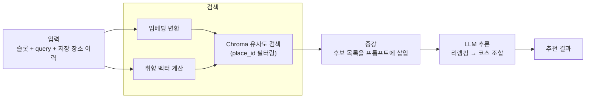
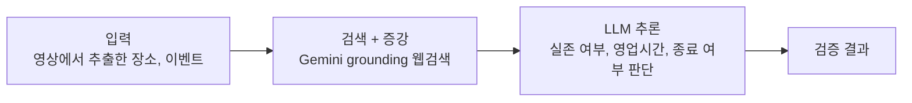

작성일 : 2026년 9월 13일
작성자 : hayes.yu, amy.kim

> [!IMPORTANT]
> 2026/09/13 최초 작성<br>
> 2026/09/15 수정 — 임베딩 모델 선택 근거(3-2) 추가

## 목차
---
1. [데이터 흐름도](#1-데이터-흐름도)
2. [데이터, 지식 소스와 선택 이유](#2-데이터-지식-소스와-선택-이유)
3. [검색, 임베딩, 인덱싱 구현과 모델 통합](#3-검색-임베딩-인덱싱-구현과-모델-통합)
4. [도입 전후 예상 효과와 검증 계획](#4-도입-전후-예상-효과와-검증-계획)
---

우리 서비스의 컨텍스트 보강은 두 가지로 나뉜다.

1. **벡터 검색 기반 보강**: 사용자가 저장한 장소 요약을 임베딩해두고, 추천 시점에 조건과 취향에 맞는 후보만 검색해 LLM 입력으로 사용
2. **웹검색 기반 보강**: 영상에서 추출한 장소, 이벤트 정보를 Gemini grounding으로 실시간 웹검색해 검증

# 1. 데이터 흐름도

## 1-1) 벡터 검색 기반 보강 (챗봇 추천)



## 1-2) 웹검색 기반 보강 (장소 검증)



- 벡터 검색은 검색과 추론이 분리되어 있어 검색 결과를 프롬프트에 직접 삽입
- 웹검색은 Gemini API 내부에서 검색과 추론이 함께 처리되어 별도 삽입 과정이 없음

# 2. 데이터, 지식 소스와 선택 이유

| 지식 소스 | 내용 | 선택 이유 |
| --- | --- | --- |
| 장소 요약 임베딩 (Chroma) | 영상에서 추출한 장소 요약문의 벡터, 메타데이터로 `place_id` 보유 | 추천 대상이 사용자가 저장한 장소로 한정되므로, 공용 문서가 아닌 사용자 데이터가 지식 베이스가 됨 |
| 과거 저장 장소 이력 (`history_place_ids`) | 최근 저장한 장소 목록(최대 50개) | 사용자가 선호도를 직접 입력하지 않아도 저장 이력으로 취향을 추정 가능 |
| 실시간 웹검색 (Gemini grounding) | 장소 실존 여부, 영업시간, 이벤트 종료 여부 | 영상 제작 시점과 조회 시점의 시차가 커서, 모델 학습 데이터나 영상 정보만으로는 최신 상태를 알 수 없음 |

- 장소의 원본 정보(주소, 좌표, 카테고리 등)는 Backend의 MySQL에 저장되고, Chroma에는 요약 임베딩과 `place_id`만 보관
- Chroma 데이터가 유실되어도 MySQL 원본으로 재생성 가능한 파생 데이터이므로, 정합성 관리 부담이 적음

# 3. 검색, 임베딩, 인덱싱 구현과 모델 통합

## 3-1) 임베딩, 인덱싱

- 임베딩 대상은 장소 요약문 한 건 단위이며, 저장 시점(`embed-places`)에 생성
- Chroma 컬렉션에 벡터와 함께 `place_id`를 메타데이터로 저장하여, 검색 시 사용자가 저장한 장소로 범위를 제한
- 임베딩 추가, 수정, 삭제 엔드포인트로 인덱스를 관리하고, 검색 시점에도 Backend가 전달한 `place_id` 목록으로 범위를 한 번 더 제한

## 3-2) 임베딩 모델 선택

| Task type | Qwen3-Embedding-8B (DENSE) | gemini-embedding-001 (DENSE) |
| --- | --- | --- |
| Bitext Mining (13) | 80.89 | 79.28 |
| Classification (43) | 74.00 | 71.82 |
| Clustering (16) | 57.65 | 54.59 |
| Instruction Reranking (3) | 10.06 | 5.18 |
| Multilabel Classification (5) | 28.66 | 29.16 |
| Pair Classification (11) | 86.40 | 83.63 |
| **Reranking (6)** | **65.63** | **65.58** |
| **Retrieval (18)** | **70.88** | **67.71** |
| **STS (16)** | **81.08** | **79.40** |

> 2026-09-15 기준 [MTEB 리더보드](https://huggingface.co/spaces/mteb/leaderboard)에서 조회한 값입니다.

- 오픈 소스 모델 중 높은 성능을 가지고 있는 Qwen3-Embedding-8B와 Gemini를 쓰는 환경에서 사용하기 좋은 gemini-embedding-001과 mteb 성능 비교 표이다.
- 우리 서비스에서는 검색인 Retrieval를 주로 보면 되고, 부가적으로 Reranking과 STS를 보면 된다.
- Qwen3-Embedding-8B 모델의 점수가 약간 더 높지만, 인프라 전체는 AWS 기반이어도 AI 파트는 이미 Gemini API를 쓰고 있어 같은 생태계에 있는 gemini-embedding-001을 쓰는 이점이 더 커서 이 모델을 선택했다.
- 자체 서버로 Qwen3를 서빙하려면 GPU를 상시 기동해야 해 고정비가 발생하고, 지금 트래픽 규모에서는 이 비용이 API 호출 비용보다 커 콜드스타트 문제까지 떠안는 게 손해다. 트래픽이 손익분기점을 넘으면 상시 기동이 오히려 경제적이면서 콜드스타트 문제도 자연히 해소되므로, 그 시점에 서버를 구축해 Qwen3로 마이그레이션할 예정이다.

## 3-3) 검색

```python
# retrieval/chroma_store.py
taste_vector = build_taste_vector(history_place_ids)  # 과거 저장 장소 임베딩의 평균
query_vector = combine(embed(query), taste_vector)  # 이번 요청 조건 + 장기 취향

candidates = collection.query(
    query_embeddings=[query_vector],
    where={"place_id": {"$in": saved_place_ids}},  # 사용자 저장 장소로 한정
    n_results=TOP_K,
)
```

- 이번 대화에서만 유효한 조건(`query`)과 과거 이력 기반 취향을 함께 반영
- 취향 벡터는 저장하지 않고 매 요청마다 계산하여, 사용자가 장소를 삭제해도 다음 추천에 즉시 반영

## 3-4) 모델 통합

- 벡터 검색 결과는 리랭킹 프롬프트에 후보 목록 형태로 삽입

```python
# prompts/rerank.py
RERANK_TEMPLATE = """
다음 장소 후보 중 사용자 조건에 적합한 순서대로 정렬하라.
조건: {slots}
추가 요청: {query}
후보: {candidates}      # 검색으로 압축된 장소 요약 목록
출력: place_id 배열(적합도 내림차순)
"""
```

- 웹검색은 프롬프트에 검색 결과를 넣는 대신, Gemini 호출 시 grounding 도구를 활성화하여 모델이 검색과 판단을 함께 수행

# 4. 도입 전후 예상 효과와 검증 계획

## 4-1) 예상 효과

| 구분 | 도입 전 | 도입 후 |
| --- | --- | --- |
| 후보 전달 방식 | 저장 장소 전체를 프롬프트에 전달 | 조건, 취향에 맞는 상위 후보만 전달 |
| 입력 토큰 | 저장 장소 수에 비례해 증가 | 저장 장소가 늘어나도 일정 수준 유지 |
| 개인화 | 이번 대화의 조건만 반영 | 과거 저장 이력 기반 취향까지 반영 |
| 정보 신뢰도 | 영상 내용에만 의존, 폐업, 종료 이벤트 구분 불가 | 웹검색으로 실존 여부와 운영 상태 확인 |

## 4-2) 검증 계획

- 저장 장소 수를 늘려가며 입력 토큰 사용량과 응답 시간을 비교해, 후보 압축이 실제로 비용과 지연을 억제하는지 확인
- 동일한 조건에 대해 검색 보강 유무를 나누어 추천 결과를 비교하고, 조건에 맞지 않는 장소가 포함되는 비율을 측정
- 서비스 지표인 사용자 수정률(정보 불일치, 코스 불만족)을 통해 보강 효과를 간접 검증
- 웹검증 단계는 이미 종료된 이벤트가 검증을 통과하는 비율을 확인

## 4-3) RAGAS 기반 정량 평가

검색 품질을 눈으로만 확인하지 않고 지표로 측정하기 위해 RAGAS 도입을 검토한다.

| 지표 | 측정 대상 | 확인 내용 |
| --- | --- | --- |
| Context Precision | 벡터 검색 결과 | 조건에 맞는 장소가 검색 결과 상위에 오는지 |
| Context Recall | 벡터 검색 결과 | 추천에 필요한 후보가 검색 단계에서 누락되지 않는지 |
| Faithfulness | 리랭킹, 코스 조합 결과 | 검색된 후보 범위를 벗어난 장소를 만들어내지 않는지 |

- RAGAS는 질의응답형 RAG를 전제로 한 지표라 추천 구조에 그대로 적용하기 어려우므로, 평가용 발화와 정답 후보 집합을 직접 구성해 측정
- 임베딩 모델이나 `TOP_K` 값을 바꿀 때 위 지표를 재측정하여, 변경이 검색 품질을 실제로 개선했는지 비교
