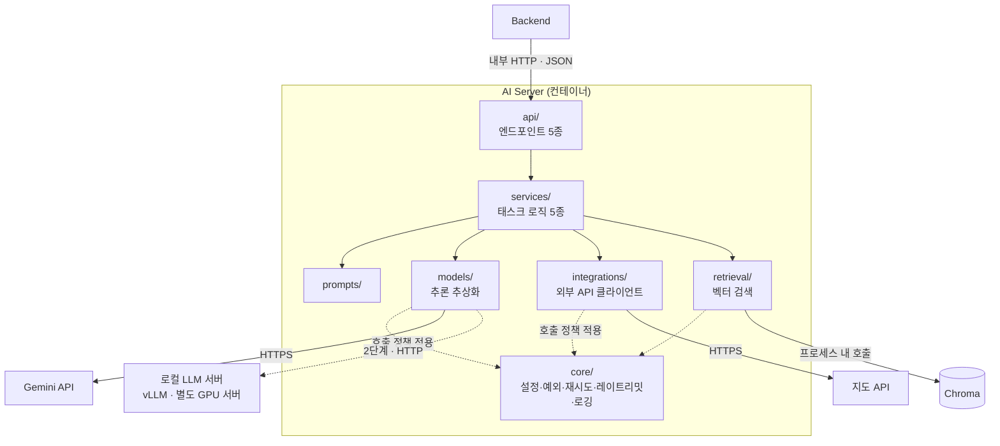

# [AI] 표준화된 도구 통합 및 외부 API 활용 설계

**작성일**: 2026년 9월 8일

**작성자**: amy.kim, hayes.yu
### 목차
---
1. [범위와 결론](#1-범위와-결론)
2. [외부 도구·서비스 식별](#2-외부-도구서비스-식별)
3. [MCP 도입 여부 결정](#3-mcp-도입-여부-결정)
4. [현재 인터페이스 설계](#4-현재-인터페이스-설계)
5. [외부 API 호출 관리](#5-외부-api-호출-관리)
6. [권한 관리와 접근 통제](#6-권한-관리와-접근-통제)
7. [상용 API vs 자체 서빙 분석](#7-상용-api-vs-자체-서빙-분석)
8. [확장 계획](#8-확장-계획)
9. [통합 방식이 서비스에 미치는 영향](#9-통합-방식이-서비스에-미치는-영향)
---

# 1. 범위와 결론

본 문서는 **AI 파트가 직접 호출·관리하는 외부 모델·도구·API 통합**만을 범위로 합니다.

| 항목 | 담당 | 본 문서 범위 |
| --- | --- | --- |
| Gemini API | AI 파트 | 포함 |
| 지도 API (좌표·이동시간) | AI 파트 (`integrations/`) | 포함 |
| 로컬 LLM 서버 (vLLM) | AI 파트 | 포함 (2단계) |
| Chroma (임베디드 벡터 DB) | AI 파트 (`retrieval/`) | 포함 |
| YouTube Data API | Backend | 제외 |
| 지도 API (역지오코딩, AI-007) | Backend | 제외 |
| MySQL | Backend | 제외 — AI Server는 직접 접근하지 않습니다 |

**결론: 현 단계에서는 MCP를 도입하지 않습니다.**

현재 AI 파이프라인은 Backend와 `services/`가 실행 순서를 사전에 정의한 workflow입니다. 모델이 런타임에 여러 도구를 탐색해 그중 하나를 골라 쓰는 에이전트 구조와는 다릅니다. MCP를 쓸 수 없어서가 아니라, **MCP가 해결하는 문제(동적 Tool 선택·Tool discovery·다중 Client 재사용)가 현재 요구사항에 없기 때문**입니다.

대신 이미 설계된 계층 구조로 동일한 목적(구현 교체 격리, 호출 관리 일원화)을 달성합니다.

```
Backend
   │ 내부 HTTP · JSON
   ▼
AI Server
   ├─ api/          엔드포인트
   ├─ services/     태스크 로직
   │      │
   │      ├─ models/        LLM 추론 추상화 → Gemini / vLLM
   │      ├─ integrations/  외부 API 클라이언트 → 지도 API
   │      └─ retrieval/     벡터 검색 → Chroma
   │             │
   │             └─ core/   타임아웃·재시도·레이트리밋·비용로깅·키 관리
```

---

# 2. 외부 도구·서비스 식별

### 2-1) AI 파트가 직접 호출하는 대상

| 도구/서비스 | 호출 모듈 | 역할 | 호출 목적 | 상태 |
| --- | --- | --- | --- | --- |
| Gemini API | `models/gemini.py` | 상용 멀티모달·텍스트 모델 | 영상 분석, 슬롯 추출, 후보 재순위, 코스 조합·제목 생성 | 사용 |
| 지도 API | `integrations/map_client.py` | 좌표·주소 조회, 이동시간 계산 | `verify-place` 좌표 확정, `recommend-courses` 이동시간 | 네이버 지도 API (확정 x, 타사 지도 api로 변경 가능성 있음) |
| Chroma | `retrieval/chroma_store.py` | 임베디드 벡터 DB | 장소 요약 임베딩 저장, 정성 조건 기반 후보 압축 | 사용 |
| 로컬 LLM 서버 (vLLM) | `models/local.py` | 자체 모델 서빙 | `extract`·`recommend-courses` 추론 대체 | 2단계 |

### 2-2) 엔드포인트별 외부 호출 시나리오

| 엔드포인트 | 외부 호출 | 호출 성격 |
| --- | --- | --- |
| `POST /v1/analyze-video` | Gemini (멀티모달) | 배치성, 지연 허용 |
| `POST /v1/verify-place` | Gemini (검증) | 배치성, 지연 허용 |
| `POST /v1/extract` | Gemini (텍스트) | **실시간, 지연 민감** |
| `POST /v1/recommend-courses` | Chroma (검색) + Gemini (재순위·조합) + 지도 API (이동시간) | **실시간, 지연 민감** |
| `POST /v1/embed-places` | 임베딩 모델(제미나이 임베딩 api) + Chroma (저장) | 배치성, 지연 허용 |

> [!NOTE]
> 배치성·지연 허용 엔드포인트(`analyze-video`, `embed-places`)는 인프라 설계에서 `ai-worker` 컨테이너가, 실시간·지연 민감 엔드포인트(`extract`, `recommend-courses`)는 `ai-api` 컨테이너가 처리하도록 프로세스가 분리되어 있습니다. 이 표의 배치/실시간 구분은 코드 배포 단위로도 그대로 실현됩니다. 그래서 배치성 작업이 오래 걸려도 실시간 경로의 요청 처리 슬롯을 빼앗지 않습니다.

### 2-3) 범위 밖 시스템

| 시스템 | 담당 | AI Server가 직접 접근하지 않는 이유 |
| --- | --- | --- |
| YouTube Data API | Backend | 콘텐츠 수집은 Backend 책임입니다. AI Server는 영상 참조 정보를 입력으로 받습니다 |
| MySQL | Backend | AI Server는 업무 데이터를 소유하지 않습니다. 후보 데이터는 Backend가 조회해 전달합니다 |
| 역지오코딩 (AI-007), 확인 필요 | Backend | 출발지 GPS → 행정동 변환은 사용자 요청 처리 흐름에 속합니다 |


---

# 3. MCP 도입 여부 결정

### 3-1) MCP가 해결하는 문제

MCP는 AI 애플리케이션과 외부 도구를 표준 프로토콜로 연결합니다.

| MCP가 해결하는 문제 | KeepGo 현황 |
| --- | --- |
| 모델이 여러 Tool 중 호출 대상을 **동적으로 선택** | 해당 없음 — 호출 순서가 `services/`에 사전 정의되어 있습니다 |
| 런타임 **Tool discovery**와 스키마 탐색 | 해당 없음 — 사용할 모델·API를 `core/config.py`가 이미 알고 있습니다 |
| **여러 AI Client**(Agent·IDE·외부 팀)가 동일 Tool 재사용 | 해당 없음 — 소비자가 우리 Backend 하나입니다 |
| Tool별 **권한 모델**을 프로토콜 수준에서 관리 | 해당 없음 — 호출자가 하나이고 내부망에만 존재합니다 ([6장](#6-권한-관리와-접근-통제)) |
| 백엔드와의 독립성 | **필요합니다 — 다만 `models/base.py` 인터페이스로 이미 해결되어 있습니다** |

MCP가 제공하는 다섯 가지 중 저희에게 마지막 하나만 필요합니다. 그마저 계층 설계로 이미 달성되어 있습니다.

### 3-2) 도입 시 발생하는 비용

현 요구사항에서 MCP를 얹으면 관리 대상이 이만큼 늘어납니다.

- Tool schema 정의와 버전 관리
- MCP client/server 연동 및 프로토콜 버전 호환성
- 장애 발생 시 분석 경로 증가 (`services` → MCP client → MCP server → 실제 API)
- 팀 전원의 학습 비용

**얻는 것이 없는데 관리 지점만 늘어납니다.** 이것이 미도입의 실질적 근거입니다.


### 3-3) MCP 재검토 조건

다음 중 하나라도 발생하면 재검토합니다.

- [ ] 모델이 여러 Tool 중 호출 대상을 동적으로 선택해야 하는 경우
- [ ] 모델이 Tool 결과를 보고 추가 호출 여부·횟수를 반복 판단해야 하는 경우
- [ ] 동일 Tool을 여러 AI Client·외부 팀에서 재사용해야 하는 경우
- [ ] Tool discovery와 schema 표준화가 필요해지는 경우
- [ ] Tool별 권한을 프로토콜 수준에서 관리해야 하는 경우

재검토 조건은 방향이 둘로 갈립니다.

- **우리가 여러 Tool 중 골라 써야 하는 경우(동적 Tool 선택)** → `models/`·`integrations/` 아래에 **MCP client**를 추가해, 우리가 외부 MCP 서버(다른 팀·벤더가 노출한 도구)를 소비합니다.
- **다른 AI Client·외부 팀이 우리 도구(지도 API 호출, 검색 등)를 재사용하려는 경우** → 반대로 우리가 **MCP server**를 만들어 우리 도구를 MCP 프로토콜로 노출해야 합니다. 이건 client를 추가하는 일과는 성격이 다릅니다. 새로운 서버 컴포넌트를 만드는 일입니다.

두 경우 모두 `models/base.py`·`integrations/` 인터페이스 경계가 살아 있는 한, 기존 `services/` 로직은 그대로 두고 그 경계 바로 아래(client 방향)나 앞(server 방향)에 컴포넌트를 붙이면 됩니다. 지금 구조가 MCP로 가는 길을 막지 않습니다.

### 3-4) 놓칠 수 있는 부분

**"웹검색 API를 붙이면 Tool Calling이니 MCP가 필요하다"**

그렇지 않습니다. 검증용 웹검색을 도입해도 호출 구조는 이렇습니다.

```
services/verify_place.py
        │  ← 검색 시점을 services가 이미 알고 있음
        ├─ integrations/search_client.py  (검색 실행)
        └─ models/                         (검색 결과로 검증 판단)
```

검색 여부·시점·횟수를 workflow가 결정하므로 일반적인 API orchestration입니다. **모델이 스스로** 검색 여부와 검색어, 반복 횟수를 결정하게 될 때 비로소 Tool Calling입니다.

**"외부 API가 늘어나면 MCP를 써야 한다"**

그렇지 않습니다. 재검토 기준은 **Tool 사용 방식과 재사용 범위**입니다. API가 몇 개인지는 기준이 아닙니다. API가 10개여도 호출 순서가 고정이면 MCP는 불필요하고, API가 2개여도 모델이 골라 쓰고 외부 팀이 재사용하면 MCP가 유효합니다.

---

# 4. 현재 인터페이스 설계

### 4-1) 통합 다이어그램



외부로 나가는 지점은 **`models/`·`integrations/`·`retrieval/` 세 곳뿐**입니다. `services/`는 어떤 벤더와 통신하는지 알지 못합니다.

### 4-2) 통신 방식 선택

| 구간 | 방식 | 근거 |
| --- | --- | --- |
| Backend ↔ AI Server | 내부 HTTP · JSON | 컨테이너 네트워크 내부 통신입니다. Pydantic 스키마로 계약을 고정하며, 디버깅이 단순하고 현재 트래픽에서 충분합니다 |
| AI Server ↔ Gemini | HTTPS (SDK) | 벤더가 제공하는 방식입니다 |
| AI Server ↔ vLLM (2단계) | HTTP · OpenAI 호환 | vLLM 규격입니다. GPU 서버를 독립적으로 재시작·교체할 수 있습니다 |
| `retrieval/` ↔ Chroma | 함수 호출 (임베디드) | 별도 프로세스가 없어 네트워크 홉이 발생하지 않습니다 |
| AI Server ↔ 지도 API | HTTPS | 벤더가 제공하는 방식입니다 |


- **내부 HTTP · JSON vs gRPC**

  - **선정 이유**: 현재 서비스 규모와 트래픽 특성상 gRPC를 도입해도 직렬화/스트리밍 이점이 미미하다고 판단했습니다. 성능 차이가 유의미하지 않은데 gRPC/Protobuf 관리 공수까지 감수할 이유는 없습니다. 현 프로젝트 단계에는 **JSON 기반 REST API의 높은 가독성과 개발·디버깅 생산성**을 확보하는 쪽이 더 적합합니다.

### 4-3) gRPC 재검토 조건

- 내부 요청량과 데이터 크기가 늘어 직렬화/역직렬화 비용이 p95 지연 시간에서 유의미하게 잡히는 경우
- 코스 추천 결과의 실시간 스트리밍(Streaming) 요구사항이 도입되는 경우
- Microservices 간 Protobuf 수준의 엄격한 컴파일 타임 스키마 계약이 필요한 경우


### 4-4) 모듈 계약

**`models/` — 벤더 독립 추론 인터페이스**

`generate(prompt: str, schema)` 형태의 단순 시그니처는 텍스트 한 종류만 다룰 때는 충분합니다. 다만 영상 분석(멀티모달 입력)과 로컬 모델 전환(2단계, 생성 옵션·토큰 사용량 추적 필요) 요구를 이미 알고 있어서 처음부터 요청·응답을 객체로 감쌉니다.

```python
# models/base.py
class InferenceRequest(BaseModel):
    messages: list[Message]
    media: list[MediaInput] = []  # 영상 분석 등 멀티모달 입력
    response_schema: type[BaseModel] | None = None
    generation_options: GenerationOptions | None = None
    trace_id: str  # 로그·비용 추적용


class InferenceResult(BaseModel):
    output: BaseModel | str
    usage: Usage | None = None  # 토큰 사용량 — 6단계 5-1절 비용 로깅과 직결
    model_id: str
    request_id: str | None = None


class InferenceModel(Protocol):
    def generate(self, request: InferenceRequest) -> InferenceResult: ...
```

```
models/
├── base.py       인터페이스 정의 (InferenceRequest/InferenceResult)
├── gemini.py     Gemini 구현
├── local.py      vLLM 구현 (2단계)
└── factory.py    core/config.py 설정에 따라 구현체 주입
```

`services/`는 `self.model.generate(request)`만 호출합니다. 벤더를 교체하면 `factory.py`가 다른 구현체를 주입할 뿐, 서비스 로직은 변경되지 않습니다. `prompt: str` 대신 `messages`로 시작한 이유는, 이후 few-shot이나 시스템 지시문이 필요해져도(7단계 문서 3-3절이 언급한 reasoning 보완용 프롬프트 설계 등) 인터페이스를 다시 바꾸지 않기 위해서입니다.

**`integrations/` — 외부 API 클라이언트**

```
integrations/
└── map_client.py    좌표·주소 조회, 이동시간 계산
```

지도 벤더는 네이버 지도 API가 유력하지만 아직 확정되지 않았으므로 호출부를 한 파일로 제한합니다. 확정되면 이 파일 안의 구현체와 core/config.py의 API 키 설정값만 채워 넣으면 되고, services/ 쪽 호출부는 바뀌지 않습니다.

**`retrieval/` — 벡터 검색**

```
retrieval/
├── embedder.py       텍스트 → 임베딩
└── chroma_store.py   저장·유사도 검색, 취향 벡터 계산
```

Chroma를 다른 벡터 DB로 교체해도 `services/`는 영향받지 않습니다. 다만 Chroma는 임베디드 방식이라 AI Server가 여러 인스턴스로 늘어나면 같은 파일을 여러 프로세스가 동시에 쓰게 되어 인덱스 정합성이 깨집니다. 그래서 운영 경계를 이렇게 둡니다.

- AI Server 인스턴스가 늘어나는 시점(7단계 문서 6-2절)에는 Chroma를 AI Server 프로세스 안에 두지 않고 **별도 프로세스 단일 인스턴스**로 떼어내, 여러 AI Server가 네트워크로 접근하게 합니다. (< 이 부분 크로마 db 중복생성되는거 어떻게 처리하는지 기억 안나서 외부로 떼놓은건데 저희 그냥 중복 생성 하기로 했었나요? 그러면 삭제하겠습니다)
- 다중 인스턴스에서 동시 쓰기가 잦아지거나 검색 트래픽이 이 단일 인스턴스의 한계를 넘으면, 그때 외부 벡터 DB로 옮깁니다. 8-4절 미결정 표에 재검토 시점으로 남깁니다.

### 4-5) 의존 방향 규칙

```
api → services → { models, integrations, retrieval } → core
```

**역방향 의존은 금지합니다.** `models/`가 `services/`를 참조하거나 `core/`가 상위를 참조하면, 하위를 교체할 때 상위가 함께 무너집니다. 이 규칙이 지켜져야 [8장 확장 계획](#8-확장-계획)의 교체 시나리오가 성립합니다.

---

# 5. 외부 API 호출 관리

### 5-1) 공통 정책의 위치

별도 계층을 신설하지 않고 **`core/`에 공통 유틸을 두고 각 모듈이 가져다 쓰는 방식**을 택했습니다.

```
core/
├── config.py       API 키, 모델명, 타임아웃, 상한값
├── exceptions.py   에러 타입 정의 (재시도 가능 여부 포함)
├── resilience.py   [신규] 타임아웃 · 재시도 · 백오프 · 레이트리밋 · 서킷브레이커
└── logging.py      호출 로그, 토큰 사용량, 추정 비용
```


**`core/`에 두는 이유**는 두 가지입니다. 첫째, `core/exceptions.py`가 이미 "재시도 가능 여부"를 정의하는데 재시도 여부를 판단하는 기준과 그것을 적용하는 로직이 서로 다른 계층에 있으면 관리 지점이 갈라집니다. 둘째, `models/`와 `integrations/`가 각자 재시도를 구현하면 동일 로직이 중복됩니다. 정책 하나를 바꿀 때마다 두 곳을 고쳐야 합니다.

### 5-2) 타임아웃

| 호출 유형 | 초기값 | 근거 |
| --- | --- | --- |
| 영상 분석 (멀티모달) | 60초 | 영상 입력 처리로 응답이 깁니다. 배치성이라 지연이 허용됩니다 |
| 텍스트 추론 (`extract`·재순위·조합) | 15초 | 챗봇 실시간 경로입니다. 길어지면 사용자가 이탈합니다 |
| 지도 API | 5초 | 단순 조회입니다. 이보다 길어지면 벤더 이상으로 판단합니다 |

> 위 값은 **실측 전 초기 가정치**입니다. 운영 후 각 호출의 p95를 측정해 조정하며, p95의 1.5~2배 수준을 타임아웃으로 두는 것을 기준으로 삼습니다.

### 5-3) 재시도

| 항목 | 정책 |
| --- | --- |
| 최대 재시도 | **2회** (총 3회 시도) |
| 백오프 | 지수 백오프 + jitter |
| `Retry-After` | 벤더가 헤더로 제시하면 자체 백오프보다 우선 적용 |
| 재시도 대상 | 네트워크 오류, 5xx, 429 |
| **재시도 제외** | 4xx (429 제외), **스키마 위반 응답** |

**재시도는 2회까지만 겁니다.** 대기 시간과 비용이 그 이상을 감당하지 못합니다. 영상 분석 60초 타임아웃에 3회 재시도를 걸면 최악의 경우 4분이 걸립니다. 챗봇 경로에서는 사용자 대기가 선형으로 늘어나 UX가 무너지고, 실패가 확정된 호출에 비용만 3배로 지불하게 됩니다.

**스키마 위반은 재시도에서 제외합니다.** 동일 프롬프트로 재호출한다고 모델이 스키마를 지킬 확률이 유의미하게 오르지는 않습니다. 이 경우는 [5-6 폴백](#5-6-폴백-전략)으로 보냅니다.

**개별 호출 타임아웃과 별개로, 엔드포인트 전체의 deadline을 정의합니다.** `recommend-courses`는 Chroma 검색 + Gemini 재순위·조합 + 지도 API 이동시간을 순차로 호출하는 하나의 요청입니다. 각 호출에 재시도까지 걸리면(15초 타임아웃에 재시도 1회면 최악 30초) 개별 타임아웃 합이 쉽게 전체 응답 목표를 넘습니다.

| 구간 | 예산 | 초과 시 동작 |
| --- | --- | --- |
| 전체 요청 deadline | **15초** (6단계 문서 5-2절 실시간 타임아웃) | — |
| Chroma 검색 | 0.5초 | 즉시 실패 처리, 기본 후보 목록 사용 |
| 지도 API 이동시간 | 3초 | 캐시(6단계 5-8절) 우선 조회, 캐시 미스면 이동시간 없이 규칙 기반 조합 |
| Gemini 재순위·조합 | 9초 | Chroma 유사도 순서·규칙 기반 조합으로 폴백(6단계 5-6절) |
| 직렬화·네트워크·여유 | 2.5초 | 전체 15초 deadline을 지키기 위한 완충 |

**지도 API 3초 예산은 후보를 그대로 다 조회하면 지키기 어렵습니다.** 후보가 10개면 순차 호출 시 5초 타임아웃(5-2절) 하나만 걸려도 예산을 넘깁니다. 그래서 두 가지를 함께 적용합니다.

- 가능하면 지도 API 호출을 **병렬로** 보냅니다(벤더가 배치 조회를 지원하면 그쪽을 우선).
- 지원하지 않으면 **재순위 이후 상위 후보에만** 이동시간을 조회합니다 — 재순위를 지도 API보다 먼저 계산해, "어차피 추천에 안 들어갈 후보"의 이동시간까지 조회하는 낭비를 막습니다.

**남은 시간이 재시도 1회분보다 적으면 재시도를 생략하고 바로 5-6절 폴백으로 넘어갑니다.** 타임아웃을 넘겨서라도 재시도를 끝까지 채우면, 이미 사용자가 기다리다 이탈한 뒤에 응답이 도착합니다.

### 5-4) 레이트리밋 — 3층 구조

| 층 | 통제 대상 | 구현 위치 | 목적 |
| --- | --- | --- | --- |
| **① 사용자당 쿼터** | 개인의 과다 사용 | **Backend** | 한 사용자가 전체 예산을 소진하는 것을 방지합니다 |
| **② 전역 일일 상한** | 서비스 전체 호출량 | AI Server `core/` | 월 예산 초과를 방지합니다 |
| **③ 벤더 제한 준수** | RPM·TPM 등 벤더 quota | AI Server `core/` | 429 발생 자체를 회피합니다 |

세 층은 각기 다른 이유로 존재하므로 하나로 합칠 수 없습니다. **①은 Backend에 둡니다.** AI Server가 stateless이고 사용자 개념을 갖지 않기 때문입니다. 누적 사용량을 사용자별로 집계하려면 사용자를 식별하고 상태를 저장할 수 있어야 하는데, 그것은 Backend의 책임입니다. AI Server에 사용자 개념을 넣으면 "AI Server는 업무 데이터를 소유하지 않는다"는 설계 원칙이 깨집니다.

> [!NOTE]
> ②·③의 카운터는 **지금부터 Redis에 둡니다** — 인스턴스가 하나뿐이라도입니다. 프로세스 메모리에 두면 인스턴스 재시작(배포·크래시) 때마다 일일 예산·서킷 상태가 초기화돼, 상한을 이미 채운 날에도 재시작 한 번으로 다시 처음부터 쓸 수 있게 됩니다. 이건 인스턴스 수와 무관한 문제라 다중 인스턴스 확장(7단계 문서 6-2절 목표 운영 구조)을 기다릴 이유가 없습니다. 이 상태는 사용자 업무 데이터가 아니라 **운영 제어 상태**(예산 카운터, 서킷 상태)라서 Redis에 둬도 "AI Server는 업무 데이터를 소유하지 않는다"는 원칙을 깨지 않습니다. 5-8절의 캐시도 같은 Redis를 씁니다.

### 5-5) 용도별 예산 캡

전역 상한이 하나뿐이면 문제가 생깁니다.

```
영상 분석 (사용자 1명이 영상 100개 저장 → 100회 호출)
   └─ 예산을 빠르게 소진
        └─ 전역 상한 도달
             └─ 챗봇도 함께 정지  ← 지연에 민감한 쪽이 죽습니다
```

**지연에 관대한 호출이 예산을 먼저 먹고, 지연에 민감한 호출을 죽이는 구조**입니다. 따라서 상한을 나눕니다.

| 대상 | 상한 | 상한 도달 시 동작 |
| --- | --- | --- |
| 전역 | 월 예산에서 역산한 일일 총량 | 전면 정지 — 단 `extract` reserve는 예외(아래) |
| 영상 분석·임베딩 (배치성) | 전역의 일정 비율 | 실패 상태로 반환, 추후 Backend에서 재개 시점 링크 전송 |
| 재순위·코스 조합 | 별도 캡 없음 (전역 상한 내 잔여분 사용) | 규칙 기반 폴백으로 degraded 응답 |
| **`extract`(슬롯 추출) 최소 reserve** | **전역 상한과 별개로, 전역 예산의 일정 비율(예: 5%)을 항상 남겨둠** | reserve까지 소진되면 완전 차단이 아니라 **제한 모드**로 전환(아래) |

> [!NOTE]
> **캡을 배치성 쪽에만 거는 것이 핵심이되, `extract`를 무제한 예외로 두지는 않습니다.** 이전 버전은 `extract`를 "전역 상한에서 제외하고 계속 호출"이라고 적었는데, 이러면 전역 상한이 이름만 상한이지 실제로는 절대 상한이 아니게 됩니다. 대신 `extract` 전용 reserve를 따로 떼어두고, 배치 작업이 그 reserve를 침범하지 못하게 막습니다. reserve 자체가 바닥나면 `extract`도 **완전히 막히는 대신 저렴한 모델·축소 프롬프트·최소 슬롯만 추출하는 제한 모드**로 전환합니다(6단계 5-6절 폴백 표와 연결). 이렇게 하면 "챗봇 핵심 기능 보호"와 "예산은 결국 유한하다"를 동시에 지킵니다.

### 5-6) 폴백 전략

폴백은 **실패한 수단과 다른 수단**이어야 의미가 있습니다. LLM 호출이 실패한 상황에서 다시 LLM을 부르는 것은 재시도일 뿐입니다. 따라서 아래 폴백은 **LLM을 쓰지 않는 경로**로 구성했습니다.

먼저 실패 원인을 두 종류로 구분합니다. 대응이 다르기 때문입니다.

| 원인 | LLM 호출 가능 여부 | 성격 |
| --- | --- | --- |
| **예산 상한 도달** | 가능 — 우리가 스스로 막은 것 | 선택적으로 통과시킬 수 있습니다 |
| **벤더 장애 · 서킷 개방 · 타임아웃** | 불가 — 외부 요인 | 어떤 호출도 성공하지 않습니다 |

#### ① 개별 호출 실패 시

| 실패 지점 | 폴백 | 사용자 체감 |
| --- | --- | --- |
| 영상 분석 실패 | 해당 영상만 실패로 기록하고 나머지는 계속 처리 | 일부 영상만 결과 누락 |
| 장소 검증 실패 | `unverified` 상태로 저장하고 추천 후보에서 제외 | 추천 품질 소폭 저하 |
| 슬롯 추출 실패 | 이전 Context를 유지하고 사용자에게 조건 재입력 요청 | 대화 한 턴 손실 |
| 후보 재순위 실패 | **Chroma의 사용자 컨텍스트 기반 유사도 순서를 그대로 사용** | 추천 순서만 덜 정교해짐 |
| 코스 조합 실패 | 상위 후보를 규칙 기반으로 조합 (이동시간 순 정렬), 제목은 지역명 기반 템플릿 | 코스 제목이 단조로움, 조합 품질 저하 |
| 로컬 모델 장애 (2단계) | `models/`에서 Gemini로 자동 전환 | 없음 — Backend는 인지조차 하지 못합니다 |

> 재순위 폴백으로 Chroma 유사도를 고른 것은 **그것이 LLM을 쓰지 않는 로컬 벡터 연산**이어서입니다. 이미 사용자의 정성 조건을 임베딩해 뽑은 결과이므로, 재순위가 없어도 컨텍스트가 반영된 순서가 유지됩니다.

#### ② 예산 상한 도달 시 — 부분 통과

| 경로 | 처리 | 근거 |
| --- | --- | --- |
| `extract` (슬롯 추출) | **5-5절 reserve로 계속 호출.** reserve까지 소진되면 더 저렴한 모델·축소 프롬프트·최소 슬롯 추출로 전환(완전 차단은 아님) | 이것이 완전히 막히면 사용자 발화를 이해할 수 없어 챗봇이 통째로 동작하지 않습니다. 호출당 토큰이 작아 reserve 비율을 작게 잡아도 오래 버팁니다 |
| 재순위 · 코스 조합 | 차단하고 규칙 기반 대체 | LLM 없이도 유사도·이동시간 기준으로 결과를 낼 수 있습니다 |
| 영상 분석 · 임베딩 | 상한 도달 시 요청 거절, Backend가 재처리 대상으로 관리 | 배치성이라 지연이 허용됩니다 |

#### ③ 벤더 장애 · 서킷 개방 시 — 기능 중단

| 경로 | 처리 |
| --- | --- |
| 챗봇 추천 | **일시 중단하고 사용자에게 안내.** 슬롯 추출이 불가능해 사용자의 조건을 알 수 없으므로, 후보를 정렬해 보여줘도 요청과 무관한 추천이 됩니다 |
| 영상 분석 · 장소 검증 | 실패 상태로 반환, Backend가 재처리 대상으로 관리 |
| 비AI 기능 (보관함 조회·수정) | 정상 동작 |

> [!IMPORTANT]
> 벤더 장애 상황에서 **억지로 결과를 내지 않습니다.** 사용자의 조건을 파악하지 못한 채 내놓은 추천은 틀린 추천이고, 틀린 추천은 "지금은 이용할 수 없습니다"라는 안내보다 나쁩니다. 모듈화 설계 6-2절의 "AI 기능만 일시 중단, 비AI 기능은 정상"이 이 경우에 해당합니다.

외부 API 장애가 서비스 전체 중단으로 전파되지 않게 하되, **부분 실패 · degraded · 기능 중단을 명확히 구분합니다.**

### 5-7) 서킷 브레이커

연속 실패가 임계치를 넘으면 해당 외부 호출을 일정 시간 차단하고 즉시 폴백으로 넘깁니다.

이미 죽은 벤더에 계속 요청을 보내면 타임아웃만큼 사용자를 대기시키고 재시도 비용까지 지불하게 됩니다. 벤더가 복구된 뒤에는 밀린 요청이 한꺼번에 몰려 다시 429를 유발합니다.

#### 임계치

시간 창 대신 **호출 횟수 창**을 기준으로 삼습니다. 피크 시간당 36건이라는 낮은 트래픽에서는 "5분 내 10회 이상"처럼 시간과 횟수를 함께 요구하면, 5분에 실제로 들어오는 호출이 3건 수준이라 **최소 표본 자체가 안 모여 서킷이 사실상 열리지 않는** 문제가 있습니다. 언제 10번째 호출이 들어오든 그 시점 기준으로 최근 호출을 세면 이 문제가 사라집니다.

| 항목 | 값 | 목적 |
| --- | --- | --- |
| 기본 판정 | 최근 호출 10회 중 실패율 50% 이상, **단 최근 1시간 이내 호출만 집계** | 표본 부족 없이 트래픽 크기와 무관하게 동작하되, 호출이 드문드문 들어올 때 몇 시간 전의 오래된 실패가 지금 판정에 섞이는 것을 막음 (1시간이 지나도 10회가 안 모이면 개방하지 않음 — 표본 부족보다 오판을 더 경계) |
| 빠른 장애 탐지 | 연속 3회 실패 시 즉시 개방 (10회가 안 모여도 트리거) | 명백한 장애를 10건 쌓일 때까지 기다리지 않고 즉시 차단 |
| 429 처리 | 서킷과 별개로 벤더의 `Retry-After` 헤더를 그대로 준수 | 429는 장애가 아니라 속도 제한 신호이므로 서킷 개방과 다른 대응이 필요 |
| 개방 유지 시간 | 30초 | 벤더 장애가 일시적이라면 이 정도면 복구될 시간입니다. 너무 짧으면 아직 안 죽은 벤더에 재시도가 다시 몰리고, 너무 길면 복구된 뒤에도 불필요하게 오래 폴백만 씁니다 |
| 반개방 시험 호출 | 1건 | 벤더가 아직 복구 안 됐을 가능성을 감안해 한 건만 흘려봅니다. 여러 건을 한꺼번에 보내면 아직 죽은 벤더에 요청이 다시 몰려, 5-7절 서두에서 지적한 "복구 직후 밀린 요청이 몰려 재차 429를 유발"하는 상황이 그대로 재현됩니다 |

> [!NOTE]
> 위 임계치는 임의로 설정한 초기값입니다. 운영 데이터를 확보한 뒤 실측 기반으로 조정합니다.

#### 적용 범위

| 대상 | 서킷 분리 여부 | 이유 |
| --- | --- | --- |
| Gemini — 영상 분석(멀티모달) | 독립 서킷 | 배치성 호출 |
| Gemini — 텍스트 추론(`extract`, 재순위, 조합) | 독립 서킷 | 실시간 호출. 영상 분석과 같은 서킷으로 묶으면 영상 분석 장애가 슬롯 추출까지 막아 챗봇이 통째로 멈춥니다 |
| 지도 API | 독립 서킷 | Gemini와 완전히 다른 벤더입니다. 같은 서킷에 묶으면 지도 API 장애 신호와 Gemini 장애 신호가 섞여, 지도 API만 죽었는데 Gemini 호출까지 같이 막히거나 반대로 실패율이 희석돼 서킷이 안 열릴 수 있습니다. 5-2절에서 타임아웃을 이미 따로(5초) 둔 것과 같은 이유입니다 |

### 5-8) 캐싱 전략

엔드포인트별로 캐싱 적합도가 다릅니다. 일괄 적용하지 않고 **재호출 시 결과가 동일한지**를 기준으로 나눕니다.

| 엔드포인트 | 캐싱 여부 | 캐시 키 | 이유 |
| --- | --- | --- | --- |
| `verify-place` (좌표 확인) | **캐싱**, TTL 30일 | 정규화된 장소 질의 + 지역·좌표 힌트 + 벤더 place ID | 장소명만 키로 쓰면 동명이인 장소(예: 같은 이름의 다른 동네 카페)를 잘못 캐시 히트시킬 수 있습니다. 지역 힌트와 벤더 place ID까지 묶어야 안전합니다 |
| 지도 API 이동시간 계산 | **캐싱**, TTL 1시간 | `HMAC(서버 비밀값, 출발좌표+도착좌표)` + 교통수단 + 출발 시간대 버킷, 키 네임스페이스에 벤더·버전 포함 | 같은 구간을 여러 사용자가 조회할 수 있습니다. **좌표는 후보 공간이 좁아 일반 해시(SHA 등)만으로는 역추정(추측 공격)에 취약**합니다 — 좌표값 후보를 촘촘히 대입해가며 해시를 비교하면 원문을 복원할 수 있습니다. 서버만 아는 비밀값을 섞는 HMAC을 쓰면 이 공격이 막힙니다. 원문 좌표는 캐시 value에도, 로그에도 남기지 않습니다(6-5절). 키 네임스페이스에 벤더·시간대 버킷 버전을 넣어, 나중에 지도 벤더를 바꾸거나(8-4절) 버킷 단위를 조정해도 옛 캐시와 섞이지 않게 합니다 |
| `analyze-video` | **캐싱**, TTL 무제한(수동 무효화) | 영상 콘텐츠 해시 + 모델 ID + 프롬프트 버전 + 스키마 버전 | 영상 ID만 키로 쓰면 프롬프트나 스키마를 바꿔 재분석해야 할 때도 옛날 결과가 캐시에서 나옵니다. 네 요소를 합쳐야 "이 버전의 분석 로직으로 이 영상을 이미 처리했는가"를 정확히 묻는 캐시가 됩니다. 캐시는 재계산 방지용일 뿐이며, 분석 결과의 정본은 Backend DB가 소유합니다 — Redis 캐시가 유실돼도 업무 데이터 유실은 아닙니다 |
| `extract` (슬롯 추출) | **캐싱 안 함** | — | 사용자 발화는 자연어라 완전히 같은 입력이 반복될 확률이 낮습니다. 캐시를 두면 히트율이 낮아 저장·조회 비용만 추가되고 절감 효과는 미미합니다 |
| `recommend-courses` | **캐싱 안 함** | — | 사용자 컨텍스트(취향, 위치, 대화 히스토리)에 종속적이라 같은 요청이 재현되지 않습니다 |

**캐시 저장소는 별도로 두지 않고 5-4절의 Redis(운영 제어 상태 저장용, 지금부터 도입)를 그대로 씁니다.** 새 인프라 없이 끝납니다.

**측정 지표**: 캐시 종류별 hit ratio와 그로 인해 절감된 실제 API 호출 수를 6단계 문서의 비용 로깅(6-4절)에 함께 기록합니다. hit ratio가 낮으면 TTL이나 키 구성이 잘못됐다는 신호이므로, "캐싱을 도입했다"가 아니라 "캐싱이 실제로 호출을 줄이고 있다"를 확인하는 지표입니다.

> [!NOTE]
> `extract`·`recommend-courses`를 캐싱하지 않는 것은 의도한 판단입니다 — 히트율이 낮은 자연어 입력에 캐시를 걸면 관리 지점만 늘고 체감 효과가 없습니다.

---

# 6. 권한 관리와 접근 통제

MCP를 도입하면 프로토콜 수준에서 Tool별 권한을 관리하게 됩니다. 미도입 시 그 자리를 무엇이 대체하는지 정의합니다.

### 6-1) 네트워크 경계 — 호출자 통제

```
[단일 서버]
  ├─ 컨테이너: Backend      ← 외부 포트 노출
  ├─ 컨테이너: AI Server    ← 컨테이너 네트워크에서만 접근 가능
  └─ 컨테이너: Nginx + Frontend
```

AI Server는 호스트 포트에 바인딩하지 않으므로 **인터넷에서 도달할 경로가 없습니다.** 애플리케이션 레벨 호출자 인증(API 키·mTLS)은 일부러 두지 않았습니다. 호출자가 Backend 하나이고 네트워크 레벨에서 이미 격리되어 있습니다.

MCP의 권한 모델이 필요한 상황 자체가 성립하지 않습니다. 여러 Client가 각기 다른 Tool 접근 권한을 갖는 경우가 여기에는 없습니다.

### 6-2) 자격증명 관리

| 항목 | 정책 |
| --- | --- |
| 저장 위치 | `core/config.py`가 환경변수에서 주입합니다. 코드·저장소 하드코딩은 금지합니다 |
| 접근 범위 | `models/`·`integrations/`만 키를 사용합니다. `services/`·`api/`는 키의 존재를 알지 못합니다 |
| 분리 | Gemini 키와 지도 API 키를 분리 관리하여, 한쪽이 유출되어도 다른 쪽에 영향이 가지 않게 합니다 |
| 로깅 | 호출 로그에 키가 포함되지 않도록 마스킹합니다 |

### 6-3) 접근 경계 — 호출 대상 통제

| 통제 | 내용 |
| --- | --- |
| DB 미접근 | AI Server는 MySQL 커넥션을 갖지 않습니다. 데이터는 Backend가 조회해 요청 본문으로 전달합니다 |
| 외부 연결 지점 3곳 | `models/`·`integrations/`·`retrieval/` 외에는 외부 통신 코드가 존재하지 않습니다 |
| 프롬프트 격리 | `prompts/`가 분리되어 있어, 프롬프트 수정이 호출 대상이나 권한 범위를 바꿀 수 없습니다 |

이렇게 AI Server가 접근할 수 있는 외부 자원이 구조적으로 제한됩니다. LLM이 생성한 텍스트가 임의의 외부 호출이나 DB 조회로 이어질 경로가 없습니다.

### 6-4) 비용 통제

권한 관리에는 **자격증명이 유효하더라도 무제한으로 쓸 수 없게 하는 것**이 포함됩니다. 키 유출이나 코드 버그로 인한 무한 호출을 막는 층입니다.

| 통제 | 위치 | 동작 |
| --- | --- | --- |
| 사용자당 쿼터 | Backend | 개인 상한 초과 시 요청을 거절합니다 |
| 전역 일일 상한 | `core/` | 초과 시 AI 기능만 degraded로 전환합니다 |
| 용도별 캡 | `core/` | 배치성 호출이 챗봇 예산을 잠식하지 못하게 제한합니다 |
| 비용 로깅 | `core/logging.py` | 호출별 토큰·추정 비용을 기록하고 이상 급증을 탐지합니다 |

상한에 도달하더라도 **서비스를 중단하지 않고 degraded 응답으로 전환합니다.** 모듈화 설계의 "AI 기능만 일시 중단" 경로를 그대로 재사용합니다.

### 6-5) 데이터 보안 — 자격증명이 아니라 전송되는 데이터 자체

6-2·6-4절은 API 키를 어떻게 지키는지를 다룹니다. 여기서는 **사용자 GPS 위치·취향 텍스트가 Gemini로 전송된다는 사실 자체의 리스크**를 별도로 다룹니다. 키가 안전해도 전송되는 데이터까지 안전한 것은 아닙니다.

| 항목 | 정책 |
| --- | --- |
| 전송 데이터 최소화 | 사용자 식별자(user_id 등 PII)는 Gemini 요청에 포함하지 않습니다. 위치·취향은 AI 서비스에 필요한 만큼만(좌표, 카테고리 태그) 전달하고 원문 그대로의 주소·이름은 꼭 필요한 경우로 제한합니다 |
| 벤더 데이터 보존 정책 | Gemini API의 데이터 보존·재학습 사용 정책을 계약·설정 단계에서 확인하고, 재학습에 사용되지 않는 옵션이 있으면 적용합니다 |
| 로그 마스킹 | `core/logging.py`가 남기는 호출 로그에서 GPS 좌표·영상 URL·모델 응답 원문의 보존 기간과 마스킹 규칙을 정의합니다 (6-2절의 키 마스킹과 같은 원칙을 데이터에도 적용) |
| 로컬 모델(V3) 경로 | **"외부 벤더로 나가지 않는다"는 정확한 표현이 아닙니다.** Gemini 같은 모델 API 벤더에는 전송하지 않지만, 7단계 문서의 RunPod은 GPU를 빌려 쓰는 별도의 외부 사업자입니다. 데이터가 그 인프라를 거쳐 갑니다. 그래서 RunPod과의 네트워크 경로(TLS)·저장 정책(모델 서빙 중 요청 로그를 남기는지)·계약상 데이터 처리 조항을 모델 API 벤더와 별개로 확인해야 합니다 |

> [!NOTE]
> 이 절은 자격증명 보안(6-2절)과 별개입니다. 키가 유출되지 않아도, 애초에 전송하지 않아도 될 데이터를 매번 벤더에 보내고 있다면 그 자체가 리스크입니다.

---

# 7. 상용 API vs 자체 서빙 분석

### 7-1) Gemini API를 초기 선택한 이유

| 이유 | 내용 |
| --- | --- |
| 멀티모달 단일 계열 처리 | Shorts 영상 분석과 텍스트 추론을 한 모델 계열로 처리할 수 있습니다 |
| GPU 인프라 불필요 | 초기 배포를 GPU 없는 서버 한 대로 구성할 수 있습니다 |
| 운영 부담 최소 | 모델 배포·GPU OOM·스케일링을 직접 관리하지 않아도 됩니다 |

### 7-1-1) 다른 상용 API와 비교

KeepGo의 가장 큰 제약은 `analyze-video`가 **원본 영상을 그대로 이해해야 한다**는 점입니다. 이 기준으로 주요 상용 API를 비교하면 선택지가 좁혀집니다.

| 벤더 | 영상 입력 지원 | KeepGo 적합도 |
| --- | --- | --- |
| **Gemini** | 네이티브 비디오 입력 — 영상을 그대로 프롬프트에 넣어 처리 | 적합 |
| OpenAI (GPT-5 계열) | **비디오 입력 미지원** — ffmpeg 등으로 프레임을 추출해 이미지 배열로 보내는 우회 방식만 가능 | 우회 구현이 필요하고, 프레임 샘플링 과정에서 정보 손실 발생 |
| Anthropic (Claude) | 텍스트·이미지만 지원, **네이티브 비디오·오디오 없음** | 동일하게 우회 구현 필요 |

OpenAI·Claude를 쓰려면 영상을 프레임 단위로 쪼개 이미지로 보내는 전처리 파이프라인을 직접 만들어야 하고, 그 과정에서 움직임·음성 정보가 빠집니다. 이 우회 구현 자체가 2장에서 범위 밖으로 뺀 "AI 파트가 직접 관리하는 복잡도"를 늘리는 일이라, 네이티브 비디오를 지원하는 Gemini를 대안 검토 없이 바로 선택했습니다. 텍스트 전용 태스크(슬롯 추출 등)만 놓고 보면 세 벤더 모두 가능합니다. 다만 영상 분석과 텍스트 추론을 **한 벤더로 묶어 관리 지점을 하나로 유지**하는 편이 7-2절의 자체 서빙 전환 우선순위(영상 분석은 유지, 텍스트만 분리)와도 일관됩니다.

### 7-2) 비교 — 실제 단가 기준

| 항목 | Gemini API | 자체 서빙 (vLLM) |
| --- | --- | --- |
| 단가 | Gemini 3.5 Flash-Lite: 입력 $0.30 / 출력 $2.50 (백만 토큰당) | RunPod A5000 24GB: $0.16/시간 — 트래픽과 무관한 고정비 |
| 초기 구축 비용 | 낮음 | 높음 — GPU 서버 대여·세팅 필요 |
| 비용 구조 | 사용량 기반 변동비 | GPU 고정비 + 운영비 |
| 낮은 트래픽 | 유리 | GPU 유휴 비용 발생 |
| 높은 지속 트래픽 | 비용이 선형 증가 | GPU 활용률이 높으면 유리 |
| 지연 | 네트워크 왕복 포함 | 내부 호출, 배치 최적화 가능 |
| 운영 부담 | 낮음 | 모델 배포·OOM·모니터링 필요 |
| 튜닝 범위 | 제한적 | 양자화·배치·디코딩 직접 제어 |
| 데이터 통제 | 외부 벤더로 전송 | 내부 처리 |
| 멀티모달 품질 | 우수 | 동급 확보 난이도 높음 |

### 7-2-1) 손익분기 호출량

`extract`(슬롯 추출) 기준, 요청당 평균 입력 500토큰·출력 200토큰으로 가정하면 다음과 같습니다.

| 방식 | 요청당 비용 | 월 고정비 |
| --- | --- | --- |
| Gemini API | (500/1,000,000)×$0.30 + (200/1,000,000)×$2.50 ≈ **$0.00065/건** | 없음 (사용량 비례) |
| RunPod A5000 24/7 | 트래픽과 무관 | **$116.8/월** |

두 비용이 같아지는 지점은 **월 약 180,000건**(하루 약 6,000건, 시간당 약 250건)입니다. 이 문서 5-7절이 서킷브레이커 임계치 설계의 근거로 쓴 "피크 시간당 약 36건"과 비교하면, **손익분기점의 7분의 1도 안 됩니다.** 즉 현재 트래픽에서 자체 서빙은 비용 절감 수단이 아닙니다 — 7단계 문서가 자체 서빙(V3)의 목적을 "비용 절감"이 아니라 "자체 호스팅 운영 경험"으로 명시한 것과 정확히 같은 결론입니다.

> [!NOTE]
> "피크 시간당 약 36건"의 출처를 명확히 합니다. 이 수치는 정식 운영 데이터를 실측한 값이 아니라, 서비스 설계 초기에 잡아둔 **AI 파트 자체의 가정치**입니다(5-2절의 타임아웃·재시도 값과 같은 성격 — "실측 전 초기 가정치"). 어느 엔드포인트의 피크인지는 5-7절 서킷브레이커 설계 맥락상 실시간 Gemini 텍스트 추론(`extract` 등) 호출을 가리킵니다. 실제 운영 데이터가 쌓이면 이 문서 전체에서 이 수치를 참조하는 모든 곳(5-7절, 7단계 문서 7-2-1·9-1절의 부하 기준선 포함)을 함께 갱신합니다.

> [!NOTE]
> 트래픽이 손익분기점 근처까지 늘어나면 자체 서빙이 비용 관점에서도 유리해집니다. 이 지점을 8-1절의 전환 우선순위와 함께 재검토 신호로 삼습니다.

### 7-2-2) 영상 분석 비용 — 텍스트와 별도로 계산

7-2-1절의 손익분기 계산은 `extract`(텍스트)만 다뤘습니다. **Gemini를 선택한 핵심 이유가 영상 분석이므로, 영상 비용을 텍스트 단가로 어림잡으면 안 됩니다.** 영상은 초당 토큰 소비량이 텍스트와 전혀 다릅니다.

Gemini 공식 문서 기준(2026-09-14 확인) 비디오 입력 토큰은 아래와 같이 계산됩니다.

| 처리 모드 | 토큰/초 | 구성 |
| --- | --- | --- |
| 저해상도(기본값) | 약 100 | 프레임 66(1fps 샘플링) + 오디오 32 |
| 고해상도 | 약 300 | 프레임 258 + 오디오 32 |

입력 단가는 텍스트·이미지·비디오·오디오 모두 동일하게 **$0.30/백만 토큰**입니다(비디오 전용 할증 없음).

**영상 1건당 비용 (프롬프트 오버헤드 약 300토큰 + 출력 약 250토큰 가정)**

> [!NOTE]
> YouTube Shorts의 길이 상한은 60초가 아니라 **3분(180초)**입니다([YouTube 공식 안내](https://support.google.com/youtube/answer/15424877), 2026-09-14 확인). 60초는 대표 시나리오 중 하나일 뿐 "상한"이 아니므로, 상한을 과소추정하지 않도록 180초까지 함께 계산합니다.

| 영상 길이·모드 | 입력 토큰 | 건당 비용 |
| --- | --- | --- |
| 30초·저해상도 | 30×100 + 300 = 3,300 | (3,300/1e6)×$0.30 + (250/1e6)×$2.50 ≈ **$0.0016** |
| 60초·저해상도 | 60×100 + 300 = 6,300 | (6,300/1e6)×$0.30 + (250/1e6)×$2.50 ≈ **$0.0025** |
| 180초·저해상도(실제 상한) | 180×100 + 300 = 18,300 | (18,300/1e6)×$0.30 + (250/1e6)×$2.50 ≈ **$0.0061** |
| 180초·고해상도 | 180×300 + 300 = 54,300 | (54,300/1e6)×$0.30 + (250/1e6)×$2.50 ≈ **$0.0169** |

텍스트 세부 정보(메뉴판 글자 등)를 읽어야 하는 경우가 아니면 저해상도로 충분한지 V2 검증 단계에서 확인합니다. 실제 Shorts 길이 분포가 확인되기 전까지는, 비용 상한을 안전하게 잡기 위해 180초·저해상도($0.0061/건) 기준으로 예산을 산정합니다.

**월 처리량별 비용 (60초·저해상도 기준 — 대표 시나리오)**

| 월 처리 건수 | 월 비용 |
| --- | --- |
| 100건 | 약 $0.25 |
| 1,000건 | 약 $2.52 |
| 10,000건 | 약 $25.15 |

> [!NOTE]
> 이 계산은 정적 처리 모드 기준입니다. Gemini의 "Agentic video understanding" 모드는 콘텐츠 복잡도에 따라 토큰을 동적으로 씁니다(장형 콘텐츠에서 최대 88% 절감 가능하다고 공식 문서가 밝히고 있음). 실제 Shorts 길이 분포에 따라 절감 효과가 달라지므로, 이 표는 실측 전 가정입니다.
>
> 확인 자료: [Gemini 가격표](https://ai.google.dev/gemini-api/docs/pricing), [Gemini 비디오 이해 문서](https://ai.google.dev/gemini-api/docs/video-understanding) (2026-09-14 확인)

### 7-3) 자체 모델 전환 우선순위 — 7단계 문서에서 확정

태스크 성격에 따라 전환 순서를 뒀던 아래 판단은 7단계 문서(V3 모델·플랫폼 선정)에서 자체 평가기 벤치마크와 실제 GPU 비용을 근거로 확정됐습니다.

| 태스크 | 최초 판단 | 확정 결과 (7단계 문서) |
| --- | --- | --- |
| 슬롯 추출 (`extract`) | 1순위 검토 | **확정** — qwen3-8b-int4, RunPod A5000 24/7 |
| 후보 재순위 · `recommend-courses` | 2순위 검토 | **확정** — 동일 (실시간 경로로 묶음, p95 9.8초로 타임아웃 이내) |
| 코스 조합·제목 생성 | 비교 후 판단 | **확정** — qwen3-8b-int4, 재순위와 같은 인스턴스에서 동기 처리(7단계 문서 4장). 2-2절이 `recommend-courses`를 재순위·조합까지 포함한 하나의 동기 호출로 정의했으므로, 조합 단계만 따로 배치성 경로로 뺄 수 없습니다 |
| 장소 검증 | 비교 후 판단 | **배치성 경로로 분류** — qwen3-30b-a3b(MoE), 서버리스. 2-2절에서 애초에 배치성·지연 허용으로 분류된 엔드포인트라 콜드스타트를 흡수할 수 있습니다. 아직 벤치마크 전이라 7단계 문서 3-4절 기준 미검증 후보 |
| 영상 분석 | 유지 | **유지 확정** — 멀티모달 품질·GPU 요구 문제가 해소되지 않아 Gemini 그대로 사용 |

전환하지 않기로 한 기준 자체는 바뀌지 않았습니다 — "출력 구조가 좁고 검증 가능한가"라는 이 절의 원래 판단 기준이 7단계 문서에서 실제 벤치마크로 검증됐습니다(qwen3-8b-int4의 classification·extraction·generation 점수가 0.88 이상으로 높고, 14B는 지연 때문에 탈락).

---

# 8. 확장 계획

### 8-1) Gemini → 자체 모델 전환 (2단계)

```
추가:      models/local.py       vLLM 호출 구현
수정:      core/config.py        주입할 구현체 설정 한 줄
변경 없음: api/, services/, prompts/, schemas/, Backend 전체, Frontend 전체
```

`models/base.py`의 `InferenceModel` 계약을 지키는 한 서비스 로직은 한 줄도 바뀌지 않습니다. 폴백(로컬 실패 시 Gemini 호출)도 `models/` 안에서 끝나므로 Backend는 전환 사실조차 알 필요가 없습니다.


### 8-2) 새로운 외부 API 추가

**케이스 A — 새로운 종류의 외부 서비스** (예: 검증용 웹검색 API)

```
추가:   integrations/search_client.py
수정:   services/verify_place.py  (검색 결과를 검증 흐름에 결합)
재사용: core/resilience.py 정책, core/config.py 키 관리
```

새 클라이언트도 `core/`의 타임아웃·재시도·레이트리밋·비용로깅을 그대로 적용받습니다. **호출 관리 정책을 다시 구현하지 않아도 되는 것**이 이 구조의 핵심 이점입니다.

**케이스 B — 사용자 작업을 대행하는 외부 서비스** (예: 생성된 코스를 구글 캘린더에 등록)

이 케이스는 **AI Server가 직접 호출하지 않습니다.** `integrations/calendar_client.py`를 AI Server에 추가하지 않습니다.

```
AI Server: services/register_schedule.py 없음 — 코스 데이터를 구조화해 반환하는 것까지만 담당
Backend:   integrations/calendar_client.py 추가 — 사용자 OAuth 토큰 보관·갱신·호출은 전부 Backend 책임
```

기존 외부 호출(Gemini, 지도 API)은 전부 우리 API 키로 인증하는 읽기 성격이었습니다. 캘린더 등록은 **사용자의 OAuth 토큰으로 사용자 대신 쓰기 작업을 수행**하는 것이라 성격이 다릅니다. AI Server가 OAuth 토큰을 전달받아 직접 호출하면, 토큰이 잠시라도 거쳐 가는 컴포넌트가 하나 늘어 6-3절의 "외부 연결 지점 3곳"이라는 접근 경계가 깨집니다. **AI Server는 사용자의 외부 계정 권한을 아예 소유하지 않는다**는 경계를 지키기 위해, 토큰 보관·갱신·실제 호출은 전부 Backend가 담당합니다. AI Server는 "무엇을 캘린더에 등록할지"에 해당하는 구조화된 코스 결과만 만들어 넘깁니다.

| 항목 | 처리 |
| --- | --- |
| AI Server 역할 | 코스 데이터를 구조화된 스키마로 반환(기존 `recommend-courses` 응답과 동일 계층) |
| Backend 역할 | 사용자 OAuth 토큰 보관·갱신, 실제 캘린더 API 호출, 재시도(멱등 키 기반, 중복 등록 방지) |

### 8-3) 확장 시 지켜야 할 규칙

| 규칙 | 이유 |
| --- | --- |
| 인터페이스는 **벤더가 아니라 기능** 기준으로 정의합니다 | `GeminiClient`가 아니라 `InferenceModel`입니다. 벤더명이 인터페이스에 박히면 교체할 때 이름부터 사실과 달라집니다 |
| 외부 호출은 반드시 `models/`·`integrations/`·`retrieval/` 중 하나를 통과합니다 | `services/`에서 직접 호출하기 시작하면 [6-3 접근 경계](#6-3-접근-경계--호출-대상-통제)가 무너집니다 |
| 호출 정책은 `core/`에만 구현합니다 | 모듈별로 중복 구현하면 정책 변경이 여러 곳으로 번집니다 |
| 의존 방향 역전을 금지합니다 | 하위를 교체할 때 상위가 함께 무너지는 것을 막습니다 |

### 8-4) 미결정 사항과 결정 일정

본문 곳곳에 흩어져 있던 TODO를 여기 모읍니다. 제출 항목이 "선택한 API 목록과 이유"를 요구하므로, 미확정 상태로 남기더라도 **무엇을 기준으로 언제까지 정할지**는 지금 확정합니다.

| 결정 대상 | 후보 | 평가 기준 | 결정 시점 | 결정 전 임시 정책 |
| --- | --- | --- | --- | --- |
| 지도 API 벤더 | 네이버 지도 API | 좌표·지오코딩 정확도, 경로·이동시간 품질, QPS 제한, 단가, 약관 | `map_client.py` 구현 전 (4-4절) | 실제 사용자 요청은 반드시 한 벤더만 사용 — 테스트 중에도 두 벤더를 섞어 쓰지 않음 |
| 임베딩 모델 | 로컬(허깅페이스) / Gemini 임베딩 API | 한국어 검색 품질, 비용, 지연, 운영 부담 | `embed-places` 구현 전 (2-2절) | 캐시·저장 키에 모델 버전을 포함해, 나중에 모델을 바꿔도 이전 임베딩과 섞이지 않게 함 |
| GPU 제공처·vLLM 운영 방식 | RunPod / Modal 등 | 고정비, GPU 가용성, 모니터링 역량 | 2단계(V2) 전환 전 | 7단계 문서에서 파일럿 기준으로는 RunPod으로 잠정 확정 (재검토 가능) |
| 역지오코딩 담당 경계 (AI-007) | Backend 처리 여부 | 사용자 요청 흐름과 데이터 소유권 | API 계약 확정 전 | 현재는 Backend 책임으로 가정(2-3절) |
| 벡터 DB: Chroma 유지 vs 외부 벡터 DB 전환 | Chroma(별도 프로세스 단일 인스턴스) / 외부 벡터 DB | 다중 AI Server 인스턴스에서의 동시 쓰기 빈도, 검색 트래픽이 단일 인스턴스 한계를 넘는지 | AI Server 다중 인스턴스 전환 시점(7단계 문서 6-2절) | Chroma를 재생성 가능한 파생 인덱스로만 다루고 정본은 Backend DB에 둠(4-4절) |

---

# 9. 통합 방식이 서비스에 미치는 영향

| 평가 항목 | 영향 |
| --- | --- |
| **확장성** | 기능 인터페이스를 유지한 채 Gemini↔로컬 모델, 벡터 DB를 각각 독립적으로 교체할 수 있습니다. 새 외부 API를 추가할 때 `core/` 정책을 재구현하지 않습니다 |
| **유지보수성** | 외부 API의 요청·응답·오류 처리가 3개 모듈에 격리되어 있습니다. 벤더 문서가 바뀌어도 수정 범위가 파일 단위로 제한됩니다 |
| **비용 효율성** | 3층 레이트리밋과 용도별 캡으로 예산 상한을 통제합니다. 태스크별 전환 우선순위로 자체 서빙 이행 비용을 관리합니다 |
| **안정성** | 타임아웃·재시도·서킷브레이커·폴백으로 외부 장애가 서비스 전체로 전파되지 않습니다. AI Server 장애 시에도 보관함 조회 등 비AI 기능은 정상 동작합니다 |
| **보안** | 네트워크 격리로 호출자를 통제하고, 자격증명을 계층으로 격리하며, DB 미접근으로 접근 경계를 확보하고, 6-5절에서 데이터 자체의 전송 리스크도 별도로 관리합니다 |
| **관측성** | 이 문서는 호출 로그·비용 기록(5-1, 6-4절)까지를 다루고, 그 값을 대시보드·알림으로 드러내는 수집·시각화 설계는 7단계 문서 8장에서 이어받습니다 |
| **복잡도** | 현재 요구에 없는 MCP server·Tool schema 관리 없이 필요한 통합만 구현하여 관리 지점을 최소화합니다 |
| **향후 표준화** | 동적 Tool 선택이 필요해지면 MCP client를 추가해 우리가 외부 도구를 소비하고, 반대로 다중 Client가 우리 도구를 재사용해야 하면 MCP server를 노출합니다(3-3절) — 어느 방향이든 기존 인터페이스 경계를 유지한 채 이행할 수 있습니다 |
