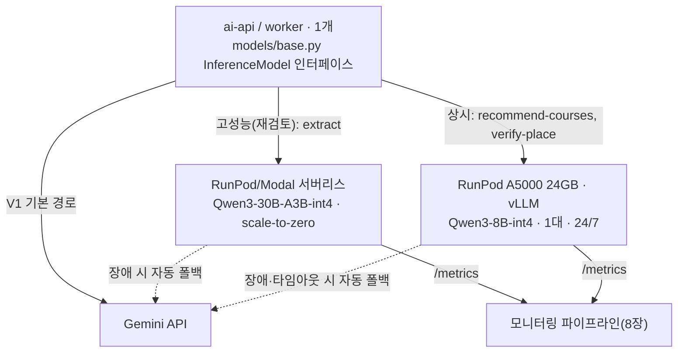
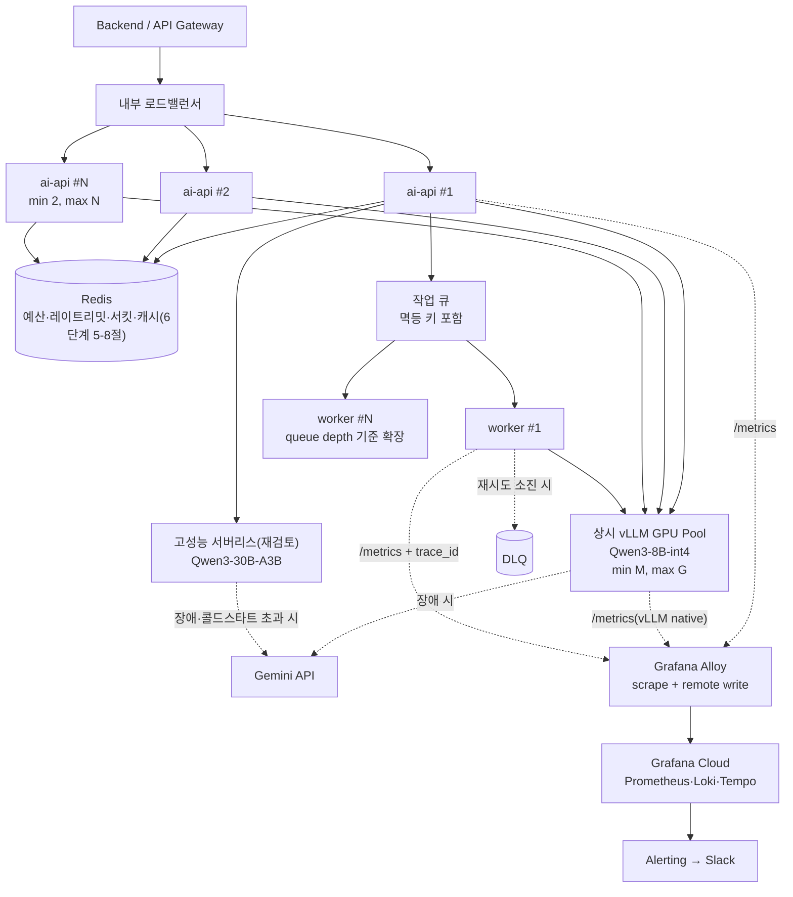

# [AI] 서비스 인프라 확장성과 모니터링 설계

**작성일**: 2026년 9월 13일

**작성자**: amy.kim, hayes.yu
### 목차
---
1. [범위와 결론](#1-범위와-결론)
2. [모델 서빙 전환 로드맵 — V1·V2·V3](#2-모델-서빙-전환-로드맵--v1v2v3)
3. [V3 모델 선정 과정](#3-v3-모델-선정-과정)
4. [태스크별 동기성·모델·폴백·SLO 확정](#4-태스크별-동기성모델폴백slo-확정)
5. [V3 GPU 플랫폼과 비용 — 파일럿 규모](#5-v3-gpu-플랫폼과-비용--파일럿-규모)
6. [배포 아키텍처 — 파일럿과 목표 운영 구조](#6-배포-아키텍처--파일럿과-목표-운영-구조)
7. [오토스케일 정책과 작업 큐 설계](#7-오토스케일-정책과-작업-큐-설계)
8. [모니터링과 관측성 설계](#8-모니터링과-관측성-설계)
9. [부하 테스트 계획](#9-부하-테스트-계획)
10. [비용 총계 — GPU 임대비를 넘어선 운영비](#10-비용-총계--gpu-임대비를-넘어선-운영비)
11. [인프라 설계가 서비스에 미치는 영향](#11-인프라-설계가-서비스에-미치는-영향)
- [부록 A — V3 모델 벤치마크 전문](#부록-a--v3-모델-벤치마크-전문)
- [부록 B — GPU 플랫폼·비용 비교 전문](#부록-b--gpu-플랫폼비용-비교-전문)
---

# 1. 범위와 결론

본 문서는 **AI Server(ai-api·worker)가 트래픽 증가와 모델 서빙 전환에 어떻게 확장되는지**를 다룹니다.

EC2·VPC·RDS·보안그룹 등 인프라 전반은 **인프라 담당(rowan)이 별도로 설계·소유**하며, 이 문서는 그 설계를 재정의하거나 수치를 가져다 쓰지 않습니다. 다만 AI 파트가 자신의 워크로드에 필요한 복제본 수·GPU 풀·공유 상태·네트워크 계약·관측성 계약을 명시하는 것은 이 문서의 책임입니다. 인프라팀의 실측 트래픽 수치를 그대로 쓰지 않더라도 **우리 워크로드 가정과 그 가정에서 나온 계산식**은 이 문서 안에서 제시합니다(7장).

**이 문서는 두 수준의 아키텍처를 분리해서 다룹니다.**

| 수준 | 정의 | 목적 |
| --- | --- | --- |
| **V3 파일럿** (5·6-1장) | AI API 1개, GPU 1개(A5000), Gemini 폴백 | 비용 최적화. **고가용성을 주장하지 않습니다** — GPU가 단일 장애점입니다 |
| **목표 운영 구조** (6-2·7장) | AI API 최소 2개(저비용, 무상태), GPU는 **트래픽이 늘 때만** 풀로 확장, 작업 큐 + Worker, 공유 상태, 관측 파이프라인 | 이 문서가 "높은 트래픽을 처리하는 인프라"로 제출하는 답 |

> [!IMPORTANT]
> **GPU 이중화(로컬 HA)와 현재 예산(₩300,000)은 동시에 성립하지 않습니다.** A5000 1대가 월 ₩161,000이므로 2대는 ₩322,000으로 이미 예산을 넘고, 배치 GPU·Gemini 사용료를 더하면 격차가 더 벌어집니다. 그래서 목표 구조에서도 **실시간 GPU는 트래픽이 실제로 늘기 전까지 1대를 유지**하고, 그 1대가 죽었을 때의 이중화는 두 번째 로컬 GPU가 아니라 **Gemini API(이종 장애조치)**가 맡습니다. AI API(무상태, 저비용)의 복제본 2개 이상과, GPU(고비용, 상태 없음)의 복제본 1개를 같은 기준으로 말하지 않습니다. 진짜 로컬 GPU 이중화는 예산이 늘어난 뒤의 별도 단계입니다(7-2절).

파일럿과 목표 구조를 같은 다이어그램에 섞으면 "지금 이미 확장돼 있다"는 오해를 주므로, 6장에서 둘을 명시적으로 나눠 그립니다.

```
V1 — 지금
   Gemini API 그대로 사용
        ↓
V2 — 마이그레이션 준비
   models/base.py 인터페이스 기준으로 로컬 모델 클라이언트 개발, Gemini와 병행 검증
        ↓
V3 파일럿 — 자체 서버 배포 시작
   실시간 경로 → Qwen3-8B-int4, RunPod A5000 1대, 24/7 상시 가동
   고성능 경로(재검토, 3-5절) → Qwen3-30B-A3B(MoE), 서버리스(scale-to-zero)
   두 경로 모두 로컬 모델 장애 시 Gemini로 자동 폴백
        ↓ 7장 트리거 조건 충족 시
목표 운영 구조 — 다중 인스턴스로 확장
   AI API 오토스케일링 그룹 + GPU replica pool + 작업 큐
```

---

# 2. 모델 서빙 전환 로드맵 — V1·V2·V3

### 2-1) 단계별 정의

| 단계 | 내용 | 완료 기준 |
| --- | --- | --- |
| **V1** | Gemini API로 전체 태스크 처리 | 현재 상태 |
| **V2** | `models/local.py`에 Qwen3-8B-int4 vLLM 클라이언트 구현, `models/base.py`의 `InferenceModel` 계약을 그대로 따름. 실트래픽에는 노출하지 않고 Gemini 응답과 비교 검증만 수행 | 태스크별(classification·extraction·generation·reasoning·tool_calling) 정확도가 자체 평가기 기준치를 만족 |
| **V3** | RunPod에서 shadow → 1% canary → 단계적 확대 → 자동 rollback 순서로 실트래픽에 노출. 이 단계의 목적 자체가 **운영 중 발생하는 에러를 잡는 것** | 안정적으로 실트래픽을 처리 |

> [!NOTE]
> "실트래픽 일부 또는 전체를 처리"라는 이전 표현은 전환 방식이 모호했습니다. 8B의 reasoning 점수(0.40)가 사용자 노출 품질에 직접 영향을 줄 수 있으므로, V3는 **shadow 트래픽(응답은 Gemini 것을 쓰고 로컬 모델 결과는 비교만) → 1% canary → 단계적 확대 → 문제 시 자동 rollback** 순서로 진행합니다.

### 2-2) V1→V2 전환이 쉬운 이유

6단계 문서(4-4절)가 `models/base.py`의 `InferenceModel` Protocol로 벤더를 추상화해뒀습니다. V2에서 새로 만드는 것은 `models/local.py` 하나뿐이고, `services/`는 `self.model.generate(request)`만 호출하므로 어떤 벤더를 쓰는지 모릅니다.

> [!NOTE]
> 이 인터페이스는 **벤더 교체를 쉽게 만드는 장치**이지, 그 자체로 **트래픽 확장성의 근거는 아닙니다.** "Gemini를 Qwen으로 바꿀 수 있다"와 "요청이 10배로 늘어도 버틴다"는 서로 다른 문제입니다. 트래픽 확장성은 무상태 API·공유 상태·작업 큐·다중 복제본·GPU 풀로 설명해야 하며, 이는 6·7장에서 다룹니다.

### 2-3) V3에서 "에러를 잡는다"는 것이 구체적으로 의미하는 것

Gemini API와 달리 자체 서빙은 아래 실패 지점을 우리가 직접 다뤄야 합니다.

| 실패 지점 | Gemini API(V1)에서는 | 자체 서빙(V3)에서는 |
| --- | --- | --- |
| 인프라 장애 | 벤더가 책임 | GPU 인스턴스 재시작, 헬스체크 직접 구현 |
| 모델 출력 스키마 위반 | 벤더 SDK가 어느 정도 보정 | vLLM 응답을 직접 파싱·검증, 재시도/폴백 로직 필요 |
| 동시 요청 처리 | 벤더가 스케일링 | GPU의 동시 처리 한계(배치 크기, KV 캐시)를 직접 관리 — 7장 |
| 콜드스타트 | 해당 없음 | 5장에서 다룸 — 운영 모드 선택의 핵심 변수 |

6단계 문서 5-6절의 폴백 전략(로컬 모델 장애 시 Gemini로 자동 전환)이 바로 이 리스크에 대한 안전판입니다. V3 초기에는 이 폴백이 자주 발동할 것으로 예상하고, 발동 빈도 자체를 관측 지표로 삼습니다(8장).

---

# 3. V3 모델 선정 과정

### 3-1) 자체 평가기 벤치마크

kanana-1.5-8b, qwen3-8b, qwen3-14b, midm-2.0-base(전부 int4 양자화) 4개 후보를 classification·extraction·generation·reasoning·tool_calling 5개 태스크와 지연으로 비교했습니다. Gemini 3.5 Flash-Lite도 참고값으로 함께 쟀습니다. **표 전문은 [부록 A](#부록-a--v3-모델-벤치마크-전문) 참고.**

> [!IMPORTANT]
> 이 표의 지연 수치는 **어떤 GPU에서, 동시 요청 몇 건으로, 웜업 이후에 측정했는지가 기록되어 있지 않습니다.** 단일 요청 벤치마크를 "GPU 1대의 처리량"으로 해석하면 안 됩니다 — 동시 요청이 늘면 배치 처리 때문에 개별 요청의 지연은 오히려 늘어날 수 있습니다. 이 표는 **모델 간 상대 비교**(어느 모델이 더 정확하고 빠른가)에만 쓰고, 7·9장의 용량 산정에는 재측정한 수치를 씁니다.

### 3-2) 국내 모델(kanana, midm)을 배제한 이유

점수만 보면 kanana-1.5-8b-int4(균형)와 midm-2.0-base-int4(reasoning 1.0)가 매력적입니다. 다만 **이번 자체 평가기의 태스크 난이도가 낮아서**, 이 점수가 실제 KeepGo 워크로드(자연어 제약 해석, 다단계 tool calling)에서도 재현될지 신뢰하기 어렵습니다. 국내 모델은 검증 트랙레코드가 상대적으로 짧아 이 불확실성을 상쇄할 근거가 부족합니다. Qwen은 다국어·tool calling 벤치마크에서 폭넓게 검증된 모델입니다. 난이도가 낮은 자체 평가기 점수만으로 판단하기 애매한 지점에서는 이쪽이 더 신뢰할 수 있습니다.

### 3-3) 8B vs 14B — 최종 확정: qwen3-8b-int4

14B는 reasoning이 8B보다 낫지만(0.60 vs 0.40) p95 지연이 15.4초로 6단계 문서 실시간 타임아웃(15초)을 이미 넘습니다(부록 A 비교표 참고). 지연 때문에 실시간 경로에 쓸 수 없어 이 시점에서 후보에서 제외합니다. reasoning 0.40은 알려진 한계로 남기고, V2 검증 단계에서 프롬프트 설계(few-shot, 구조화 출력 강제)로 보완 가능한지 확인합니다. 보완이 안 되면 4장의 canary 확대를 reasoning 비중이 낮은 태스크부터 시작해 리스크를 관리합니다.

### 3-4) 더 높은 추론이 필요한 경로의 별도 후보 — Qwen3-30B-A3B(MoE)

8B의 reasoning 한계를 프롬프트로도 못 메우는 경우를 대비해 별도 후보를 둡니다. 처음에는 이 모델을 지연에 관대한 배치성 기능 쪽에 두려 했으나 3-5절에서 배치 대상을 슬롯 추출(`extract`)로 바꿨습니다. 아래 아키텍처 특성 자체는 배치 대상과 무관하게 그대로 적용됩니다.

**Qwen3-30B-A3B는 MoE(Mixture-of-Experts) 구조입니다.** 전체 파라미터는 30B지만 토큰 하나를 처리할 때 실제로 켜지는 파라미터는 3B뿐입니다. 그래서 **VRAM은 30B만큼 필요한데 추론 속도는 3B급에 가깝습니다.** 대신 콜드스타트는 active param과 무관하게 전체 30B 가중치를 다 로딩해야 해서 8B보다 오히려 느립니다. VRAM·GPU 요구치·웜/콜드 비교표는 [부록 A](#부록-a--v3-모델-벤치마크-전문)에 정리했습니다.

> [!IMPORTANT]
> Qwen3-30B-A3B는 자체 평가기로 벤치마크된 적이 없습니다. 이 표는 MoE 아키텍처 특성에서 나온 **추정**이지 실측치가 아닙니다. V2 검증 단계에서 반드시 벤치마크한 뒤 채택 여부를 결정합니다. 이 모델의 배치 대상 태스크는 4장에서 확정합니다.

### 3-5) Qwen3-30B-A3B를 실시간 경로(`extract`)에 배치하는 안

3-4절은 30B-A3B를 배치성 경로 전용으로 뒀지만, 이 배정은 **"어느 태스크가 어려운가"가 아니라 "어느 태스크가 콜드스타트를 견디는가"**로 정한 것이었습니다. 실제로는 `verify-place`(장소 매칭)보다 `extract`(복합 제약 조건 구조화 — "7시까지 판교, 지하철로 40분 안에" 같은 문장을 파싱하는 일)가 더 높은 reasoning을 요구할 가능성이 큽니다. 3-1절 벤치마크에서 reasoning이 가장 낮은 모델(8B, 0.40)이 하필 가장 어려운 실시간 태스크에 붙어 있었습니다.

그래서 방향을 바꿉니다. **`extract`에 30B-A3B를 배치하는 쪽을 1차 목표로 잡되, 콜드스타트를 무조건 배제하지 않습니다.** 챗봇은 API 하드 타임아웃과 달리 사용자가 "생각 중" 상태를 어느 정도 견뎌주는 경로라, 상시 가동(콜드스타트 없음, 비용 높음)과 완전 서버리스(콜드스타트 있음, 비용 훨씬 낮음)를 둘 다 저울에 올립니다.

**콜드스타트를 포함한 총 소요시간(추정)**

30B-A3B-int4(~15~18GB)를 RunPod Network Volume에서 로딩하는 경우, vLLM·RunPod 공개 벤치마크(27~32GB급 모델 기준 콜드스타트 실측치)를 우리 모델 크기 비중으로 환산하면 다음과 같습니다.

| 최적화 수준 | 콜드스타트(추정) | 웜 추론(3-4절 추정) | 총 소요시간 | 챗봇 UX 판단(가정) |
| --- | --- | --- | --- | --- |
| 미최적화(vLLM 기본) | 약 150~250초 | 약 5~10초 | 약 2.5~4분 | 부적합 — 챗봇 응답으로는 너무 김 |
| 기본 최적화(weight prefetch·compile cache) | 약 60~100초 | 약 5~10초 | 약 1~2분 | 경계 — "생각 중" 표시를 병행해야 감내 가능한 수준 |
| 적극 최적화(RunPod FlashBoot류) | 약 10~30초 | 약 5~10초 | 약 15~40초 | 감내 가능 — 일반적인 챗봇 응답 지연 범위 |

> [!IMPORTANT]
> 이 표는 **우리 모델·우리 GPU에서 측정한 값이 아닙니다.** vLLM·RunPod가 보고한 27~32GB급 모델의 콜드스타트 실측치를 30B-A3B-int4의 대략적인 가중치 크기 비율로 환산한 추정일 뿐입니다. 실제 콜드스타트는 양자화 방식·네트워크 볼륨 처리량·vLLM 버전에 따라 달라지므로, V2 검증 단계에서 반드시 우리 환경으로 재측정합니다.

**V2에서 확인할 것**: ① 실제 콜드스타트 시간이 위 추정과 맞는지, ② 완전 서버리스로 돌렸을 때 월 비용이 예산 안에 들어오는지, ③ 상시 가동으로 돌렸을 때 GPU 임대비가 얼마나 늘어나는지. 이 세 가지를 실측해 상시 가동과 콜드스타트 허용 서버리스 중 하나를 고릅니다.

**실패 시 대안 — qwen3-14b로 통일**: 실측 결과가 비용이나 챗봇 UX 기준을 못 넘기면, `extract`와 배치성 경로 모두 **qwen3-14b-int4 하나로 통일**하는 절충안으로 갑니다. 14B는 dense라 int4 기준 VRAM이 30B-A3B보다 작고(~7GB대, A5000 24GB에 여유 있게 들어감) 상시 가동에 부담이 없어 콜드스타트 고민 자체가 사라집니다. reasoning은 0.60으로 8B(0.40)보다 낫고 30B-A3B(미검증, 기대치는 더 높음)보다는 낮은 중간 지점입니다. 3-3절이 14B를 제외했던 근거(p95 9.8초 vs 15.4초 비교)는 동시 요청 조건이 기록되지 않은 단일 요청 벤치마크였다는 한계가 있어(3-1절 IMPORTANT), 상시 가동 전용 환경에서 재측정하면 결과가 달라질 수 있습니다.

**결정 순서**: 30B-A3B 실측(비용·콜드스타트·총 소요시간) → 기준 통과 시 채택 → 미통과 시 14B 통일안 재검토 → 그마저 안 되면 8B(현재 확정값) 유지.

---

# 4. 태스크별 동기성·모델·폴백·SLO 확정

| 태스크 | 엔드포인트 | 동기성 | 주 모델 | 폴백 | SLO |
| --- | --- | --- | --- | --- | --- |
| 슬롯 추출 | `/extract` | 동기 | **재검토 중** — 1차 목표 qwen3-30b-a3b(3-5절), 실패 시 qwen3-14b 통일안, 현재 확정값은 qwen3-8b-int4 | Gemini | p95 13초(8-4절) |
| 후보 재순위 | `/recommend-courses` 내부 1단계 | 동기 | qwen3-8b-int4 (재순위·조합 같은 인스턴스) | Chroma 유사도 순서(6단계 5-6절) | `recommend-courses` 전체 SLO에 포함 |
| 코스 조합·제목 생성 | `/recommend-courses` 내부 2단계 | 동기 | qwen3-8b-int4 | 규칙 기반 조합(6단계 5-6절) | `recommend-courses` 전체 SLO에 포함 |
| 장소 검증 | `/verify-place` | **비동기** (6단계 문서 2-2절: 배치성·지연 허용) | qwen3-8b-int4 | Gemini | p95 15초 / p99 18초(8-4절) |
| 영상 분석 | `/analyze-video` | 비동기 | Gemini (유지) | 재처리 큐 | p95 50초 / p99 56초(8-4절) |
| 임베딩 | `/embed-places` | 비동기 | Gemini 임베딩 API(6단계 문서 2-2절 확정) | — | p95 8초 / p99 9초(8-4절) |

**qwen3-30b-a3b의 1차 배치 대상을 슬롯 추출로 잡은 이유**가 이 표의 핵심입니다. 여섯 태스크 중 추론 난도가 가장 높은 쪽은 슬롯 추출입니다. 사용자가 자유롭게 쓴 문장에서 지역·시간대·동행·예산·분위기를 한 번에 끊어내야 하고 "저녁에 조용한 데" 같은 표현은 명시되지 않은 조건까지 읽어야 합니다. 반면 장소 검증은 지도 API가 돌려준 정보와 영상에서 뽑은 정보를 대조해 같은 곳을 가리키는지 맞춰보는 작업이라 추론 부담이 슬롯 추출만큼 크지 않습니다. 처음에는 콜드스타트를 감당할 수 있느냐만 보고 배치성 엔드포인트인 장소 검증에 고성능 모델을 넣으려 했는데, 그러면 가장 쉬운 일에 가장 좋은 모델이 붙고 가장 어려운 일에 가장 약한 모델이 남습니다. 3-5절에서 이 순서를 뒤집었습니다.

슬롯 추출은 동기 경로라 콜드스타트가 그대로 사용자 대기 시간이 됩니다. 다만 이 경로는 챗봇 대화창이고 챗봇은 몇 초 더 기다려도 사용자가 비교적 납득하는 화면입니다. 그래서 무조건 배제하는 대신 3-5절에서 최적화 수준별 총 소요시간을 따져 감내 가능한 구간이 있는지 먼저 확인하기로 했습니다.

확정이 아니라 **재검토 중**으로 표기한 것은 V2에서 실측을 거쳐야 하기 때문입니다. 판단 순서는 이렇습니다. 30B-A3B의 콜드스타트와 총 소요시간을 재서 통과하면 슬롯 추출에 채택합니다. 통과하지 못하면 전체를 qwen3-14b로 맞추는 통일안으로 내려가고 그마저 비용이나 지연에 걸리면 현재 확정값인 qwen3-8b-int4를 유지합니다. 표의 "현재 확정값"은 이 사다리의 맨 아래 칸이자 실측 전까지 실제로 돌아가는 값입니다.

장소 검증은 이 변경으로 qwen3-8b-int4로 내려왔습니다. 슬롯 추출용 30B-A3B가 실측을 통과해 올라가더라도 GPU 한 장에 두 모델을 함께 올릴 수 없으므로, 장소 검증은 8B 인스턴스나 Gemini 폴백 쪽에 남습니다. 앞으로 복잡한 추론이 필요한 배치성 기능이 추가되면 그때 고성능 경로에 함께 배정할지 다시 판단합니다.

---

# 5. V3 GPU 플랫폼과 비용 — 파일럿 규모

> [!NOTE]
> 이 장의 수치는 **파일럿(AI API 1개, GPU 1개) 기준**입니다. 트래픽이 늘어 다중 GPU가 필요해지는 시점의 비용·구조는 7장(오토스케일 정책)과 10장(비용 총계)에서 별도로 다룹니다.

### 5-1) 플랫폼 비교 (실제 요금 기준, 24GB급 GPU)

RunPod(Community Cloud), Vast.ai, Modal, RunPod 서버리스, Lambda 다섯 곳의 실제 시간당 요금을 비교했습니다. **표 전문은 [부록 B](#부록-b--gpu-플랫폼비용-비교-전문) 참고.**

**Lambda·Vast.ai는 배제합니다.** Lambda는 24GB급 단일 GPU 옵션이 A10($1.29/h)뿐이라 예산과 안 맞고, Vast.ai는 개인 호스트 마켓플레이스라 가동 안정성을 보장받을 수 없습니다(interruptible은 예고 없는 회수, on-demand는 RunPod보다 비쌈). RunPod Community Cloud의 RTX A5000(24GB, $0.16/h)이 가격·안정성 모두에서 가장 낫습니다.

### 5-2) 운영 모드별 월 비용 — 예산 ₩300,000 기준

> [!NOTE]
> 환율은 1,380원/$로 가정했습니다(변동 가능). 예산 ₩300,000 ≈ $217. 이 비용은 **GPU 임대비만**이며, 전체 운영비는 10장에서 다룹니다.

RunPod A5000($0.16/h) 기준 무중단(24/7)·하루 8시간·트리거 기반(서버리스) 세 가지 운영 모드의 월 비용을 비교했습니다(부록 B). 24/7 상시 가동이 **$116.8(₩161,000)로 예산의 절반 수준**이라 가장 여유 있고, 나머지 두 모드는 더 저렴하지만 콜드스타트·운영 복잡도 트레이드오프가 있어 5-3절에서 최종 선택을 다룹니다.

### 5-3) 최종 선택: RunPod Community Cloud · RTX A5000(24GB) · 무중단(24/7)

트리거 기반(서버리스)이 압도적으로 저렴하지만 콜드스타트 지연이 걸립니다. V3의 목적이 "서버에 띄우고 에러를 잡는 과정"이므로, 콜드스타트라는 새 변수까지 처음부터 끼워 넣기보다 먼저 안정적으로 띄워 정상 동작을 확인하는 순서를 택했습니다.

> [!IMPORTANT]
> **AI API가 이 GPU 1대에 묶여 있다는 것은, 이 GPU가 단일 장애점이라는 뜻입니다.** 24/7 가동은 콜드스타트를 없애지만 가용성을 보장하지는 않습니다 — 인스턴스가 죽으면 6단계 문서 5-6절 폴백이 Gemini로 넘기긴 하지만, 그동안 로컬 모델 서빙 자체는 완전히 중단됩니다. 파일럿 단계에서는 이 리스크를 감수하며, 7장의 트리거 조건을 충족하면 다중 GPU로 확장합니다.

### 5-4) 고성능 경로: 왜 "항상 웜"이 아니라 완전 서버리스인가

4장에서 정한 대로 Qwen3-30B-A3B의 1차 배치 대상은 `extract`입니다. 이 경로가 동기라는 게 문제입니다 — 서버리스로 돌리면 콜드스타트가 그대로 사용자 대기 시간이 되므로, 원칙대로라면 항상 웜으로 띄워두는 편이 맞습니다.

그런데 비용이 그 선택을 막습니다. A100 40GB를 완전 서버리스(scale-to-zero)로 쓰면 월 $10~20대지만 콜드스타트를 없애려고 항상 웜으로 띄우면 월 $1,533(₩2,115,000)로 예산을 7배 넘깁니다(비교 표는 부록 B). 30만 원 예산에서 상시 웜은 검토 대상이 아닙니다.

그래서 이 경로에 30B-A3B를 쓰기로 한다면 운영 방식은 완전 서버리스 하나뿐이고 **채택 여부는 곧 콜드스타트를 챗봇 UX로 흡수할 수 있느냐의 문제로 좁혀집니다.** 3-5절의 최적화 수준별 총 소요시간 표가 그 판단 근거이고 흡수되지 않으면 같은 절의 결정 순서에 따라 14B 통일안, 다시 8B 유지로 내려갑니다. 14B 통일안이 매력적인 이유가 여기 있습니다 — A5000에 상시로 올라가므로 콜드스타트 문제 자체가 사라집니다.

`verify-place`·`analyze-video`·`embed-places`는 배치성이라 지연을 허용하지만(6단계 문서 2-2절) 8B와 Gemini로 처리하므로 별도 GPU가 필요하지 않습니다.

### 5-5) V3 파일럿 구성 요약

| 경로 | 태스크 | 모델 | 플랫폼 | 운영 방식 | 월 비용(추정) |
| --- | --- | --- | --- | --- | --- |
| 상시 | `recommend-courses`(재순위·조합 포함), `verify-place` | qwen3-8b-int4 | RunPod A5000 24GB | 24/7 상시, **1대(파일럿)** | $116.8 (₩161,000) |
| 고성능(재검토, 3-5절) | `extract` | qwen3-30b-a3b-int4 (미검증) | RunPod/Modal A100 40GB | 완전 서버리스 | 월 $10~20대(추정) |

### 5-5-1) 서빙 엔진 선택 — vLLM

**TGI는 후보에서 제외합니다.** 2025년 12월부터 유지보수 모드로 전환돼 신규 기능이 없고, HuggingFace 스스로 vLLM이나 SGLang을 권장합니다.

**TensorRT-LLM은 지금 단계엔 과합니다.** H100 기준 vLLM보다 처리량이 15~30% 높지만, 모델 하나당 약 28분의 컴파일 단계가 필요합니다. 지금은 Qwen3-8B·14B·30B-A3B를 계속 바꿔가며 검증하는 단계라(V2, 3장), 모델을 바꿀 때마다 28분씩 재컴파일하는 비용을 감당할 이유가 없습니다.

**SGLang은 근접 대안이지만 지금 시점엔 안 맞습니다.** RadixAttention 덕분에 prefix가 반복되는 워크로드에서 vLLM보다 처리량이 최대 약 29% 높습니다. 다만 메트릭 엔드포인트가 추론 포트와 같은 포트를 공유해서, 8-1절이 이미 정한 "모델 요청 Bearer 토큰과 메트릭 수집 자격증명을 분리한다"는 원칙과 바로 부딪힙니다. 커뮤니티도 vLLM보다 작습니다(빠르게 크고는 있습니다).

**vLLM을 유지하는 이유는 최고 성능이 아니라 지금 단계에 맞는 유연성입니다.** 모델을 자주 교체해도 재컴파일이 필요 없고, int4 양자화의 사실상 표준인 AWQ-Marlin 커널을 지원하며, 커뮤니티가 가장 넓어 V3의 목적(자체 서빙 운영 중 만나는 에러에 대응하는 경험, 2-3절)에 필요한 참고 자료를 구하기 쉽습니다.

> [!NOTE]
> 재검토 조건: 모델이 확정되고 `recommend-courses`처럼 같은 시스템 프롬프트를 반복 재사용하는 경로에서 처리량이 병목이 되면, 그때 SGLang(RadixAttention)을 다시 검토합니다. 비교 표는 [부록 B](#부록-b--gpu-플랫폼비용-비교-전문) 참고.

### 5-6) 컨테이너화 — RunPod에 배포하는 방식

| 항목 | 내용 |
| --- | --- |
| 이미지 | `keepgo-vllm:qwen3-8b-int4`, `keepgo-vllm:qwen3-30b-a3b-int4` |
| 모델 가중치 | 이미지에 포함하지 않고 컨테이너 시작 시 Hugging Face Hub에서 내려받아 RunPod Network Volume에 캐싱 |
| 레지스트리 | Docker Hub (Private Repository) |
| 헬스체크 | vLLM `/health` → RunPod readiness 체크 |
| 태그 | Git commit SHA, `latest` 미사용 |
| **네트워크 인증** | AI API ↔ RunPod GPU 엔드포인트 사이에 공유 비밀키(Bearer 토큰) 헤더를 강제합니다. GPU 엔드포인트를 인증 없는 공개 URL로 두지 않습니다 |

### 5-7) 매니지드 추론 API를 검토했지만 채택하지 않은 이유

GPU를 직접 빌리는 방식(RunPod) 외에, 모델 호스팅 자체를 맡기고 토큰당 요금만 내는 매니지드 추론 API(OpenRouter, DeepInfra, Together AI, Fireworks AI 등)도 함께 검토했습니다. DeepInfra 기준으로 계산하면 Qwen3-8B 요청당 약 $0.00015, KeepGo 규모에서 월 ₩1,000~3,000대로 RunPod(₩161,000)보다 훨씬 싸고, 콜드스타트도 없고, GPU 운영 부담도 없습니다(비교 표는 부록 B).

숫자만 보면 매니지드 API가 압도적으로 유리합니다. **그럼에도 채택하지 않은 이유는, 그렇게 하면 V3가 아니라 V1의 반복이 되기 때문입니다.** **자체 호스팅 경험 자체가 V3의 목적**이므로, 비용·안정성 비교와 무관하게 RunPod 하이브리드를 유지합니다.

---

# 6. 배포 아키텍처 — 파일럿과 목표 운영 구조

### 6-1) V3 파일럿 (현재)



**이 구조는 비용 최적화 목적의 파일럿이며, 고가용성 배포 구조가 아닙니다.** AI API도 GPU도 각각 1개뿐이라, 어느 한쪽이 죽으면 그 경로 전체가 폴백에 의존합니다.

### 6-2) 목표 운영 구조 (7장 트리거 충족 시)



파일럿과의 차이는 세 가지입니다 — **AI API가 다중 복제본**(로드밸런서 필요, 저비용이라 바로 2개 이상), **공유 상태가 Redis로 외부화**(6단계 5-4·5-8절), **GPU는 여전히 1대를 유지하되 Gemini 폴백을 이종 장애조치로 명시적으로 편입**합니다. GPU가 실제로 풀(2대 이상)로 늘어나는 것은 7-2-1절의 100배 시나리오처럼 트래픽이 GPU 1대 용량을 넘어설 때이며, 그 전까지는 다이어그램의 "GPU Pool"이 곧 "GPU 1대"입니다. 세부 확장 규칙은 7장에서 수치로 정의합니다.

---

# 7. 오토스케일 정책과 작업 큐 설계

### 7-1) 확장·축소 규칙

| 대상 | 확장 입력 | 축소 입력 | 보호 장치 |
| --- | --- | --- | --- |
| AI API | RPS, 동시 요청 수, p95/p99, 요청 대기 시간 | 저부하 지속 시간(예: 10분) | 최소 2개(목표 운영 시), readiness 체크 통과 후 트래픽 편입, graceful drain(SIGTERM 후 진행 중 요청 완료까지 대기) |
| worker | **queue depth, 가장 오래 기다린 작업의 대기 시간(oldest-job-age)** — CPU 아님 | 대기열이 비어 있는 상태 지속 | DLQ, 멱등 키, 최대 재시도 횟수 |
| GPU pool | vLLM 대기 요청 수, KV cache 사용률, GPU 메모리, TTFT(첫 토큰까지 시간), 처리 토큰/초 | 지속 저부하 | warm replica 유지 수, cooldown, 최대 GPU 수 |

**worker를 CPU가 아니라 queue depth로 확장하는 이유**는, worker의 실제 병목이 CPU 연산이 아니라 "처리를 기다리는 작업이 쌓이는 것"이기 때문입니다. CPU 기준으로 확장을 걸면 큐가 쌓이고 있어도 CPU는 한가해 보여 확장이 트리거되지 않습니다. 이는 6단계 문서 5-5절이 지적한 "지연에 관대한 호출이 지연에 민감한 호출을 죽이는" 문제의 worker 버전입니다.

### 7-2) 필요 GPU 수 계산식

인프라팀의 MAU 수치를 그대로 쓰지 않는 대신, 계산식을 제시합니다.

```
현 예산 단계 (로컬 GPU 이중화 없음, 장애는 Gemini 이종 폴백):
   필요 GPU 수 = ceil(피크 실시간 RPS / 부하 테스트로 측정한 GPU 1대의 SLO 충족 RPS)

예산 증액·로컬 HA 단계:
   필요 GPU 수 = ceil(피크 실시간 RPS / GPU 1대의 SLO 충족 RPS) + 1 (장애 허용 여유)
```

두 식을 나눈 이유는 아래 "`min=2`는 GPU pool에는 적용하지 않습니다"와 맞물립니다. 현 예산에서는 장애 여유를 두 번째 GPU가 아니라 Gemini 폴백이 맡으므로 `+1`이 붙지 않습니다. `+1`은 로컬 GPU 이중화를 예산으로 감당할 수 있게 된 뒤에만 켜집니다. 한 식에 `+1`을 박아두면 "GPU는 1대"라는 현재 정책과 산술적으로 충돌합니다.

**GPU 1대의 SLO 충족 RPS**는 3-1절의 단일 요청 벤치마크가 아니라, 9장의 부하 테스트로 실측합니다.

**`min=2`는 AI API에는 적용하지만 GPU pool에는 적용하지 않습니다.** 1장에서 밝힌 대로 A5000 2대는 그 자체로 예산을 넘습니다(₩322,000 > ₩300,000). 그래서 GPU pool은 `min=1`을 유지하고, 이 1대가 실패할 때의 이중화는 **Gemini API 폴백**(이종 장애조치)이 담당합니다. 이건 "GPU를 이중화하지 않는다"는 것이지 "이중화를 안 한다"는 뜻이 아닙니다 — 다만 그 이중화 수단이 같은 종류(GPU 한 대 더)가 아니라 다른 종류(외부 API)라는 점이 다릅니다. GPU가 진짜 여러 대로 늘어나는 시점은 **7-2절 계산식이 `ceil(피크 RPS / GPU 1대 RPS) ≥ 2`를 요구할 때**, 즉 트래픽이 실제로 GPU 1대의 용량을 넘어설 때입니다 — 이때는 예산 자체를 늘리는 결정이 함께 필요합니다(10장).

### 7-2-1) 100배 성장 시나리오

제출 항목이 요구하는 "일별 사용자 수에 따라 몇 대의 서버가 필요한가"에 대한 답입니다.

> [!IMPORTANT]
> **"시간당 36건"은 시간 평균이지, 용량 산정에 쓸 피크 RPS가 아닙니다.** 36건이 한 시간에 고르게 들어오면 0.01 RPS지만, 실제로는 사용자가 특정 시간대(저녁 식사·약속 시간대 등)에 몰려서 쓰는 서비스라 훨씬 짧은 창에 몰릴 가능성이 높습니다. GPU·AI API의 동시 처리 용량은 시간 평균이 아니라 **짧은 창의 burst**로 결정됩니다. 그래서 기준선을 세 종류로 나눕니다.

| 지표 | 값(가정) | 용도 |
| --- | --- | --- |
| 시간당 요청 수 | 약 36건 (6단계 문서 5-7절, 초기 가정치) | 월 비용 추정, 일반적인 처리량 감 잡기 |
| **5분 창 최대 RPS** | 36건이 5분(300초)에 집중된다는 보수적 가정 → 36/300 ≈ **0.12 RPS** | GPU·API의 최소 용량 산정, HPA 기준 |
| 동시 진행 요청 최고치 | 5분 집중 가정 + 응답시간 13초(9-1절과 같은 보수적 고정값 — `/extract` p95 13초 기준, `/recommend-courses` p95는 12초라 이보다 짧음)로 역산 → 0.12 × 13 ≈ **약 1.6건 동시 진행** | vLLM KV cache·큐잉 한계 판단 |

이 문서의 GPU·API 용량 산정은 **시간당 36건이 아니라 5분 창 기준 0.12 RPS**를 기준선으로 씁니다.

| 시나리오 | 피크 실시간 RPS(5분 창 기준) | GPU 1대 SLO 충족 RPS | 산정 GPU 수 | AI API 복제본 | 예산 영향 |
| --- | --- | --- | --- | --- | --- |
| 현재 파일럿 | 0.12 RPS (기준선) | 9장 부하 테스트 후 측정 | 1 | 1 | 현재 ₩161,000 |
| 10배 | 1.2 RPS | 부하 테스트 후 측정 | 계산식 적용 — 기준선의 10배는 여전히 낮은 축이라 GPU 1대 유지 가능성 높음 | 2(HA 목표 최소값) | 현재 예산 내 |
| 100배 | 12 RPS | 부하 테스트 후 측정 | 현 예산 단계 식(`+1` 없음) 적용 — 이 지점에서 GPU 2대 이상이 트래픽만으로 필요해질 가능성이 큼. 로컬 HA(`+1`)까지 원하면 여기에 1대 더 | HPA 범위 내 | **예산 재산정 필요** — 1장 예산 한계를 넘을 가능성이 높음 |

> [!NOTE]
> "GPU 1대 SLO 충족 RPS"는 실측 전 빈칸입니다. 실측이 없는 지금은 "5분 창에 36건이 집중된다"는 보수적 burst 계수로 9장 부하 테스트의 초기 목표 RPS를 정하고, 실제 요청 로그가 쌓이면 시간당 수치가 아니라 5분/1분 창 burst 패턴으로 이 표 전체를 갱신합니다.

> [!NOTE]
> GPU 증설에는 모델 다운로드·가중치 로딩 시간이 있어(5-6절 Network Volume 캐싱으로 일부 단축), 일반적인 HPA(CPU 기반 웹 서버 오토스케일링)처럼 즉시 용량이 생긴다고 가정하면 안 됩니다. 확장 트리거가 발동한 시점과 실제로 새 GPU가 트래픽을 받는 시점 사이에 수 분의 공백이 있을 수 있습니다.

### 7-3) 비용 상한과 증설 제한

GPU pool 확장은 7-2절 계산식과 별개로 **10장의 비용 상한**에 걸립니다. 예산 상한에 도달하면 신규 GPU 증설을 멈추고, 초과 요청은 대기열에 쌓이거나(배치성) Gemini 폴백으로 처리합니다(실시간). 확장이 곧 무제한 비용 지출을 뜻하지 않도록, 최대 GPU 수는 항상 10장의 비용 상한에서 역산한 값으로 고정합니다.

### 7-4) 배치 작업 큐 설계

`verify-place`, `analyze-video`, `embed-places`처럼 비동기로 처리하는 태스크는 다음 요소를 갖춘 작업 큐를 통과합니다.

| 요소 | 설계 |
| --- | --- |
| 멱등 키 | Backend가 요청 시 부여 — 동일 작업이 재시도로 중복 생성되는 것을 방지 |
| 재시도 정책 | 6단계 5-3절의 재시도 정책(최대 2회, 지수 백오프)을 큐 컨슈머 레벨에도 동일 적용 |
| 실패 작업 보관(DLQ) | 최대 재시도를 소진한 작업은 DLQ로 이동, 사람이 원인 확인 후 수동 재처리 |
| 상태 조회 | Backend가 작업 ID로 진행 상태(대기·처리 중·완료·실패)를 조회할 수 있는 API |

### 7-4-1) Redis Streams 장애 복구

7-5절에서 Redis를 캐시·예산·레이트리밋·서킷브레이커뿐 아니라 작업 큐(Redis Streams)로도 쓰기로 했습니다. **캐시·예산 카운터는 유실돼도 재계산하면 그만이지만, 처리 중이던 비동기 작업은 Redis가 죽으면 그 작업 자체가 사라질 수 있어 성격이 다릅니다.** 이 구분을 명확히 합니다.

| 항목 | 정책 |
| --- | --- |
| **업무 작업의 정본** | **Backend DB가 소유**합니다. Redis Streams는 정본이 아니라 전달·처리 상태를 담는 통로입니다 — `verify-place`·`analyze-video`·`embed-places` 요청 자체는 Backend가 생성 시점에 자기 DB에 먼저 기록하고, Redis Streams에는 처리를 위한 참조(작업 ID)만 넣습니다 |
| Redis 재시작 후 복구 | Backend가 자신의 DB에서 **lease가 만료된** 작업만 골라 Redis Streams에 다시 발행합니다. Redis가 완전히 비워져도 Backend DB 기준으로 복구할 수 있습니다 |
| **중복 처리 방지** | "5분 이상 처리 중이면 재발행"만 두면, 정상적으로 오래 걸리는 영상 분석(60초 타임아웃 + 재시도면 수 분)이 아직 돌고 있는데 또 발행될 수 있습니다. 세 겹으로 막습니다. ① worker가 처리 중인 작업의 **lease(예: 3분)를 주기적으로 heartbeat로 갱신**하고, Backend는 lease가 만료된 작업만 재발행 대상으로 봅니다 — 살아있는 worker가 잡고 있는 작업은 lease가 계속 연장돼 재발행되지 않습니다. ② 작업 상태 전환을 **버전 기반 CAS**로 처리해, 재발행된 작업을 두 worker가 동시에 잡아도 `processing` 권한은 하나만 얻습니다. ③ worker가 **외부 API(Gemini·RunPod)를 호출하기 직전에 Backend 멱등 키를 한 번 더 검사**해, 이미 완료된 작업의 재발행이 중복 Gemini 호출(= 중복 비용)로 이어지지 않게 합니다 |
| Consumer Group pending entry | idle 시간(예: 2분, 배치 작업 특성상 여유 있게)을 넘긴 pending entry는 다음으로 poll하는 worker가 `XCLAIM`으로 reclaim합니다. 이미 처리 중이던 worker가 죽은 경우를 이렇게 흡수합니다 |
| DLQ 영속성 | Redis AOF(Append Only File)로 최소한의 영속성을 확보하되, **DLQ의 최종 정본도 Backend의 실패 작업 테이블**입니다. 이관 시점에 DLQ 진입 사실을 Backend에 기록해, Redis AOF가 손상돼도 "무엇이 실패했는지"는 Backend에 남습니다 |

이렇게 하면 "Redis가 유실돼도 서비스 중단이 아니다"(6단계 문서 5-8절 캐시 원칙)라는 말이 **작업 큐까지 포함해도 성립**합니다. Redis는 어디까지나 전달 계층이고 업무 데이터의 정본은 항상 Backend에 있기 때문입니다.

### 7-5) 구성 요소별 기술 선택

지금까지 "작업 큐", "GPU pool", "Redis"라고 부른 것들을 실제 제품·운영 방식으로 확정합니다.

| 구성요소 | 선택 | 이유 |
| --- | --- | --- |
| 작업 큐 | **Redis Streams** | SQS·RabbitMQ 같은 별도 제품을 새로 들이지 않고, 5-8절(6단계 문서)부터 이미 쓰는 Redis 안에서 큐까지 처리합니다. Consumer Group으로 멱등 처리·재시도·가시성 timeout을 구현할 수 있어 7-4절 요구사항을 충족합니다 |
| Redis 운영 형태 | **Self-hosted 단일 인스턴스**(파일럿), Managed Redis는 목표 구조에서 재검토 | 지금은 AI 파트 예산 안에서 새 매니지드 서비스 비용을 추가하지 않습니다. TTL·메모리 상한을 설정해 무한정 커지지 않게 합니다. Redis에 두는 상태는 성격이 둘로 갈립니다 — 캐시·예산 카운터·서킷 상태는 **유실돼도 재계산 가능**하므로 백업 없이 두고(6단계 문서 5-8절 캐시 원칙), 작업 큐(Streams)·DLQ는 **AOF와 Backend 실패 작업 테이블로 이중 보호**합니다(7-4-1절). 어느 쪽이든 업무 데이터의 정본은 Backend라, Redis 장애가 서비스 중단으로 이어지지 않습니다 |
| GPU pool 라우터 | **GPU 대수에 따라 3단계로 전환** — 아래 표 | round-robin은 GPU 1대일 때만 적합합니다. 요청 길이·KV cache·대기열이 GPU마다 달라지면, 단순 순환은 이미 포화된 GPU에 계속 요청을 보낼 수 있습니다 |
| ai-api / worker 실행 환경 | **결정 보류 — 인프라팀과 조율** | 1장 경계대로 컴퓨트 실행 환경(ECS·EKS·EC2+Docker Compose 등)은 인프라팀 소관입니다. AI 파트가 요구하는 조건만 명시합니다: 무상태 컨테이너, 수평 확장 가능, `/health` readiness 엔드포인트 제공. rowan님의 V1 설계가 이미 Docker Compose 기반이므로, 목표 구조 전환 시점에는 그 기반 위에서 오토스케일링 그룹으로 확장하는 경로가 가장 자연스럽습니다 |

| GPU 대수 | 라우팅 방식 |
| --- | --- |
| 1대 (현재 파일럿) | 단일 endpoint + health check — 분산 로직 자체가 불필요 |
| **2~9대** | **최소 in-flight 요청 수 또는 최소 큐 길이 기준**의 client-side 선택. 실패한 endpoint는 즉시 목록에서 제외. 이 상태 정보는 8장의 metrics scrape 주기(초 단위 이상)보다 빨라야 하므로, AI API가 각 GPU 호출의 완료·실패를 직접 관찰해 자체적으로 갱신하는 경량 카운터를 씁니다(별도 metrics 파이프라인을 거치지 않음) |
| 10대 이상 | 전용 모델 게이트웨이 또는 service discovery 재검토 |

"GPU가 소수일 때는 round-robin으로 충분하다"는 이전 판단은 **"두 자릿수가 될 때까지"가 아니라 "1대일 때만"**으로 좁혀야 정확합니다. 2대가 되는 순간부터 이미 GPU 간 부하 차이가 생길 수 있습니다.

### 8-1) 수집 파이프라인

`/metrics`를 노출하는 것만으로는 수집 체계가 완성되지 않습니다. **누가 그것을 긁어가서 어디로 보내는지**까지 정의합니다. Grafana Alloy 하나가 metrics·logs·traces를 모두 다룰 수 있지만, 신호 종류마다 전송 경로가 다르므로 나눠서 명시합니다.

```
Metrics: prometheus.scrape (Alloy) → prometheus.remote_write → Grafana Cloud Metrics
Logs:    구조화 로그(OTLP logs) → loki.write (Alloy)         → Grafana Cloud Loki
Traces:  OpenTelemetry SDK → OTLP → trace sampling (Alloy)    → Grafana Cloud Tempo
```

**Alloy를 어디에 두는가**가 RunPod GPU 쪽에서 중요한 결정입니다. AI Server 쪽 Alloy가 RunPod GPU의 `/metrics`를 당겨오려면(pull-scrape) GPU 인스턴스의 metrics 포트를 외부에 열어야 하는데, 이건 5-6절에서 이미 "GPU 엔드포인트를 인증 없는 공개 URL로 두지 않는다"는 원칙과 부딪힙니다. 그래서 **Alloy를 GPU 호스트(RunPod 컨테이너) 쪽에 함께 배치**하고, GPU에서 Grafana Cloud로 아웃바운드 전송(push)하는 방식을 씁니다 — 포트를 여는 대신 나가는 연결만 허용하면 됩니다.

| 신호 | 노출 주체 | 수집 위치 | 전송 |
| --- | --- | --- | --- |
| Metrics | ai-api·worker·vLLM `/metrics`(Prometheus 포맷) | AI Server 쪽 Alloy(자기 프로세스), GPU 쪽 Alloy(vLLM) | remote_write → Grafana Cloud Metrics |
| Logs | 구조화 로그(6단계 6-5절 마스킹 원칙 적용) | 각 프로세스에서 직접 | loki.write → Grafana Cloud Loki |
| Traces | OpenTelemetry SDK가 발행하는 `trace_id` 기반 스팬 | 각 프로세스에서 직접 | OTLP → Grafana Cloud Tempo |

**인증은 두 종류를 분리합니다.** 모델 요청에 쓰는 Bearer 토큰(5-6절)과 metrics/logs/traces 수집용 자격증명(Grafana Cloud API 키)은 서로 다른 값을 씁니다 — 하나가 유출돼도 다른 하나에는 영향이 없도록 합니다. GPU→Grafana Cloud 아웃바운드는 IP allowlist 또는 mTLS로 추가 제한합니다.

**Prometheus 레이블에 고카디널리티·민감 값을 넣지 않습니다.** `trace_id`, 사용자 ID, GPS 원문 같은 값은 metrics label이 아니라 traces·logs에만 둡니다. metrics label은 `endpoint`, `model`, `provider`, `오류 유형`처럼 값의 종류가 제한된 집합만 씁니다. 그렇지 않으면 Prometheus의 시계열 수가 폭발해 저장·조회 비용이 예측 불가능해집니다.

### 8-2) 수집 지표

| 범주 | 지표 | 목적 |
| --- | --- | --- |
| 사용자 관점 | 엔드포인트별 p50/p95/p99, 성공률, end-to-end 지연 | 7-2절 SLO 판정 |
| 모델 관점 | TTFT(첫 토큰까지 시간), 토큰 생성 속도, 입력·출력 토큰 수, 모델별 품질 실패율 | vLLM `/metrics`가 기본 제공 |
| GPU 관점 | 실행·대기 요청 수, KV cache 사용률, VRAM, OOM 발생, GPU 사용률 | 7-1절 GPU pool 확장 판단 — **GPU 사용률만으로는 증설 시점을 판단하기 어려워**, 대기 요청 수와 KV cache 사용률을 함께 봅니다 |
| 큐 관점 | queue depth, 작업 대기 시간, DLQ 건수, 재시도 횟수 | 7-1절 worker 확장 판단 |
| 외부 의존성 | Gemini·지도 API 성공률, 서킷브레이커 상태(6단계 5-7절) | |
| 모델 서빙(V3) | **Gemini 폴백 발동 빈도**(사유별 분해 포함) | 2-3절 — V3 안정성의 직접적 지표 |
| 운영 | 인스턴스 수, readiness 실패, 비용 예측 대비 실제 비용 | |

**오류율은 엔드포인트·모델·provider(Gemini/RunPod)·오류 유형·폴백 사유별로 분해합니다.** 뭉뚱그린 오류율 하나로는 "Gemini가 문제인지 RunPod가 문제인지 모델 출력이 문제인지"를 구분할 수 없습니다.

### 8-3) 트레이스와 로그

- **OpenTelemetry trace**: `trace_id` 하나로 `ai-api → worker → vLLM/Gemini` 호출 사슬을 연결합니다. 실패가 어느 구간에서 발생했는지 로그를 뒤지지 않고 트레이스 한 번으로 추적합니다.
- **구조화 로그**: 6단계 문서 6-5절의 마스킹 원칙(GPS·영상 URL·모델 응답 원문의 보존 기간·마스킹)을 그대로 적용해 Loki에 적재합니다.

### 8-4) SLO와 알림을 구분합니다

| 종류 | 예시 | 측정 창 |
| --- | --- | --- |
| **용량 경보** (내부 신호) | `/extract` p95가 타임아웃의 70% 초과 | 5분 — 빠른 대응용 |
| **서비스 SLO** (사용자 관점 목표) | 아래 표 | 30일 — 장기 품질 목표 |

"p95가 타임아웃의 70%"는 용량 경보로는 유용하지만 그 자체가 서비스 SLO는 아닙니다. 이전 버전은 이 둘을 구분하지 않았습니다.

**서비스 SLO는 모델 호출 타임아웃보다 짧아야 합니다.** `/extract`의 모델 호출 타임아웃이 15초(6단계 문서 5-2절)인데 서비스 SLO도 p95 15초로 같으면, 네트워크 왕복·직렬화·재시도에 쓸 여유가 전혀 없습니다. 타임아웃은 "이 이상 기다리면 실패로 처리한다"는 하드 리밋이고, SLO는 그보다 안쪽에서 지켜야 하는 목표입니다.

| 엔드포인트 | 모델 호출 타임아웃(6단계 문서) | 서비스 SLO(p95) | 서비스 SLO(p99) | 여유 |
| --- | --- | --- | --- | --- |
| `/extract` | 15초 | **13초** | 14.5초 | 네트워크·직렬화·재시도용 2초 — 단일 모델 호출이라 이 정도로 충분 |
| `/recommend-courses` | 개별 호출은 각각 타임아웃(6단계 5-2절), 전체는 15초 deadline(6단계 5-3절 신설) | **12초** | **13.5초** | 1.5초 — `/extract`보다 좁게 잡습니다 |

**`/recommend-courses`의 p99를 `/extract`와 같은 14.5초로 두면 안 됩니다.** 15초 하드 deadline까지 0.5초밖에 안 남아, 지도 API 호출 1회가 조금만 늦어져도(6단계 5-2절 타임아웃 5초 중 일부만 써도) 여유를 넘깁니다. `/recommend-courses`는 Chroma+모델+지도 API를 순차로 묶는 경로라 실패 지점이 더 많으므로, **p99를 13.5초로 더 안쪽에 두고 1.5초를 하드 deadline과의 완충 구간으로 남깁니다.** 이 완충 구간 안에서도 시간이 부족하면, 6단계 문서 5-3절의 규칙대로 재시도를 생략하고 즉시 폴백(5-6절 규칙 기반 조합)으로 전환합니다 — "p99 13.5초를 넘긴 뒤에도 재시도를 계속 시도하다 15초에 실패로 끝나는" 상황을 만들지 않습니다.

이 표는 6단계 문서 5-3절에서 새로 정의한 "엔드포인트 전체 deadline"과 짝을 이룹니다 — 6단계 문서가 *언제 재시도를 포기하고 폴백으로 넘어가는지*(15초 하드 리밋)를 정했다면, 이 표는 *정상적으로는 몇 초 안에 끝나야 하는지*(목표치)를 정합니다.

| 조건 | 채널 | 종류 |
| --- | --- | --- |
| Gemini 폴백 발동 비율이 지속적으로 높음 | Slack | 용량 경보 |
| 서킷브레이커 개방 | Slack | 용량 경보 |
| `/extract` p95가 타임아웃의 70% 초과 | Slack | 용량 경보 |
| RunPod 월 누적 비용이 예산에 근접 | Slack | 비용 경보 |
| 30일 p95/p99 또는 성공률이 SLO 미달 | Slack + 주간 리뷰 | SLO 위반 |

---

# 9. 부하 테스트 계획

실행 가능한 스테이징 환경이 아직 없어 실제 결과는 포함하지 않습니다. 다만 재현 가능한 계획이 되도록 정량화합니다.

### 9-1) 부하 프로필

| 구간 | 시간 |
| --- | --- |
| Warm-up | 5분 |
| 단계적 증가(ramp) | 10분 |
| 피크 유지 | 15분 |
| 회복(recovery) | 5분 |

| 항목 | 값 |
| --- | --- |
| 엔드포인트별 요청 비율 | **초기 테스트용 placeholder — `extract` : `recommend-courses` : `verify-place` = 5 : 3 : 2.** 근거: 대화 한 턴에서 `extract`가 먼저 호출되고(가장 빈번), `recommend-courses`는 조건이 갖춰졌을 때만 호출되며(그보다 적음), `verify-place`는 후보 장소당 한 번이라 가장 드묾. 실제 로그가 없어 이 비율 자체도 추정입니다 — V2 검증 데이터가 쌓이면 이 표를 실측 비율로 교체합니다 |
| `extract` 입력·출력 토큰 | 입력 ~500 / 출력 ~200 토큰 가정 (6단계 문서 7-2-1절 손익분기 계산, 그리고 이 문서 10장 비용 총계와 동일한 가정을 재사용) |
| `recommend-courses` payload | 후보 장소 수(Chroma 검색 결과) ~20개 가정, 재순위 입력에 후보 요약 포함(입력 ~1,500토큰), 조합 출력(코스 3~5개, 각 제목 포함, 출력 ~400토큰), 지도 API 호출 ~10회(후보 간 이동시간) |
| 목표 RPS(단계별) | 7-2-1절의 **5분 burst 기준선 0.12 RPS**의 1배 · 10배 · 100배 = **0.12 / 1.2 / 12 RPS**. 시간 평균(0.01 RPS)이 아니라 burst 기준을 쓰는 이유는 7-2-1절과 같습니다 — 용량은 평균이 아니라 짧은 창의 몰림으로 결정되고, 부하 테스트와 용량 산정이 서로 다른 기준선을 쓰면 테스트 결과를 산정식에 대입할 수 없습니다 |
| 동시 사용자 수 | `동시 사용자 ≈ 목표 RPS × 응답시간(초)`으로 역산합니다. 응답시간은 `/extract`(p95 13초)와 `/recommend-courses`(p95 12초)를 요청 비율 5:3으로 가중 평균한 값(≈12.6초)을 쓰되, **테스트 설계 단순화를 위해 보수적으로 13초로 고정**합니다. 예: 12 RPS × 13초 ≈ 156명 동시 |

**모델 품질 실패율은 운영 지표만으로 측정할 수 없습니다.** 구조화 출력이 스키마를 위반했는지는 즉시 자동 판정할 수 있지만, "답이 그럴듯한가"는 다른 신호가 필요합니다. 이 문서에서는 아래 순서로 측정 방법을 정합니다.

| 방법 | 적용 시점 |
| --- | --- |
| 자동 평가 샘플(V2 검증 단계의 자체 평가기 재사용) | V2·V3 canary 확대 단계 — 3-1절 벤치마크와 같은 채점 기준 |
| 사용자 재요청률(같은 대화 턴에서 조건을 다시 입력하는 비율) | V3 운영 중 상시 |
| 추천 결과의 후속 클릭·저장률 | V3 운영 중 상시, Backend 협조 필요 |
| 인적 표본 검수 | 주기적 샘플링(빈도는 운영 데이터 확보 후 결정) |

### 9-2) 시나리오

| 시나리오 | 방법 | 확인 대상 |
| --- | --- | --- |
| 정상 웜 상태 | 일반 부하 | baseline 확보 |
| 콜드스타트 | GPU를 유휴 상태로 둔 뒤 첫 요청 | 고성능 경로(9-1절) 콜드스타트 실측치로 3-1절 벤치마크 대체 |
| Gemini 429 | Gemini 응답을 인위적으로 429 처리 | 6단계 5-3절 `Retry-After` 준수, 서킷 개방 여부 |
| GPU 프로세스 재시작 | RunPod 인스턴스 강제 재시작 | 헬스체크 실패 감지 시간, 폴백 전환까지 걸리는 시간 |
| OOM | 동시 요청을 KV cache 한계 이상으로 유발 | vLLM의 OOM 대응(요청 거부 vs 큐잉), 8-2절 VRAM 지표가 사전 경고로 작동하는지 |
| 네트워크 지연 | AI API ↔ RunPod 구간에 인위적 지연 주입 | 타임아웃·재시도 정책이 실제로 동작하는지 |

### 9-3) 판정 기준

| 지표 | 기준 |
| --- | --- |
| p50/p95/p99 | 8-4절 서비스 SLO 이내 |
| 오류율 | 1% 미만 |
| TTFT | 별도 목표치(V2 검증 데이터로 초기값 설정) |
| 폴백 비율 | 급증 없이 정상 범위 유지 |
| queue wait | worker 확장 트리거(7-1절) 전에 회복 |
| VRAM, GPU 사용률 | OOM 없이 7-2절 계산식이 예측한 범위 내 |

**테스트의 핵심 결과물은 "최대 몇 RPS까지 버티는가" 하나가 아니라, 부하가 늘 때 p95/p99가 완만하지 않고 급격히 꺾이기 시작하는 지점과, 그 시점의 GPU·큐 상태입니다.** 이 지점이 7-2절 계산식의 "GPU 1대의 SLO 충족 RPS"가 됩니다.

---

# 10. 비용 총계 — GPU 임대비를 넘어선 운영비

5장의 ₩161,000~175,000은 **GPU 임대비 추정 합계일 뿐, 서비스 총 운영비가 아닙니다.** 아래 항목을 더해야 실제 예산 상한을 말할 수 있습니다.

| 항목 | 내용 | 비용(추정) |
| --- | --- | --- |
| GPU 임대비 (5-5절) | 상시 A5000 24/7 + 고성능 서버리스 | ₩161,000~175,000 |
| Gemini API 사용료 | V1 트래픽(전환 전 태스크) + V3 폴백 발동분(2-3·8-2절) | 6단계 문서 7-2-1절 단가 기준, 트래픽에 비례 |
| 데이터 전송 | RunPod ↔ AI Server 구간 아웃바운드 | 소액, 트래픽 낮아 무시 가능한 수준으로 추정 |
| 모델 저장 볼륨 | RunPod Network Volume(5-6절, 가중치 캐싱) | GB당 월정액, 8B+30B-A3B 합쳐도 소액 |
| 로그·메트릭 저장 | Grafana Cloud 무료 티어 초과분 | 초기엔 무료 티어 내 예상, 초과 시 종량 과금 |
| GPU 추가(7장) | 트래픽 증가로 GPU pool이 늘어날 경우 | 7-3절 비용 상한으로 통제 |
| **Gemini 전체 장애조치 여유분** | GPU 1대가 죽으면(5-3절) **실시간 트래픽 전체**가 순간적으로 Gemini로 넘어갑니다. 이때 필요한 RPM·TPM이 평소 폴백 발동분보다 훨씬 큽니다 | 평소 예상 폴백 비용과 별개로, "GPU 완전 장애 시 예상 지속 시간 × 평소 실시간 트래픽 전량"을 Gemini 사용료 항목에 여유분으로 얹어둡니다. 이 여유분의 RPM·TPM 할당량을 벤더 측에서 미리 확보(quota 신청)해두지 않으면, 정작 GPU가 죽었을 때 Gemini마저 429로 막힐 수 있습니다 |

> [!NOTE]
> "예산 ₩300,000 이내"라는 주장은 5-5절 GPU 임대비 기준으로만 성립합니다. 폴백 발동 빈도가 높거나(Gemini 사용료 증가) 트래픽이 늘어 GPU가 추가되면 이 표의 다른 항목들이 예산을 잠식합니다. 8-2절의 "비용 예측 대비 실제 비용" 지표가 바로 이 총계를 실측으로 추적하기 위한 것입니다.

---

# 11. 인프라 설계가 서비스에 미치는 영향

| 평가 항목 | 영향 |
| --- | --- |
| **확장성** | `models/base.py` 인터페이스는 벤더 교체를 쉽게 하지만, 실제 트래픽 확장성은 6-2·7장의 다중 복제본·작업 큐·GPU pool·공유 상태가 담당합니다. 파일럿(단일 인스턴스)과 목표 구조를 분리해, 지금의 비용 최적화 선택이 고가용성 주장과 섞이지 않도록 했습니다 |
| **비용 효율성** | 5장의 GPU 임대비 비교에 더해 10장에서 총 운영비 상한을 별도로 추정합니다. GPU 임대비만으로 예산을 판단하지 않습니다 |
| **안정성** | Gemini 폴백이 안전판이지만, 파일럿은 GPU 1대가 단일 장애점이라는 점을 5-3절에서 명시했습니다. 목표 구조에서는 readiness·graceful drain·DLQ로 부분 실패를 흡수합니다 |
| **관측성** | metrics(Grafana Alloy·Cloud)·logs(Loki, PII 마스킹)·traces(Tempo, trace_id)를 모두 연결하고, 용량 경보와 서비스 SLO를 구분했습니다(8장) |
| **운영 복잡도** | 인프라(EC2 등)와 모델 서빙(GPU)을 서로 다른 팀·예산·도구로 분리하되, AI 파트가 소유하는 복제본 수·GPU 풀·공유 상태·관측성 계약은 이 문서가 직접 수치로 책임집니다 |
| **향후 확장 경로** | 7-2절 계산식으로 필요 GPU 수를 실측 기반으로 산정하고, 트래픽 패턴이 확인되면 5장의 8시간 운영이나 서버리스로 비용을 더 낮출 수 있습니다 |

---

## 부록 A — V3 모델 벤치마크 전문

3-1·3-3·3-4절 본문에서 결론만 남기고 뺀 표를 여기 모읍니다.

### A-1) 자체 평가기 벤치마크 (3-1절)

int4 양자화, thinking 비활성화 이후 수치입니다.

| 모델 | classification | extraction | generation | reasoning | tool_calling | p50 / p95 지연 |
| --- | --- | --- | --- | --- | --- | --- |
| kanana-1.5-8b-int4 | 0.90 | 0.88 | 0.975 | 0.70 | 0.925 | 4.2s / 7.4s |
| qwen3-8b-int4 | 1.0 | 0.88 | 1.0 | 0.40 | 0.875 | 4.3s / 9.8s |
| qwen3-14b-int4 | 1.0 | 0.83 | 1.0 | 0.60 | 0.925 | 8.7s / 15.4s |
| midm-2.0-base-int4 | 1.0 | 0.90 | 1.0 | 1.0 | 0.775 | 10.6s / 16.6s |
| gemini-3.5-flash-lite (참고) | 1.0 | 0.98 | 1.0 | 0.60 | 0.975 | 0.7s / 0.9s |

### A-2) 8B vs 14B (3-3절)

| 항목 | qwen3-8b-int4 | qwen3-14b-int4 |
| --- | --- | --- |
| p95 지연(재측정 필요, A-1 참고) | 9.8초 | 15.4초 |
| 6단계 문서 실시간 타임아웃(15초) 대비 | 여유 있음 | **이미 초과** |
| reasoning | 0.40 (약함) | 0.60 |

### A-3) 8B(dense) vs 30B-A3B(MoE) (3-4·3-5절)

| 항목 | qwen3-8b-int4 | qwen3-30b-a3b-int4 (MoE) |
| --- | --- | --- |
| VRAM | ~8~10GB | ~15~18GB (전체 30B 가중치를 올려야 함) |
| 필요 GPU | A5000 24GB로 충분 | 24GB로 빠듯 — A100 40GB급 권장 |
| 웜 상태 추론 속도(기대치) | 기준 | active param 3B 기준 — 비슷하거나 더 빠를 가능성 |
| 콜드스타트 | 기준 | **더 느림** — active param과 무관하게 전체 30B 가중치를 GPU에 로딩해야 함 |

---

## 부록 B — GPU 플랫폼·비용 비교 전문

5-1·5-2·5-4·5-7절 본문에서 결론만 남기고 뺀 표를 여기 모읍니다.

### B-1) 플랫폼 비교 — 24GB급 GPU (5-1절)

| 플랫폼 | GPU | 시간당(USD) | 성격 |
| --- | --- | --- | --- |
| **RunPod (Community)** | RTX A5000 24GB | **$0.16** | 데이터센터급, 안정적 |
| RunPod (Community) | RTX 3090 24GB | $0.22 | A5000보다 비싸고 구형 |
| RunPod (Community) | RTX 4090 24GB | $0.34 | A5000과 VRAM 동일, 더 비쌈 |
| Vast.ai | RTX 4090 (interruptible) | ~$0.29~0.31 | 개인 호스트 마켓플레이스, 예고 없이 회수 가능 |
| Vast.ai | RTX 4090 (on-demand) | ~$0.35~0.50 | 중단 없음, 대신 RunPod보다 비쌈 |
| Modal (서버리스) | L4 24GB | $0.80 상당(초당 과금) | 유휴 시 과금 없음, 콜드스타트 있음 |
| RunPod (서버리스) | L4/A5000/3090 | $0.69 상당(초당 과금) | Modal과 동일 구조 |
| Lambda | A10 24GB | $1.29 | 가장 비쌈, 4090·A5000 옵션 자체가 없음 |

### B-2) 운영 모드별 월 비용 (5-2절)

RunPod RTX A5000($0.16/h) 기준. 환율 1,380원/$ 가정, 예산 ₩300,000 ≈ $217.

| 운영 모드 | 가동 시간 | 월 비용 | 예산(₩300,000) 대비 |
| --- | --- | --- | --- |
| 무중단(24/7) | 730h | **$116.8 (₩161,000)** | 절반 수준, 여유 있음 |
| 하루 8시간만 | 243h | $38.9 (₩53,700) | 매우 여유 |
| 트리거 기반(서버리스) | 실사용량만 | 월 $10 미만 예상 | 압도적으로 저렴 |

### B-3) 고성능 경로 — 서버리스 vs 항상 웜 (5-4절)

| 운영 방식 | GPU | 월 비용(추정) | 예산(₩300,000) 대비 |
| --- | --- | --- | --- |
| 완전 서버리스 (scale-to-zero) | A100 40GB (Modal, $0.000583/s) | KeepGo 현재 트래픽 기준 월 $10~20대 | 여유 있음 |
| 항상 웜(min worker=1, 24/7) | A100 40GB | 730h × $2.10/h(대략) ≈ $1,533 (₩2,115,000) | **7배 이상 초과** |

### B-4) RunPod 자체 호스팅 vs 매니지드 추론 API (5-7절)

| 항목 | RunPod 자체 호스팅 | 매니지드 API(DeepInfra 기준) |
| --- | --- | --- |
| Qwen3-8B 요청당 비용 | GPU 상시 가동비에 포함 | 약 $0.00015/건 |
| KeepGo 규모 기준 월 비용 | ₩161,000(상시) + 서버리스 소액(고성능) | 월 ₩1,000~3,000대 |
| 콜드스타트 | 고성능 경로에만 존재 | 없음(여러 고객이 공유하는 상시 warm 인프라) |
| GPU 운영 부담 | 있음 — 인스턴스·vLLM 직접 관리 | 없음 — API 호출만 |

### B-5) 서빙 엔진 비교 (5-5-1절)

| 엔진 | 상태·강점 | KeepGo 적합도 |
| --- | --- | --- |
| TGI | 2025년 12월부터 유지보수 모드(신규 기능 없음), HuggingFace가 직접 vLLM·SGLang을 권장 | 탈락 |
| TensorRT-LLM | H100 기준 vLLM 대비 처리량 15~30% 높음, TTFT 최대 14배 단축 | 모델 하나당 약 28분 컴파일 필요 — 모델을 자주 바꾸는 지금 단계엔 과함 |
| SGLang | RadixAttention으로 prefix 반복 워크로드에서 vLLM보다 처리량 최대 약 29% 높음, Prometheus 지표 내장 | 메트릭 엔드포인트가 추론 포트와 공유돼 8-1절 인증 분리 원칙과 부딪힘, 커뮤니티가 vLLM보다 작음 |
| **vLLM** | 모델 교체가 잦아도 재컴파일 불필요, AWQ-Marlin INT4 커널 지원, 가장 넓은 커뮤니티 | **채택** — 최고 성능이 아니라 지금 단계(모델 유동적, 첫 자체 호스팅)에 맞는 유연성 기준 |
