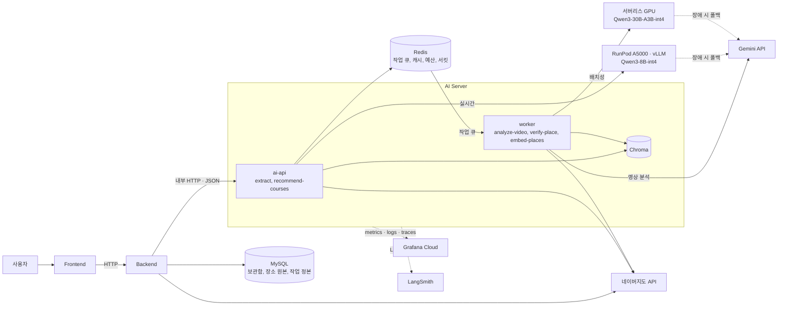

작성일 : 2026년 9월 14일

작성자 : hayes.yu, amy.kim

## 목차
---
1. [최종 서비스 아키텍처](#1-최종-서비스-아키텍처)
2. [단계별 설계 적용 결과](#2-단계별-설계-적용-결과)
3. [시스템 성능, 품질 평가](#3-시스템-성능-품질-평가)
4. [회고](#4-회고)
5. [개선 제안 및 계획](#5-개선-제안-및-계획)
6. [결론](#6-결론)
---

# 1. 최종 서비스 아키텍처

## 1-1) 전체 구성도 (V3 파일럿 기준)

> 점선은 장애 시 폴백 경로이거나 관측용 연결

## 1-2) 구성 요소별 역할

| 구성 요소 | 역할 | 도입 이유 |
| --- | --- | --- |
| Backend | 사용자 요청 처리, 업무 데이터와 작업 정본 소유, AI Server 호출 | AI Server는 업무 데이터를 소유하지 않고, Backend가 조회해 전달 |
| ai-api | 실시간 엔드포인트(`extract`, `recommend-courses`) 처리 | 지연에 민감한 요청이 배치성 작업에 처리 슬롯을 빼앗기지 않도록 분리 |
| worker | 배치성 엔드포인트(`analyze-video`, `verify-place`, `embed-places`) 처리 | 지연을 허용하는 작업을 큐로 받아 queue depth 기준으로 확장 |
| Chroma | 장소 요약 임베딩 저장, 유사도 검색 | 소규모 데이터에 맞는 경량 구성, 메타데이터 필터링 지원 |
| Redis | 작업 큐(Redis Streams), 캐시, 예산 카운터, 서킷 상태 | 인스턴스 재시작에도 운영 제어 상태를 유지, 별도 큐 제품 없이 처리 |
| RunPod vLLM (Qwen3-8B-int4) | 장소 검증 추론 | 자체 호스팅 운영 경험, 실시간 타임아웃(15초) 이내의 지연 |
| 서버리스 GPU (Qwen3-30B-A3B-int4) | 실시간 경로 추론 | 큰 모델은 24시간 띄우면 예산을 넘어 요청이 있을 때만 켜지는 서버리스로 운영하고, 사용자와 실시간으로 대화하며 지연이 생겼을때의 불편감 보다는 사용자에게 흡족한 대답을 내놓지 못했을때 불편감이 더 크리라는 판단 |
| Gemini API | 영상 분석, 로컬 모델 장애 시 폴백 | 유튜브 영상 네이티브 입력 지원, GPU 1대의 이중화를 이종 장애조치로 대체 |
| 네이버지도 API | 좌표 조회, 이동 시간 계산 | 국내 로컬 매장 데이터 정확도 |
| Grafana Cloud | metrics, logs, traces 수집과 알림 | 용량 경보와 서비스 SLO를 구분해 관측 |
| LangSmith | LLM 호출의 프롬프트, 중간 출력, 토큰 사용량 추적 | 멀티스텝 파이프라인의 단계별 디버깅 |

> AI Server 내부 모듈(`api/`, `services/`, `models/`, `integrations/`, `core/` 등)의 역할은 [3번 문서](3_wiki_architecture_modularization.md) 참고

## 1-3) 요청 흐름

- **유저 동기화 (비동기)**: Backend가 사용자가 저장한 쇼츠 목록을 작업으로 요청 → 영상 분석(Gemini) → 장소, 이벤트와 관련 없는 쇼츠 제외 → 장소, 이벤트 검증 → 결과 반환 및 임베딩 저장
- **챗봇 추천 (동기)**: Backend가 최종 슬롯과 저장 장소 목록을 전달 → ai-api가 후보 압축 → 리랭킹 → 코스 조합 → 결과 검증(실패 시 재시도) → 결과 반환, 전체 15초 deadline 적용
(데드라인은 추후 검증 후 재설정)

> 단계별 상세 흐름은 [4번 문서](4_wiki_pipeline_design.md) 참고

## 1-4) 배포 구조: 파일럿과 목표 운영 구조

| 구분 | V3 | 트래픽이 늘었을 때 |
| --- | --- | --- |
| AI API 서버 | 1대 | 최소 2대, 요청이 많아지면 자동으로 대수를 늘림 |
| GPU | A5000 1대를 24시간 가동, 오류 시 Gemini로 폴백 | GPU 1대로 감당이 안 될 만큼 트래픽이 늘었을 때만 추가 |
| 배치 작업 처리 | worker 1대 | 처리를 기다리는 작업이 쌓이면 worker를 늘리고, 재시도해도 계속 실패한 작업은 따로 모아 나중에 재처리 |
| Redis | 직접 설치한 1대 | Managed Redis 전환 검토 |
| 안정성 | GPU 오류 시 로컬 모델 추론이 멈추고 Gemini 폴백에만 의존 | 서버가 여러 대라 1대가 죽어도 서비스 유지, 서버를 늘리거나 줄일 때도 처리 중인 요청이 끊기지 않음 |

> 목표 운영 구조의 다이어그램과 확장 규칙은 [7번 문서](7_wiki.md) 6-2절, 7장 참고

# 2. 단계별 설계 적용 결과

## 2-1) 모델 API 설계

**주요 설계 결정 및 변경 사항**
- 서비스 흐름에 맞춰 5개 엔드포인트 정의(`analyze-video`, `verify-place`, `extract`, `recommend-courses`, `embed-places`)
- Backend가 각각 호출하던 `rerank`와 `compose-course`를 `recommend-courses` 하나로 통합
- `preference`를 이번 대화의 조건(`query`)과 과거 저장 이력(`history_place_ids`)으로 분리
- 동명 장소 후보는 신뢰도순으로 정렬해 자동 채택하고, 나머지 후보는 응답에 보존

**효과**
- 후보 압축부터 코스 완성까지 AI Server 안에서 끝나 순환 의존 제거
- 세션 조건과 장기 취향의 역할이 구분되어 각각 독립적으로 반영 가능
- 사용자 입력 없이도 백그라운드 동기화 중 장소 검증 진행 가능

> 상세 내용은 [1번 문서](1_wiki_api_design.md) 참고

## 2-2) 모델 추론 성능 최적화

**주요 설계 결정**
- 외부 API 구조의 병목(네트워크 왕복, 배치 처리 불가, 후보 수에 비례한 토큰 증가) 분석
- 텍스트, 구조화 출력인 `extract`, `recommend-courses`를 로컬 모델 전환 대상으로 선정
- 로컬 모델 최적화 방안으로 양자화(INT4, INT8), Gemini 출력을 정답으로 쓰는 지식 증류, vLLM dynamic batching 계획
- 로컬 후보 모델을 자체 평가기로 실측하고, 로컬 모델 장애 시 Gemini 폴백 구조 설계

**효과**
- 구조화 출력이라 양자화에 따른 품질 손실을 작게 유지하면서 GPU 메모리와 연산량 절감
- 외부 API로는 불가능했던 배치 스케줄링을 직접 제어해 처리량 확보
- 사람 라벨링 없이 파인튜닝용 학습 데이터를 확보할 경로 마련
- 실측 결과가 7단계의 모델 확정(Qwen3-8B-int4) 근거로 사용됨

> 상세 내용은 [2번 문서](2_wiki_inference_optimization.md) 참고

## 2-3) 서비스 아키텍처 모듈화

**주요 설계 결정**
- 자원 특성, 책임, 배포 주기, 장애 특성이 달라 AI Server를 Backend와 분리
- AI 파트를 CPU 기반 AI Server와 GPU 기반 로컬 LLM Server로 분리
- AI Server 내부를 8개 모듈로 구성하고, 책임에 따른 표준 분리(`api/services/models/schemas/core`)와 교체 가능성에 따른 분리(`prompts/retrieval/integrations`) 기준 적용
- 벡터 DB는 임베디드 방식의 Chroma를 사용하고, AI Server 스케일아웃 시 별도 인스턴스의 서버 모드로 전환
- 모듈 간 인터페이스를 네트워크 통신(HTTP, JSON)과 내부 함수 호출로 구분해 계약 정의 위치 명시

**효과**
- 프롬프트 수정처럼 AI 쪽 변경이 잦아도 Backend 재배포 불필요
- AI Server에 장애가 나도 Backend는 정상 동작해 장애 범위가 AI 기능으로 한정
- 모델, 벡터 DB, 지도 API를 교체해도 영향받는 모듈이 1~2개로 좁혀짐
- 스키마만 합의하면 담당자별로 병렬 개발 가능

> 상세 내용은 [3번 문서](3_wiki_architecture_modularization.md) 참고

## 2-4) 멀티스텝 파이프라인

**주요 설계 결정**
- 유저 동기화를 요청 → 영상 분석 → 관련성 필터링 → 장소, 이벤트 검증 → 결과 반환, 저장 5단계로 구성
- 챗봇 추천을 요청 → 후보 압축 → 리랭킹 → 코스 조합 → 결과 검증 → 결과 반환 6단계로 구성하고, 검증 실패 시 후보를 제외해 재시도
- LangChain으로 모델 호출과 구조화 출력 파싱을 처리하고, 흐름이 고정된 workflow 구조라 LangGraph는 도입하지 않음
- LangSmith로 단계별 LLM 호출 로그와 토큰 사용량 추적
- 유튜브 URL을 직접 입력받는 Gemini, 웹검색이 내장된 Gemini grounding, 국내 데이터가 정확한 네이버지도, 필터링을 지원하는 Chroma 선택

**효과**
- 단계마다 중간 결과를 검증해 잘못된 데이터가 다음 단계로 전파되는 것을 방지
- 앞 단계에서 후보를 줄여 뒤 단계 LLM 입력 토큰 절감
- LLM 추론, 벡터 검색, 외부 API 호출이 단계별로 분리되어 각각 독립적으로 수정 가능
- LangSmith를 통해 어느 단계에서 문제가 발생했는지 추적이 쉬워 디버깅 부담 감소

> 상세 내용은 [4번 문서](4_wiki_pipeline_design.md) 참고

## 2-5) 데이터, 컨텍스트 보강

**주요 설계 결정**
- 장소 요약을 임베딩해 `place_id` 메타데이터와 함께 Chroma에 저장
- 이번 대화 조건(`query`) 임베딩과 과거 저장 이력의 평균인 취향 벡터를 결합해 검색하고, 결과를 리랭킹 프롬프트의 후보 목록으로 삽입
- 취향 벡터는 저장하지 않고 요청마다 계산
- 장소 실존 여부, 영업시간, 이벤트 종료 여부는 Gemini grounding 웹검색과 지도 api를 통하여 검증
- RAGAS 지표(Context Precision, Context Recall, Faithfulness)로 검색 품질 평가 계획

**효과**
- 저장 장소가 늘어나도 LLM 입력 크기를 일정하게 유지
- 사용자가 선호도를 직접 입력하지 않아도 저장 이력 기반으로 개인화
- 영상 정보만으로는 알 수 없는 폐업, 종료 이벤트를 걸러 실제 방문 가능한 장소만 저장
- 장소를 삭제하면 다음 추천에 바로 반영

> 상세 내용은 [5번 문서](5_wiki_context_augmentation.md) 참고

## 2-6) 외부 도구 통합, 외부 API 활용

**주요 설계 결정**
- 호출 순서가 미리 정해진 workflow 구조라 MCP는 도입하지 않고, 동적 Tool 선택이나 다중 Client 재사용이 필요해질 때 재검토
- 외부로 나가는 지점을 `models/`, `integrations/`, `retrieval/` 3곳으로 제한하고, 의존 방향을 `api → services → {models, integrations, retrieval} → core`로 고정
- 타임아웃, 재시도(최대 2회), 서킷브레이커를 `core/`에 공통으로 두고 각 모듈이 가져다 사용
- 레이트리밋을 사용자당 쿼터(Backend), 전역 일일 상한, 벤더 제한 준수 3층으로 나누고, 배치성 호출에 예산 캡을 걸어 `extract` 전용 reserve 확보
- 재순위 실패 시 Chroma 유사도 순서, 코스 조합 실패 시 규칙 기반 조합처럼 LLM을 쓰지 않는 폴백 설계
- 장소 검증, 이동 시간, 영상 분석 결과를 Redis에 캐싱

**효과**
- 외부 API 장애가 서비스 전체 중단으로 번지지 않고, 부분 실패, 기능 저하, 기능 중단으로 구분되어 처리됨
- 영상 분석처럼 지연에 관대한 호출이 예산을 먼저 소진해 챗봇이 멈추는 상황 방지
- 새 외부 API를 추가해도 호출 정책을 다시 구현할 필요가 없음
- 불필요한 프로토콜 계층 없이 관리 지점을 최소화하면서, 필요 시 MCP로 전환할 경로는 유지

> 상세 내용은 [6번 문서](6_wiki.md) 참고

## 2-7) 서비스 인프라 확장성, 모니터링

**주요 설계 결정**
- 모델 서빙을 V1(Gemini) → V2(로컬 모델 병행 검증) → V3(자체 서버 배포) 순서로 전환하고, V3는 shadow → 1% canary → 단계적 확대로 실트래픽에 노출
- 추론과 ux에 직결되는 실시간 경로는 서버리스 GPU로, 비교적 추론 과정이 적은 배치성 경로는 Qwen3-8B-int4를 RunPod A5000 1대에 24시간 운영(모델은 벤치마크 후 확정, 후보 : Qwen3-30B-A3B/Qwen3-14b)
- GPU 이중화 대신 GPU 오류 시 Gemini로 폴백하는 이종 장애조치 채택
- V3 기준 소규모 프로젝트와 트래픽이 증가하였을때를 기준으로 두가지 버전 설계
- ai-api는 요청 수와 응답 시간, worker는 대기 작업 수, GPU는 대기 요청 수와 KV cache 사용률을 기준으로 확장
- Grafana Cloud로 metrics, logs, traces를 수집하고, 용량 경보와 서비스 SLO(`/extract` p95 13초, `/recommend-courses` p95 12초)를 구분

**효과**
- 트래픽이 늘었을 때의 확장 경로와 필요 GPU 수 계산식을 미리 확보
- 폴백 발동 빈도와 provider별 오류율을 관측해 V3 안정성을 수치로 판단 가능

> 상세 내용은 [7번 문서](7_wiki.md) 참고

# 3. 시스템 성능, 품질 평가

## 3-1) 모델 추론 (실측)

| 모델 | classification | extraction | generation | reasoning | tool_calling | p50 / p95 |
| --- | ---: | ---: | ---: | ---: | ---: | ---: |
| Gemini 3.5 Flash-Lite (참고) | 1.0 | 0.98 | 1.0 | 0.60 | 0.975 | 0.7s / 0.9s |
| **Qwen3-8B-int4 (채택)** | **1.0** | **0.88** | **1.0** | **0.40** | **0.875** | **4.3s / 9.8s** |
| Qwen3-14B-int4 | 1.0 | 0.83 | 1.0 | 0.60 | 0.925 | 8.7s / 15.4s |
| Kanana 1.5 8B-int4 | 0.90 | 0.88 | 0.975 | 0.70 | 0.925 | 4.2s / 7.4s |

- 14B는 reasoning이 더 높지만 p95가 15.4초로 실시간 타임아웃(15초)을 넘어 제외 (8b의 실성능 확인 후 변경 가능성 있음)
- 국내 모델은 자체 평가기의 난이도가 낮아 점수가 실제 워크로드에서 재현될지 신뢰하기 어려워 전반적인 벤치마크 데이터와 종합적으로 평가하여 모델 선정
- 실트래픽은 shadow → 1% canary → 단계적 확대 순서로 노출
- 전체 비교는 [2번 문서](2_wiki_inference_optimization.md), [7번 문서](7_wiki.md) 부록 A 참고

## 3-2) 서비스 목표 (SLO)

| 엔드포인트 | 모델 호출 타임아웃 | SLO p95 | SLO p99 |
| --- | ---: | ---: | ---: |
| `/extract` | 15초 | 13초 | 14.5초 |
| `/recommend-courses` | 전체 deadline 15초 | 12초 | 13.5초 |

- SLO는 타임아웃보다 안쪽에 두어 네트워크, 직렬화, 재시도에 쓸 여유를 확보
- `recommend-courses`는 Chroma, 모델, 지도 API를 순차로 묶는 경로라 실패 지점이 많아 SLO를 더 좁게 설정
- 현재 SLO는 임시이며 실측 이후 변경 예정

## 3-3) 비용

| 항목 | 월 비용(추정) |
| --- | ---: |
| 배치성 GPU (RunPod A5000 24/7) | ₩161,000 |
| 실시간 GPU (서버리스) | $10~20대 |
| Gemini (영상 분석, 폴백) | 트래픽에 비례 |
| 예산 | ₩360,000 |

## 3-4) 아직 측정하지 못한 항목

- 부하 테스트는 스테이징 환경이 없어 계획만 수립(목표 RPS 0.12 / 1.2 / 12), GPU 1대의 SLO 충족 RPS는 미확정
- 파이프라인 전체 응답 시간, 코스 검증 재시도율, 검색 품질(RAGAS) 등 end-to-end 지표는 측정 예정

# 4. 회고

## 4-1) 배운 점

- 엔드포인트를 어디서 나눌지는 AI 처리 흐름이 아니라 책임을 기준으로 정해야 했음
    - 처음에는 AI 내부 처리 순서(후보 압축 → 재순위 → 코스 조합)를 그대로 엔드포인트로 옮겨, 재순위와 코스 조합을 따로 만들었음
        - 두 엔드포인트 모두 AI 서버에 있었지만, 백엔드는 재순위를 호출하고 그 결과를 코스 조합에 다시 넘겨 이어 붙이는 일만 했고 중간에 하는 작업은 없었음
        - 결국 AI 쪽 처리 순서를 백엔드가 알고 조립해야 하는 구조라, AI 파이프라인에 단계를 추가하거나 순서를 바꾸면 백엔드 코드도 같이 고쳐야 했음. 요청 한 번에 네트워크 왕복도 두 번 생겼음
        - 그래서 코스 추천 하나로 합쳤음. 반대로 슬롯 추출과 코스 추천은 사이에 사용자가 조건을 확인·수정하는 과정이 있어 나눈 채로 두었음
        - 무조건 합치거나 쪼개는 게 아니라, 다른 주체에게 책임이 넘어가는 지점에서 경계를 그어야 한다는 기준이 생겼음
- 널리 쓰이는 기술이 우리 프로젝트에도 맞는 기술은 아니었음
    - 벡터 DB를 처음 정할 때는 가장 많이 쓰인다는 이유로 Pinecone을 골랐음
        - 서비스 규모를 기준으로 다시 따져보니 임베딩할 데이터가 적고 운영 규모도 작아, 관리형 서비스가 주는 이점이 필요 없었음. 임베디드 방식 중에서도 place_id 필터링을 기본으로 지원하는 Chroma로 변경했음
        - 바꾸고 나서야 임베디드 방식은 AI 서버를 여러 대로 늘리면 서버마다 인덱스가 따로 놀게 된다는 한계가 보였음. 지금은 단일 인스턴스로 운영하고, 스케일아웃할 때 서버 모드로 분리하는 계획으로 남겼음
        - 새로 고른 기술에도 트레이드오프는 있어서, 지금 이걸 고른 이유와 나중에 다시 검토할 조건을 함께 남겨두는 게 중요하다는 걸 알게 되었음
- 요구사항이 세세해도 설계에 빠짐없이 옮기는 건 별개의 문제였음
    - 요구사항 정의서에 AI 로직 요구사항이 항목별로 정리되어 있었지만, API를 설계할 때는 흐름 위주로 보다 보니 일부가 스키마에 반영되지 않았음
        - 요구사항과 하나씩 대조해 보니, 행사 기간을 날짜로 바꿔 만료를 판정하는 요구사항(AI-003)은 문자열 필드 하나로만 있었고, 코스를 최대 3개까지 구성하라는 제약(AI-012)도 빠져 있었음
        - 반대로 요구사항 자체가 실제 실행 흐름과 맞지 않는 경우도 있었음. 동명 장소가 여러 개면 사용자에게 선택을 요청하라고 되어 있었지만, 장소 검증은 백그라운드 동기화 중에 실행돼 물어볼 화면이 없었음. 그래서 신뢰도순으로 자동 채택하고 나머지 후보는 응답에 남기는 방식으로 바꿨음
        - 요구사항을 빠짐없이 반영했는지뿐 아니라, 실제 실행 흐름에서 가능한지까지 대조해야 한다는 걸 알게 되었음
- 평소 알던 설계 방식과 완전히 달라서, 처음부터 다시 배우는 느낌이었음
  - 워터폴로 설계해 본 경험은 있었지만, AI 프로젝트는 신경 쓸 지점이 달랐음. "데이터를 어떻게 가공해 전달하고 무엇을 사용자에게 보여줄 것인가"라는 근본 목표는 같아도, 나머지는 사실상 새로 배워야 했음
  - 어떤 API와 오픈웨이트 모델을 쓸지는 문서만 보고 정할 수 없었고, 여러 조건을 두고 직접 돌려 보며 골라야 하는 문제였음. 베이스 코드조차 없는 단계라 AI가 맡을 기능을 잘게 나눈 뒤, 기능별로 가벼운 태스크를 만들어 성능을 비교했음
  - 그 과정에서 기술 선택 기준 자체가 바뀌었음. 예전에는 배운 기술을 최대한 써 보는 것이 목표였다면, 이번에는 "프로젝트 규모에 맞는가"를 먼저 따졌고, 성능이 가장 좋고 널리 쓰이는 기술이 언제나 정답은 아니라는 점을 알게 되었음
  - 같은 질문에도 답이 달라지는 모델 특성 때문에 신뢰도를 높일 검증 단계를 설계에 넣었는데, 비정형 데이터를 소프트웨어로 다루려면 이런 장치가 필요하다는 것을 처음 경험했음
- 벤치마크 대신 평가기를 직접 만들어 돌려 보며 알게 된 것
  - 벤치마크 순위는 해당 도메인을 벗어나는 순간 신뢰하기 어려운 지표가 되었고, 이것이 평가기를 따로 제작한 이유였음
  - 간단한 태스크에서는 모델 성능이 좋은 것이 오히려 독이 될 수 있었음. 당시 별도의 사고 과정을 두는 모델은 Qwen과 Gemini뿐이었는데, 조금만 복잡한 작업이었다면 분명 도움이 됐을 그 기능이 태스크가 쉬운 탓에 시간만 늘리는 역효과를 냈음
  - 같은 비정형 데이터를 다루는데도 모델마다 문제를 일으키는 지점이 달랐음. 카나나는 프롬프트의 요일 정보를 제대로 반영하지 못했고, Qwen은 앞서 말한 사고 모드 탓에 이상치를 내놓는 경우가 있었음. 프롬프트를 조정하고 사고 모드를 끄는 방식으로 해결했음
  - 서빙 시 메모리를 좌우하는 것은 결국 총 파라미터 수였음

## 4-2) 해결하지 못한 점

- 슬롯 카테고리를 상세하게 정의하지 못했음
    - 슬롯에는 지역, 날짜, 외출 가능 시간, 카테고리가 들어가는데, 카테고리는 세부 목록과 분류 기준까지 확정하지 못했음
        - 영상 분석에서 장소에 붙이는 카테고리와 챗봇에서 사용자 발화로 추출하는 카테고리가 같은 기준이어야 1차 필터링에서 제대로 걸러지는데, 기준이 없으면 두 값이 어긋날 수 있음. 예를 들어 영상 분석은 "디저트 카페"로 붙이고 사용자는 "카페"라고 말하면 서로 매칭되지 않음
        - 카테고리 목록을 확정한 뒤, 영상 분석과 슬롯 추출에 같은 목록을 적용해야 함
- 외부 API별 호출 제한을 확인하지 못했음
    - 벤더 제한(분당 요청 수, 분당 토큰 수)을 지키는 레이트리밋과 예산 상한을 설계했지만, Gemini와 지도 API의 실제 한도는 확인하지 못해 초기 가정치로 두었음
        - 로컬 모델에 오류가 나면 실시간 요청이 전부 Gemini로 넘어가는데, 할당량을 미리 확보하지 않으면 폴백마저 호출 제한에 막힐 수 있음
        - 운영 전에 벤더별 한도와 단가를 확인해 설정값을 실제 수치로 바꾸고, 필요하면 할당량을 미리 신청해야 함
- 후보를 몇 개까지 압축할지, 파이프라인 전체가 잘 동작하는지 수치로 확인하지 못했음
    - 모델 단위로는 자체 평가기로 성능을 비교했지만, 추천 파이프라인 전체의 응답 시간, 코스 검증 재시도 비율, 검색 단계에서 적합한 후보가 빠지지 않는지는 측정하지 못했음
        - 그래서 벡터 검색에서 후보를 몇 개 남길지도 근거 없이 정해져 있음. 너무 적으면 적합한 장소가 압축 단계에서 떨어지고, 너무 많으면 리랭킹 입력 토큰이 늘어남
        - 평가용 발화와 정답 후보를 만들어 검색 품질을 측정하고, 그 결과로 후보 개수를 정해야 함
- 멀티턴 대화의 컨텍스트 관리 구조를 구체적으로 설계하지 못했음
    - 슬롯 추출은 매 턴마다 이전 컨텍스트와 새 발화를 합쳐 조건을 갱신하는데, 이 컨텍스트를 Backend DB에서 읽고 쓰는 방향만 정했음
        - 어떤 형태로 저장할지, 대화가 길어졌을 때 어디까지 유지할지는 정하지 못했음
- 아직 코드가 나오지 않았고 지원금 한계로 GPU 인프라를 3개월 내내 돌릴 수는 없어, 어떤 모델을 어떤 방식으로 양자화한 것이 가장 적합했는지 지금으로서는 확인할 수 없다는 점이 아쉬움
- 한정된 예산 안에서 결정을 내려야 했지만 실측이 불가능해, 대부분의 판단을 평균값이나 예측에 기대어 내릴 수밖에 없었음
- 인프라 설계는 사실상 배워 본 적이 없는 영역이라 생성형 AI의 도움을 많이 받아야 했고, 그만큼 의존도가 높아진 점이 아쉬움
- 문제가 발생했을 때 프롬프트 수준의 조정으로 해결되는 사안인지, 파라미터 조절까지 들어가야 하는 사안인지 
    - 모델의 한계선을 직접 확인해 볼 수 없었던 점도 아쉬움

# 5. 개선 제안 및 계획

## 5-1) 기능 확장

- 추천받은 코스를 구글 캘린더에 일정으로 등록 (페르소나 목표 "방문 일정을 캘린더로 연결"과 연결)
    - AI Server는 코스 데이터를 구조화해서 반환하는 것까지만 담당하고, 사용자 OAuth 토큰 보관과 캘린더 API 호출은 Backend가 담당
    - 사용자의 외부 계정 권한을 AI Server가 갖지 않아, 외부 연결 지점을 `models/`, `integrations/`, `retrieval/` 3곳으로 제한한 기존 경계가 그대로 유지됨

> 상세 내용은 [6번 문서](6_wiki.md) 8-2절 참고

## 5-2) 최적화, 검증 계획

- V2에서 `models/local.py`에 Qwen3-8B-int4 클라이언트를 구현하고, 실트래픽 노출 없이 Gemini 응답과 병행 검증
- V3에서 shadow → 1% canary → 단계적 확대 → 자동 rollback 순서로 실트래픽 전환
- 스테이징 환경 구성 후 부하 테스트로 GPU 1대의 SLO 충족 RPS를 실측해 필요 GPU 수 계산식에 반영
- Qwen3-30B-A3B를 자체 평가기로 벤치마크한 뒤 장소 검증 경로 채택 여부 결정
- RAGAS 기반 검색 품질 평가 체계 구축
- 실제 요청 로그로 burst 패턴을 확인한 뒤, 8시간 운영이나 서버리스 전환으로 GPU 비용 재검토

# 6. 결론

- 초기 규모와 예산(₩360,000)에 맞춰 MCP, LangGraph 같은 추가 계층 없이 워크플로우 구조로 구성하고, GPU 이중화 대신 Gemini 폴백으로 가용성을 확보해 운영 부담과 비용을 낮춤
- 모델, 벡터 DB, 지도 API처럼 교체 가능성이 있는 부분을 인터페이스 뒤로 격리해, Gemini에서 Qwen으로 전환해도 서비스 로직은 변경되지 않음
- 외부 호출 정책을 `core/`로 일원화하고 LLM을 쓰지 않는 폴백을 두어, 외부 장애가 발생해도 AI 기능만 degraded되고 보관함 조회 등 비AI 기능은 정상 동작
- 파일럿과 목표 운영 구조, SLO, GPU 수 계산식, MCP·gRPC·벡터 DB 재검토 조건을 미리 정의해두어, 현재의 단순한 구성이 이후 확장을 가로막지 않음